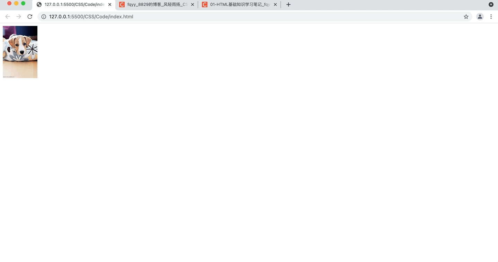
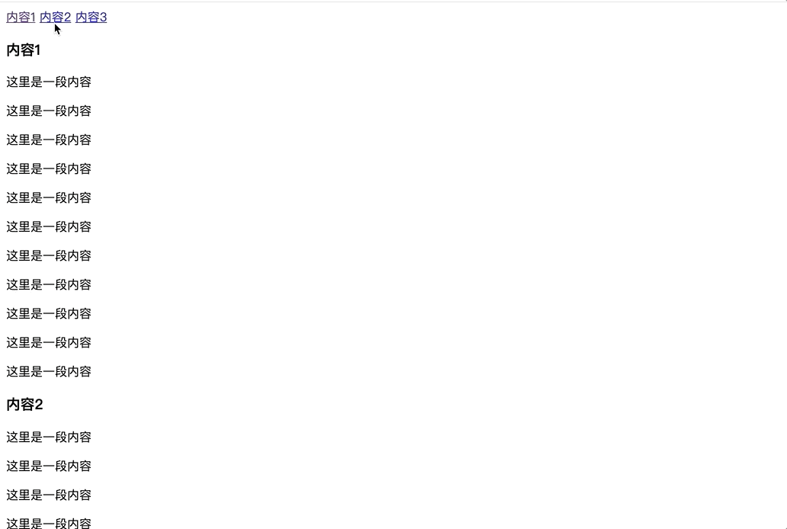

[toc]

# 使用 a 元素
## 基本用法

&emsp;&emsp;HTML5保留了定义超链接的 <font color=orange>**a**</font> 元素，它可以指定如下属性：

+ <font color=orange>**href：**</font> 指定超链接所链接的另一个资源
+ <font color=orange>**hreflang：**</font> 指定超链接所链接的文档所使用的语言
+ <font color=orange>**target：**</font> 指定使用框架集中的哪个框架来装载另一个资源
  + <font color=orange>**\_self：**</font> 自身
  + <font color=orange>**\_blank：**</font> 新窗口
  + <font color=orange>**\_top：**</font> 顶层框架
  + <font color=orange>**\_parent：**</font> 父框架
+ <font color=orange>**download：**</font> 用于让用户下载目标链接所指向的资源，而不是打开该目标链接。该属性的属性值指定用户保存下载资源时的默认文件名
+ <font color=orange>**type：**</font> 指定被链接文档的MIME类型
+ <font color=orange>**media：**</font> 指定目标URL所引用的媒体类型，默认为all(<font color=red> **只有当指定了href属性时该属性才有效** </font>)

<font color=skyblue size=3>**1. 使用超链接**</font>

&emsp;&emsp;a 标签可以包含文本、图像、各种文本格式化元素和表单元素等内容：

```html
<!DOCTYPE html>
<html lang="en">
<head>
    <meta charset="UTF-8">
    <meta name="viewport" content="width=device-width, initial-scale=1.0">
    <title>Document</title>
</head>
<body>
    <!-- 在本窗口打开页面 -->
    <a href="http://www.baidu.com" target="_blank">在新的页面打开</a>

    <!-- 在新窗口打开页面 -->
    <a href="http://www.baidu.com" target="_self">在本页面打开</a>

    <!-- 图片链接 -->
    <h3>图片链接</h3>
    <a href="http://www.baidu.com"></a>
</body>
</html>
```


> <font color=red>*__注意：__*</font>
> 1. 外部链接：需要添加 <font color=green>*__http://__*</font> ，如：http://www.baidu.com
> 2. 内部链接：直接链接内部页面名称即可，比如：<font color=green>*__&lt;a href="index.html"&gt; 首页 &lt;/a&gt;__*</font>
> 3. 如果当时没有确定链接目标，通常将链接标签的<font color=orange> **href属性设置为 "#"** </font>，表示当前链接暂时是一个空链接
> 4. 不仅可以创建文本超链接，网页中的其它元素，如：图像、表格、音视频等都可以添加超链接
> 5. href 值可以是绝对路径或相对路径

<font color=skyblue size=3>**2. 使用 download 属性**</font>

&emsp;&emsp;如果为 a 元素指定了<font color=orange> **download** </font>属性，则可控制让用户下载目标链接所指向的资源，而不是打开目标链接，download 属性指定了目标资源另存为的文件名：

```html
<!DOCTYPE html>
<html>
<head>
    <meta charset="UTF-8">
    <title></title>
</head>
<body>
    <!-- 为图片增加超链接 -->
    <a href="images/a.jpg" download="a.jpg" type="image/jpeg">
        
    </a>
</body>
</html>
```



## 锚点定位

&emsp;&emsp;通过创建锚点链接可以快速定位到目标内容，实现该功能有两种方法：

<font color=skyblue size=3>**1. 指定id的方法**</font>

&emsp;&emsp;使用该方法需要两个步骤：

1. 创建一个带有 id 属性的标签，作为需要跳转的点
2. 创建一个 a 标签，并且指定它的 href 属性为<font color=orange> *__#id__* </font>，该 id 就是上面创建好的跳转点的标签的 id 属性值

```html
<!DOCTYPE html>
<html lang="en">
<head>
    <meta charset="UTF-8">
    <meta name="viewport" content="width=device-width, initial-scale=1.0">
    <title>Document</title>
</head>
<body>
    <a href="#content1">内容1</a>
    <a href="#content2">内容2</a>
    <a href="#content3">内容3</a>

    <h3 id="content1">内容1</h3>
    <p>这里是一段内容</p>
    <p>这里是一段内容</p>
    <p>这里是一段内容</p>
    <p>这里是一段内容</p>
    <p>这里是一段内容</p>
    <p>这里是一段内容</p>
    <p>这里是一段内容</p>
    <p>这里是一段内容</p>
    <p>这里是一段内容</p>
    <p>这里是一段内容</p>
    <p>这里是一段内容</p>

    <h3 id="content2">内容2</h3>
    <p>这里是一段内容</p>
    <p>这里是一段内容</p>
    <p>这里是一段内容</p>
    <p>这里是一段内容</p>
    <p>这里是一段内容</p>
    <p>这里是一段内容</p>
    <p>这里是一段内容</p>
    <p>这里是一段内容</p>
    <p>这里是一段内容</p>
    <p>这里是一段内容</p><p>这里是一段内容</p>
    <p>这里是一段内容</p>

    <h3 id="content3">内容3</h3>
    <p>这里是一段内容</p>
    <p>这里是一段内容</p>
    <p>这里是一段内容</p>
    <p>这里是一段内容</p>
    <p>这里是一段内容</p>
    <p>这里是一段内容</p>
    <p>这里是一段内容</p>
    <p>这里是一段内容</p> 
</body>
</html>
```



<font color=skyblue size=3>**2. 指定name的方法**</font>

&emsp;&emsp;使用该方法同样也需要两个步骤：

1. 在需要跳转的上面加上一个空的 a 标签，然后使用 name 属性
2. 创建一个 a 标签，并且指定它的 href 属性为<font color=orange> *__#name__* </font>，这里的 name 就是上面创建好的跳转点的空的 a 标签的 name 属性值

```html
<!DOCTYPE html>
<html lang="en">
<head>
    <meta charset="UTF-8">
    <meta name="viewport" content="width=device-width, initial-scale=1.0">
    <title>Document</title>
</head>
<body>
    <a href="#content1">内容1</a>
    <a href="#content2">内容2</a>
    <a href="#content3">内容3</a>

    <h3>内容1</h3>
    <a name="content1"></a>
    <p>这里是一段内容</p>
    <p>这里是一段内容</p>
    <p>这里是一段内容</p>
    <p>这里是一段内容</p>
    <p>这里是一段内容</p>
    <p>这里是一段内容</p>
    <p>这里是一段内容</p>
    <p>这里是一段内容</p>
    <p>这里是一段内容</p>
    <p>这里是一段内容</p>
    <p>这里是一段内容</p>

    <h3>内容2</h3>
    <a name="content2"></a>
    <p>这里是一段内容</p>
    <p>这里是一段内容</p>
    <p>这里是一段内容</p>
    <p>这里是一段内容</p>
    <p>这里是一段内容</p>
    <p>这里是一段内容</p>
    <p>这里是一段内容</p>
    <p>这里是一段内容</p>
    <p>这里是一段内容</p>
    <p>这里是一段内容</p><p>这里是一段内容</p>
    <p>这里是一段内容</p>

    <h3>内容3</h3>
    <a name="content3"></a>
    <p>这里是一段内容</p>
    <p>这里是一段内容</p>
    <p>这里是一段内容</p>
    <p>这里是一段内容</p>
    <p>这里是一段内容</p>
    <p>这里是一段内容</p>
    <p>这里是一段内容</p>
    <p>这里是一段内容</p>
    
</body>
</html>
```

&emsp;&emsp;此时就可以看到和上面案例同样的效果。

> <font color=red>**提示：**</font> 也可以跨URL，格式如下<font color=orange> *__&lt;a href="url#name"&gt;...&lt;/a&gt;__*</font>。

# base标签

&emsp;&emsp;base标签 <font color=orange>**用来改变 a 链接的默认行为**</font>，它是一个单标签，一般写在 head 标签中，它可以指定下面两个属性：

+ <font color=orange>**href：**</font> 指定所有链接的基准路径
+ <font color=orange>**target：**</font> 指定超链接默认在哪个窗口打开链接

```html
<!DOCTYPE html>
<html lang="en">
<head>
    <meta charset="UTF-8">
    <meta name="viewport" content="width=device-width, initial-scale=1.0">
    <title>base标签</title>
    <!-- 指定默认行为: 在本页面打开百度-->
    <base href="http://www.baidu.com" target="_self">
</head>
<body>
    <h3>默认行为: 在本页面打开百度</h3>
    <!-- 使用默认行为 -->
    <a href="">使用默认行为</a>

    <!-- 只改变打开方式 -->
    <a href="" target="_blank">只改变打开方式</a>

    <!-- 只改变地址 -->
    <a href="http://www.qq.com">只改变地址</a>

    <!-- 同时改变地址和打开方式 -->
    <a href="http://www.qq.com" target="_blank">同时改变地址和打开方式</a>
</body>
</html>
```

