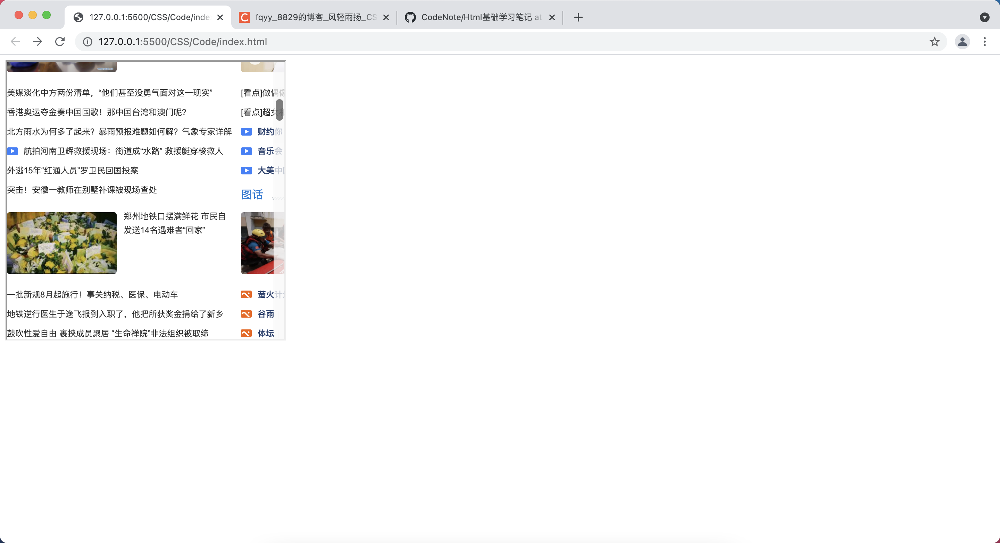
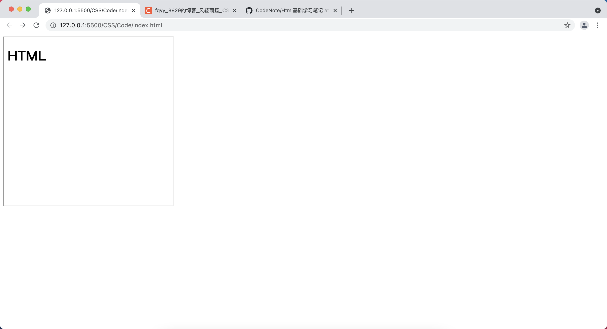
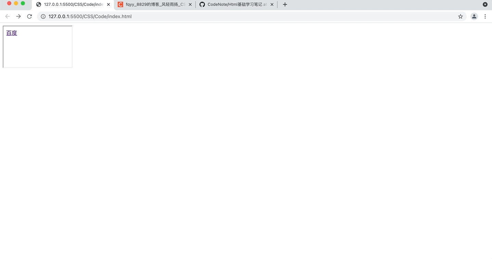
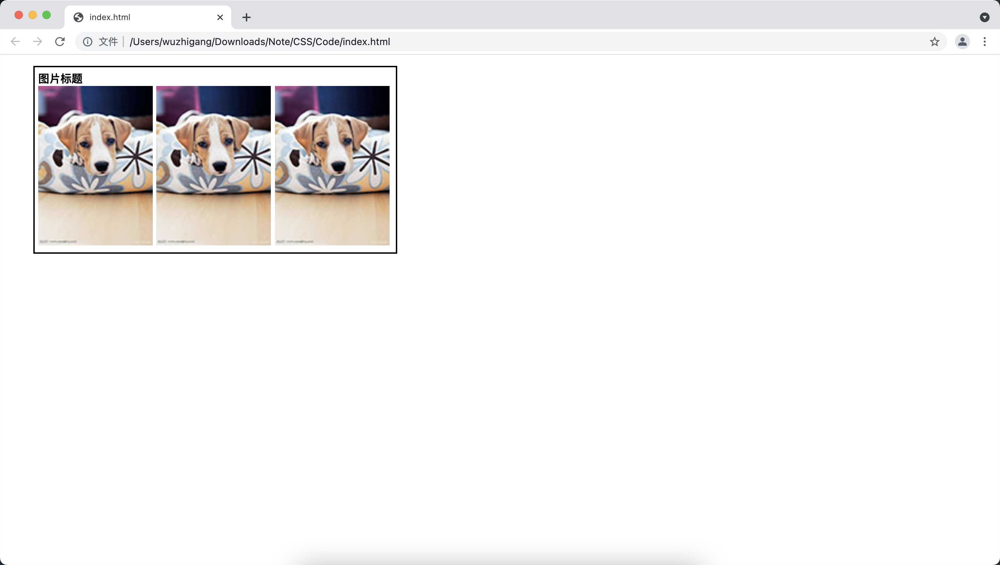
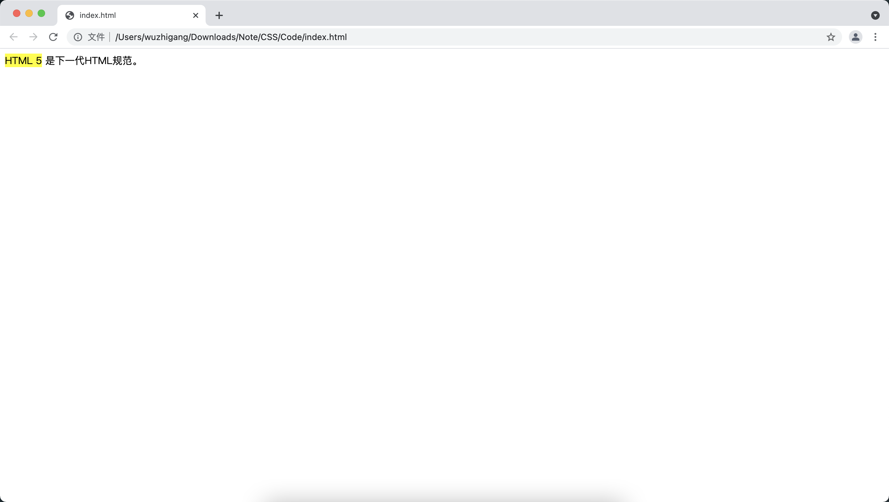
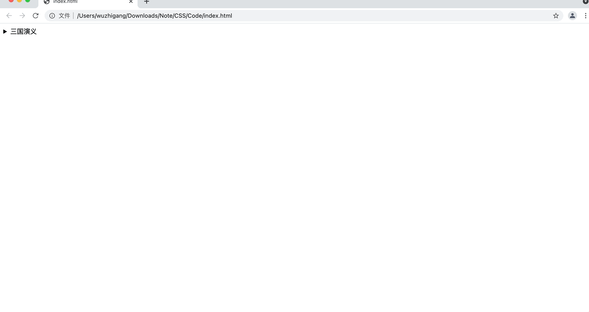
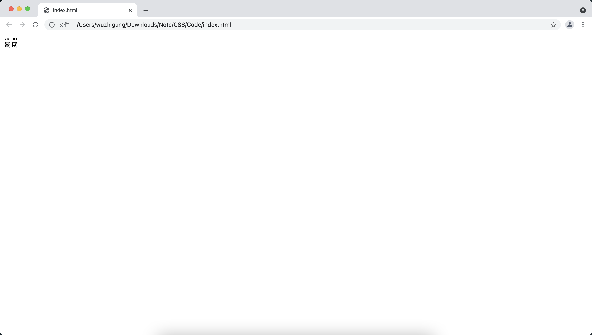

[toc]

# HTML5 增强的iframe元素

&emsp;&emsp;HTML5不再推荐在页面中使用框架集，但是依然保留一个与框架集相关的元素：<font color=orange>**iframe**</font> 元素，该元素可以在普通 HTML 页面中使用，用于在普通 HTML 页面中生成一个行内框架，可以直接放在 HTML 页面的任意位置，可以指定以下属性：

+ <font color=orange>**src：**</font> 指定一个URL，指定该 iframe 将装载哪个页面
+ <font color=orange>**name：**</font> 设置 iframe 的名字
+ <font color=orange>**longdesc：**</font> 指定一个页面的 URL ，该页面包含了 iframe 的长描述
+ <font color=orange>**scrolling：**</font> 设置是否在 iframe 中显式滚动条（ <font color=green>**yes、no、auto**</font> ）
+ <font color=orange>**height：**</font> 设置 iframe 的高度
+ <font color=orange>**width：**</font> 设置 iframe 的宽度
+ <font color=orange>**frameborder：**</font> 设置是否显示该 iframe 的边框
+ <font color=orange>**marginheight：**</font> 设置该 iframne 的顶部和底部的页边距
+ <font color=orange>**marginwidth：**</font> 设置该 iframe 的左侧和右侧的页边距

```html
<!DOCTYPE html>
<html>
<head>
    <meta charset="UTF-8">
    <title></title>
</head>
<body>
    <iframe src="http://www.qq.com" frameborder="2" width="400" height="400" name="baidu" scrolling="auto"></iframe>
</body>
</html>
```



## HTML5新增的srcdoc属性

&emsp;&emsp;HTML5 新增的 srcdoc 属性允许直接指定 HTML 片段，这样 iframe 元素将直接显示该 srcdoc 所指定的 HTML 片段，如果浏览器暂时不支持 srcdoc 属性，那么将会继续显示 src 属性所指定的页面内容：

```html
<!DOCTYPE html>
<html>
<head>
    <meta charset="UTF-8">
    <title></title>
</head>
<body>
    <iframe src="http://www.qq.com" frameborder="2" width="400" height="400" name="baidu" scrolling="auto" srcdoc="<h1>HTML</h1>"></iframe>
</body>
</html>
```



## HTML5新增的seamless属性

&emsp;&emsp;seamless 属性是一个支持 boolean 值的属性，指定了该属性的 iframe 所生成的框架看上去像是原文档的一部分，不再显示边框和滚动条（<font color=red> **目前没有浏览器支持** </font>）。

## HTML5新增的sandbox属性

&emsp;&emsp;sandbox 是一个安全性方面的属性，用于对框架中的网页增加一系列额外限制，该属性支持如下属性值：

+ <font color=orange>**""：**</font> 限制全部
+ <font color=orange>**allow-forms：**</font> 允许框架内的表单进行提交
+ <font color=orange>**allow-same-origin：**</font> 允许将框架内所加载的网页视为与使用该 iframe 元素的页面来自相同源（即使这两个网页来自不同源）
+ <font color=orange>**allow-scripts：**</font> 允许框架内所加载的网页执行 JavaScript 脚本
+ <font color=orange>**allow-top-navigation：**</font> 允许将框架内所加载网页中的超链接导航到父级窗口

&emsp;&emsp;对于不指定 sandbox 属性的 iframe 元素，该元素对应框架内所加载的 HTML 页面几乎不受任何限制，但如果指定了 sandbox 为 ""，这就意味着限制了 iframe 元素页面的如下功能：

+ 禁止该页面内的插件
+ 禁止该页面内的表单提交
+ 该页面内超链接只能加载到该 iframe 框架内
+ 该 iframe 框架内所加载的网页将被视为来自不同的源，对于不同源的网页（两个页面对应URL的域名不同或端口不同），该页面将会被禁止使用Ajax与服务器交互，禁止加载来自服务器的内容，同时禁止该页面从 Cookie 或 Web Storage 中读取内容

> <font color=red>**注意：**</font> sandbox 允许同时指定以上多个属性，多个属性之间以空格隔开即可。

<font color=skyblue size=3>**1. allow-forms属性值**</font>

&emsp;&emsp;指定 allow-forms 属性值允许 iframe 框架内的网页提交表单，该属性通常需要和 allow-same-origin 属性值结合使用：<font color=orange>*__sandbox="allow-forms allow-same-origin"__*</font>

<font color=skyblue size=3>**2. allow-scripts属性值**</font>

&emsp;&emsp;指定 allow-scripts 属性值允许 iframe 框架内页面中的 JavaScript 脚本运行。但是出于安全性考虑，其它浏览器（除了IE）都禁止指定了 sandbox 属性的 iframe 内页面弹出 JavaScript 对话框。

<font color=skyblue size=3>**3. allow-top-navigation属性值**</font>

&emsp;&emsp;指定 allow-top-navigation 属性值允许 iframe 框架内网页中的超链接在该行内框架所在的父级浏览器中打开：

```html
<!-- top.html -->
<!DOCTYPE html>
<html>
<head>
    <meta charset="UTF-8">
    <title></title>
</head>
<body>
    <iframe src="nav.html" width="200" height="120" sandbox="allow-top-navigation"</iframe>
    主页面内容
</body>
</html>

<!-- nav.html -->
<!DOCTYPE html>
<html>
<head>
    <meta charset="UTF-8">
    <title></title>
</head>
<body>
    <a href="http://www.baidu.com" alt="百度" target="_top">百度</a>
</body>
</html>
```



&emsp;&emsp;<font color=orange>target="\_top"</font> 设置该超链接需要直接在浏览器中打开，由于 iframe 元素设置了<font color=orange> sandbox="allow-top-navigation"属性 </font>，因此该页面中行内框架内的超链接所链接的页面会直接装载到浏览器中。

<font color=skyblue size=3>**4. allow-same-origin 属性值**</font>

&emsp;&emsp;设置该属性值允许将 iframe 框架内的网页视为与使用该 iframe 元素的网页来自相同的源（两个网页所在的URL的域名相同、端口相同）。出于安全性考虑，如果 iframe 所加载页面来自不同的源，那么该 iframe 内的页面将不允许使用 Ajax 与服务器交互，禁止加载来自服务器的内容，同时禁止该页面从 Cookie 或 Web Storage 中读取内容。

&emsp;&emsp;一旦设置了该属性值，该行内框架内所加载的页面将会被视为与包含行内框架的页面来自相同的源，框架内的页面才可以使用 Ajax 与服务器交互，加载来自服务器的内容，从 Cookie 或 Web Storage 中读取内容。

> <font color=red>**注意：**</font> 上面的功能往往都需要使用 JavaScript 脚本才能实现，因此 allow-same-origin 属性值通常与 allow-scripts 属性值结合使用。

# HTML5新增结构元素
## article与section元素

+ <font color=orange>**article：**</font> 用于代表页面上独立、完整的一篇文章，该元素的内容可以是一个帖子、一篇博客、一篇短文、一条完整的回复等
  + article 元素内部可以使用 header 定义文章标题
  + article 元素内部可以使用 footer 定义文章脚注部分
  + article 元素内部可以使用多个 section 把文章内容分成几个段落
  + article 内部可以嵌套多个 article 作为它的附属文章
+ <font color=orange>**section：**</font> 该元素用于对页面的内容进行分块，通常可以由标题和内容组成
  + 通常建议 section 元素包含一个标题
  + section 元素可以嵌套 section 元素，用于表示该分块包含多个子分块
  + section 元素可以包含多个 article 元素，表示该分块内部包含多篇文章

```html
<!DOCTYPE html>
<html lang="en">
<head>
    <meta charset="UTF-8">
    <title></title>
</head>
<body>
   <h1>浏览器帖子内容</h1>
   <article>
       <h2>学习Android，必须先学习Java吗？</h2>
       <p>Android上程序必须用Java写吗？可以用C++吗？</p>
       <!-- 帖子回复部分 -->
       <section>
           <h2>回复内容</h2>
           <!-- 每个article表示一个回复 -->
           <article>
               <!-- 回复标题 -->
               <h3>还是得学习的</h3>
               <div>作者：Jack</div>
               <p>回复内容</p>
           </article>
           <!-- 每个article表示一个回复  -->
           <article>
                <!-- 回复标题 -->
                <h3>Java是基础</h3>
                <div>作者：Tom</div>
                <p>回复内容</p>
            </article>
       </section>
       <!-- 帖子评价部分 -->
       <section>
           <h2>评价内容</h2>
           <!-- 每个article表示一个评价 -->
           <article>
               <h3>讨论很好</h3>
               <p>很好</p>
           </article>
       </section>
   </article>
</body>
</html>
```

> <font color=red>**注意：**</font> div 元素只是作为页面内容的通用容器，如果程序是为了动态修改页面某个部分的内容，则建议使用 div 元素；而 section 元素则主要作为内容的分块。

&emsp;&emsp;article、section 元素的主要作为是定义文档结构，以便搜索引擎、浏览器等工具解析该文档的结构。

## header和footer元素

+ <font color=orange>**header：**</font> 该元素通常用于代表标题
+ <font color=orange>**footer：**</font> 该元素通常用于父级元素定义脚注部分，包括该文章的版权信息、作者授权信息等

```html
<!DOCTYPE html>
<html lang="en">
<head>
    <meta charset="UTF-8">
    <title></title>
</head>
<body>
    <!-- 网页标题 -->
    <header>
        <a href="#">返回首页</a>
        <h1>浏览器帖子内容</h1>
    </header>
   <article>
       <h2>学习Android，必须先学习Java吗？</h2>
       <p>Android上程序必须用Java写吗？可以用C++吗？</p>
       <!-- 帖子回复部分 -->
       <section>
           <h2>回复内容</h2>
           <!-- 每个article表示一个回复 -->
           <article>
               <!-- 回复标题 -->
               <h3>还是得学习的</h3>
               <div>作者：Jack</div>
               <p>回复内容</p>
           </article>
           <!-- 每个article表示一个回复  -->
           <article>
                <!-- 回复标题 -->
                <h3>Java是基础</h3>
                <div>作者：Tom</div>
                <p>回复内容</p>
            </article>
       </section>
       <!-- 帖子评价部分 -->
       <section>
           <h2>评价内容</h2>
           <!-- 每个article表示一个评价 -->
           <article>
               <h3>讨论很好</h3>
               <p>很好</p>
           </article>
       </section>
       <!-- 帖子的脚注 -->
       <footer>以上帖子和回复仅代表个人立场。</footer>
   </article>
   <footer>
       <a href="#">站点信息</a>
       <a href="#">联系我们</a>
   </footer>
</body>
</html>
```

## nav与aside元素

+ <font color=orange>**nav：**</font> 该元素专门用于定义页面上的 "导航条"
+ <font color=orange>**aside：**</font> 该元素专门用于定义当前页面或当前文章的附属信息，通常建议使用 CSS 将其渲染成侧边栏

```html
<!DOCTYPE html>
<html lang="en">
<head>
    <meta charset="UTF-8">
    <title></title>
</head>
<body>
    <!-- 网页标题 -->
    <header>
        <a href="#">返回首页</a>
        <h1>浏览器帖子内容</h1>
    </header>
   <article>
       <h2>学习Android，必须先学习Java吗？</h2>
       <p>Android上程序必须用Java写吗？可以用C++吗？</p>
       <!-- 帖子回复部分 -->
       <section>
           <h2>回复内容</h2>
           <!-- 每个article表示一个回复 -->
           <article>
               <!-- 回复标题 -->
               <h3>还是得学习的</h3>
               <div>作者：Jack</div>
               <p>回复内容</p>
           </article>
           <!-- 每个article表示一个回复  -->
           <article>
                <!-- 回复标题 -->
                <h3>Java是基础</h3>
                <div>作者：Tom</div>
                <p>回复内容</p>
            </article>
       </section>
       <!-- 帖子评价部分 -->
       <section>
           <h2>评价内容</h2>
           <!-- 每个article表示一个评价 -->
           <article>
               <h3>讨论很好</h3>
               <p>很好</p>
           </article>
       </section>
       <!-- 帖子的脚注 -->
       <footer>以上帖子和回复仅代表个人立场。</footer>
       <!-- 作为文章的边栏 -->
       <aside>
           <section>
               <h4>关于楼主</h4>
               <div>用户组：</div>
               <div>注册日期：</div>
           </section>
       </aside>
   </article>
   <footer>
       <a href="#">站点信息</a>
       <a href="#">联系我们</a>
   </footer>
   <!-- 作为HTML的边栏信息 -->
   <aside>
       <h3>页面导航</h3>
       <nav>
           <ul>
               <li><a href="#">查看相关内容</a></li>
               <li><a href="#">返回首页</a></li>
           </ul>
       </nav>
   </aside>
</body>
</html>
```

## main元素

&emsp;&emsp;一个HTML文档最多只能包含一个 main 元素，该元素用于包含网页中除导航条、Logo、版权信息等之外的主要内容。main 元素不应该放在允许重复出现的内容中：

```html
<!DOCTYPE html>
<html lang="en">
<head>
    <meta charset="UTF-8">
    <title></title>
</head>
<body>
    <!-- 网页标题 -->
    <header>
        <h1>浏览回复内容</h1>
    </header>
   <main>
       <h2>学习Android，必须先学习Java吗？</h2>
       <p>Android上程序必须用Java写吗？可以用C++吗？</p>
   </main>
</body>
</html>
```

## hgroup 标题组合

&emsp;&emsp;用于定义标题的组合：

```html
<!DOCTYPE html>
<html lang="en">
<head>
    <meta charset="UTF-8">
    <title></title>
</head>
<body>
    <!-- 网页标题 -->
    <header>
        <hgroup>
            <h1>主标题</h1>
            <h3>副标题</h3>
        </hgroup>
    </header>
   <main>
       <h2>学习Android，必须先学习Java吗？</h2>
       <p>Android上程序必须用Java写吗？可以用C++吗？</p>
   </main>
</body>
</html>
```

## figure与figcaption元素

+ <font color=orange>**figure：**</font> 该元素用于表示一块独立的图片区域，该元素内部可以包含一个或多个 img 元素所代表的图片。还可以包含一个 figcaption 元素，用于定义该图片区域的标题
+ <font color=orange>**figcaption：**</font> 该元素通常放在 figure 内部，用于定义图片区域的标题

```html
<!DOCTYPE html>
<html lang="en">
<head>
    <meta charset="UTF-8">
    <title></title>
</head>
<body>
    <figure style="border: 2px solid black;padding: 5px;width: 510px;">
        <figcaption><b>图片标题</b></figcaption>
        
        
        
    </figure>
</body>
</html>
```



# HTML5新增的语义元素
## mark元素

&emsp;&emsp;mark 元素用于显示 HTML 页面中需要重点关注的内容，浏览器通常会用黄色显示 mark 标注的内容，非常适用于高亮显示全文检索时的关键字：

```html
<!DOCTYPE html>
<html lang="en">
<head>
    <meta charset="UTF-8">
    <title></title>
</head>
<body>
    <mark>HTML 5</mark> 是下一代HTML规范。
</body>
</html>
```



## time元素

&emsp;&emsp;time 用来显示被标注内容是日期、时间或日期时间。可以指定下面两个主要的属性：

+ <font color=orange>**datetime：**</font> 主要用于向机器提供时间，datetime 属性的属性值应该是符合 <font color=green>*__yyyy-MM-ddTHH:mm__*</font> 格式的日期时间。也可以只指定日期或者时间
+ <font color=orange>**pubdate：**</font> 是一个支持 boolean 值的属性，用于表明是否为发布日期

```html
<!DOCTYPE html>
<html lang="en">
<head>
    <meta charset="UTF-8">
    <title></title>
</head>
<body>
    旅游计划时间<time datetime="2020-12-12">2020年12月12日</time>
</body>
</html>
```

## details与summary元素

&emsp;&emsp;details 元素用于显示一段详细信息或某个主题的细节，通常和 summary 元素结合使用，当把 summary 放在 details 元素内部的时候， summary 元素用于为 details 定义摘要信息，摘要信息默认是可见的，当用户点击摘要信息的时候，浏览器就会显示出 details 里的详细内容：

```html
<!DOCTYPE html>
<html lang="en">
<head>
    <meta charset="UTF-8">
    <title></title>
</head>
<body>
    <details>
        <summary>三国演义</summary>
        中国四大名著之一
    </details>
</body>
</html>
```



## ruby、rtc、rb、rt和rp元素

&emsp;&emsp;这个几个元素都用于为东亚文字定义解释：

+ <font color=orange>**ruby：**</font> 该元素用于为一个或多个短语定义 ruby 注释，该注释的通用形式是在短语后面紧跟一段注释文字，用于说明该短语的发音或其他注释
+ <font color=orange>**rb：**</font> 该元素作为 ruby 的子元素，用于定义该 ruby 注释所解释的短语
+ <font color=orange>**rt：**</font> 该元素用于定义 ruby 注释的说明部分（发音或其他注释）。该元素通常作为 ruby 或 rtc 的子元素，如果 rt 元素后面紧跟 rb、rt、rtc 或 rp 元素，该元素就可以省略结束的 rt 标签
+ <font color=orange>**rtc：**</font> 该元素将作为 ruby 注释的说明部分的容器，通常作为 rt 元素的容器并作为 ruby 的子元素，如果 rtc 元素后面紧跟 rb、rtc 元素，则该元素可以省略结束的 rtc 标签
+ <font color=orange>**rp：**</font> 该元素用于为不支持 ruby 注释提供备用文本，一个广泛的约定是使用该元素标注 ruby 注释的文本内容两边的圆括号。对于支持 ruby 的浏览器而言，rp 元素的内容通常不会显示出来

```html
<!DOCTYPE html>
<html lang="en">
<head>
    <meta charset="UTF-8">
    <title></title>
</head>
<body>
    <ruby>
        <rb>饕</rb>
        <rp>（</rp>
        <rt>tao</rt>
        <rp>）</rp>
        <rb>餮</rb>
        <rp>（</rp>
        <rt>tie</rt>
        <rp>）</rp>
    </ruby>
</body>
</html>
```



## wbr元素

&emsp;&emsp;该元素用于指定在文本的何处适合添加换行，有些英文单词或术语过长可能导致在错误的位置换行，此时可以通过 wbr 元素来告诉浏览器适合的换行时机：

```html
<!DOCTYPE html>
<html lang="en">
<head>
    <meta charset="UTF-8">
    <title></title>
</head>
<body>
    这里有一个很长的英文单词，使用wbr告诉浏览器，是否换行由浏览器决定：inter<wbr>national<wbr>ization.
</body>
</html>
```


## menu和menuitem元素

+ <font color=orange>**menu：**</font> 用于定义菜单
  + <font color=orange>**type：**</font> 指定为 context 值，表明菜单是弹出式菜单，这样该菜单可以作为其它组件的 contextmenu 属性的属性值
  + <font color=orange>**label：**</font> 菜单文本
+ <font color=orange>**menuitem：**</font> 用于定义菜单项
  + <font color=orange>**type：**</font> 指定菜单的类型，支持：<font color=green>*__command（普通菜单项）、checkbox（复选菜单项）、radio（单选菜单项）__*</font>
  + <font color=orange>**label：**</font> 指定菜单项的文本
  + <font color=orange>**icon：**</font> 指定菜单项的图标
  + <font color=orange>**disabled：**</font> 指定菜单项是否不可用
  + <font color=orange>**checked：**</font> 指定该菜单项是否已勾选，<font color=red> **当 type 属性为 checkbox 或 radio 的时候有效**</font>
  + <font color=orange>**radiogroup：**</font> 该属性指定该菜单项所属的单选组，<font color=red> **当 type 为 radio 的时候有意义**</font>
  + <font color=orange>**default：**</font> 指定菜单项是否为默认菜单项

```html
<menu>
    <menu label="文件">
        <menuitem type="command" onclick="file_new()" label="新建">
        <menuitem type="command" onclick="file_open()" label="打开">
    </menu>
    <menu label="编辑">
        <menuitem type="command" onclick="edit_cut()" label="剪切">
        <menuitem type="command" onclick="edit_copy()" label="复制">
    </menu>
<menu>
```

> <font color=red>**注意：**</font> 目前还没有浏览器支持。