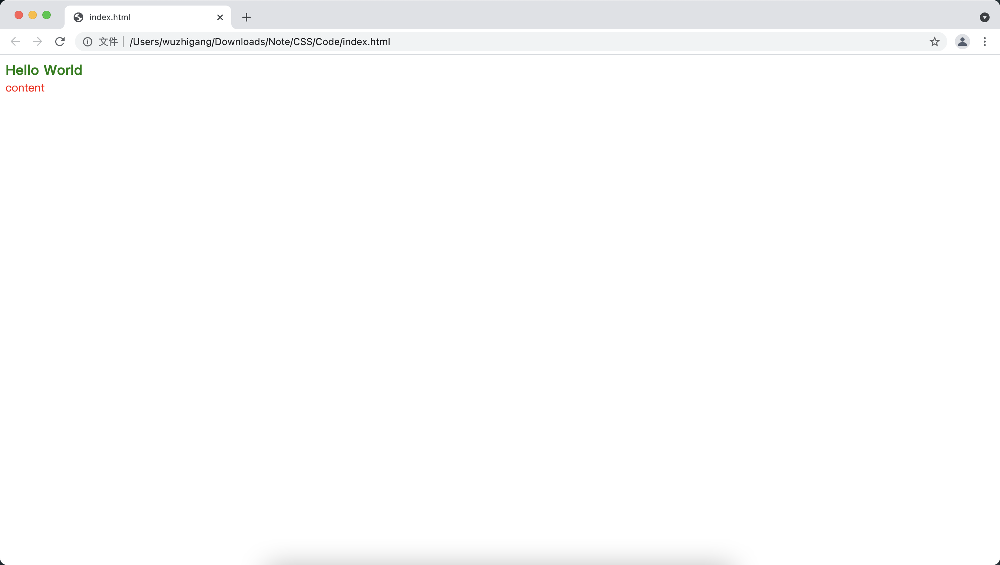
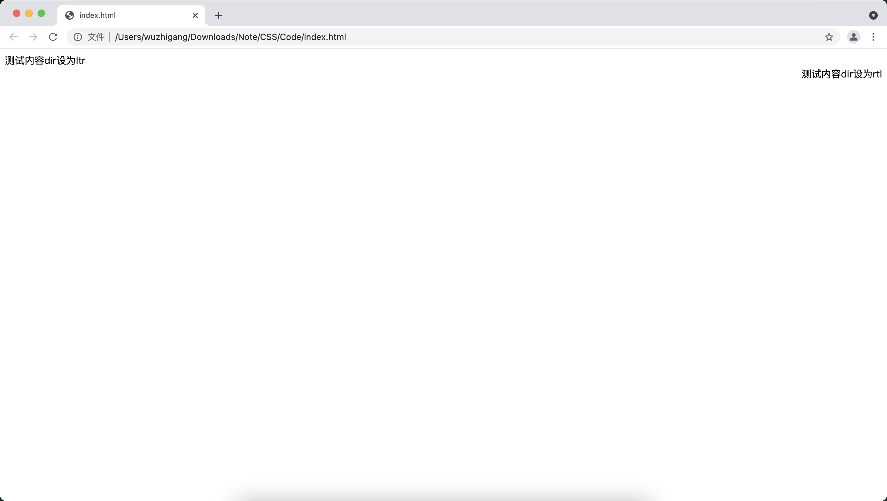
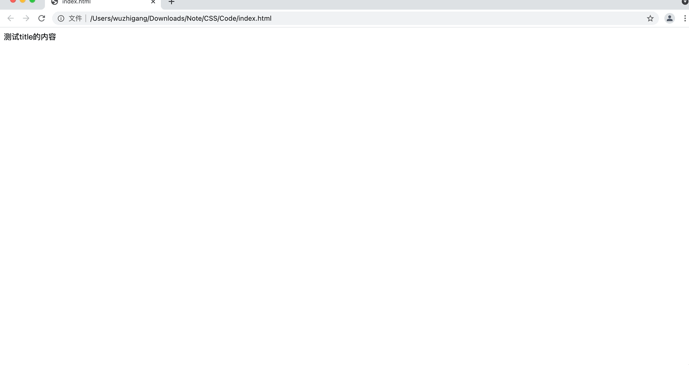

[toc]

# HTML5保留的通用属性
## id、style、class属性

+ <font color=orange>**id属性：**</font> 用于为 HTML 元素指定唯一标识，当程序使用 JavaScript 编程时即可通过该属性值来获取该 HTML 元素
+ <font color=orange>**style属性：**</font> 用于为 HTML 元素指定 CSS 样式
+ <font color=orange>**class属性：**</font> 用于匹配 CSS 样式的 class 选择器

```html
<!DOCTYPE html>
<html>
<head>
    <meta charset="UTF-8">
    <title></title>
    <style>
        .content {
            color: red;
        }
    </style>
</head>
<body>
    <div id="header" style="color: green;font-weight: bold;font-size: 20px;"></div>
    <div class="content">content</div>
    <script>
        document.getElementById("header").innerHTML = "Hello World"
    </script>
</body>
</html>
```



## dir属性

&emsp;&emsp;对于大部分 HTML 元素而言，dir 属性用于设置元素中内容的排列方向。该属性支持 <font color=orange>**ltr（内容从左到右）**</font> 和 <font color=orange>**rtl（内容从右到左）**</font> 排列：

```html
<!DOCTYPE html>
<html>
<head>
    <meta charset="UTF-8">
    <title></title>
    <style>
        .content {
            color: red;
        }
    </style>
</head>
<body>
    <div dir="ltr">测试内容dir设为ltr</div>
    <div dir="rtl">测试内容dir设为rtl</div>
</body>
</html>
```



## title属性

&emsp;&emsp;title 属性用于为 HTML 元素指定额外信息，通常鼠标移动到元素上面时，浏览器会显示 title 属性所指向的内容：

```html
<!DOCTYPE html>
<html>
<head>
    <meta charset="UTF-8">
    <title></title>
    <style>
        .content {
            color: red;
        }
    </style>
</head>
<body>
    <div title="测试内容">测试title的内容</div>
</body>
</html>
```



## lang属性

&emsp;&emsp;通过设置 lang 属性来告诉浏览器和搜索引擎：网页或网页中元素的内容所使用的语言，该属性的属性值应该是符合标准的语言代码，比如<font color=green> **zh代表中文、en代表英语等**</font>：

```html
<!DOCTYPE html>
<html lang="en">
<head>
    <meta charset="UTF-8">
    <title></title>
</head>
<body>
    <div lang="zh">测试title的内容</div>
</body>
</html>
```

## accesskey属性

&emsp;&emsp;当 HTML 页面中有多个元素时，可以通过 accesskey 属性指定激活该元素的快捷键，这样用户通过键盘快捷键就可以激活对应的 HTML 元素：

```html
<!DOCTYPE html>
<html lang="en">
<head>
    <meta charset="UTF-8">
    <title></title>
</head>
<body>
    用户名：<input type="text" accesskey="u"><br data-tomark-pass>    密  码：<input type="text" accesskey="p">
</body>
</html>
```

&emsp;&emsp;指定了 accesskey 属性之后，用户只要按下<font color=orange> **"Alt + 快捷键"** </font>即可激活元素。

## tabindex属性

&emsp;&emsp;当用户浏览网页时，可通过按键盘上的 Tab 键来不断切换窗口或页面中的 HTML 元素来获得焦点，tabindex 属性则用于控制窗口、HTML元素获取焦点的顺序：

```html
<!DOCTYPE html>
<html lang="en">
<head>
    <meta charset="UTF-8">
    <title></title>
</head>
<body>
    用户名：<input type="text" tabindex="2"><br data-tomark-pass>    密  码：<input type="text" tabindex="1">
</body>
</html>
```

&emsp;&emsp;如果将 HTML 元素的 tabindex 属性值设为-1，这样就可以避免用户按下Tab键时让这些元素获取焦点，同时又可以在脚本中让这些元素获得焦点。

# HTML5新增的通用属性
## contentEditable属性

&emsp;&emsp;HTML5 为大部分 HTML 元素添加了 contentEditable 属性，如果将该属性设置为true，那么浏览器会允许开发者直接编辑该HTML元素里的内容（此处的HTML并不是指那些原本就允许用户输入的表单元素）。contentEditable 属性具有可继承的特点：如果一个HTML元素的父元素是可编辑的，那么它默认也是可编辑的，除非显式指定<font color=orange> **contentEditable="false"** </font>。HTML5为允许设置 contentEditable 属性的元素提供了<font color=orange> **isContentEditable** </font>属性，当该元素处于可编辑状态时，该属性返回true；否则返回false：

```html
<!DOCTYPE html>
<html lang="en">
<head>
    <meta charset="UTF-8">
    <title></title>
</head>
<body>
   <div id="test" contenteditable="true">asdasdasdasdas</div>
   <script>
       document.getElementById("test").ondblclick = function() {
            this.contentEditable = !this.isContentEditable;
       }
   </script>
</body>
</html>
```

## designMode属性

&emsp;&emsp;designMode 属性相当于一个全局的 contenteditable 属性，如果把整个页面的 designMode 属性设置为 on，该页面上所有可支持 contenteditable 属性的元素都变成可编辑状态，该属性默认值为 false。在 JavaScript 代码中只能修改整个 HTML 页面的 designMode 属性：

```html
<!DOCTYPE html>
<html lang="en">
<head>
    <meta charset="UTF-8">
    <title></title>
</head>
<body ondblclick="document.designMode = 'on';">
   <div>asdasdasdasdas</div>
   <p>asdasdasdasdas</p>
</body>
</html>
```

## hidden属性

&emsp;&emsp;HTML5 为所有元素都提供了一个 hidden 属性，这个 hidden 属性支持 true、false 两个属性值，一旦把某个 HTML 元素的 hidden 设为 true，就意味着浏览器不显示该组件，也不会保留该组件所占用的空间：

```html
<!DOCTYPE html>
<html lang="en">
<head>
    <meta charset="UTF-8">
    <title></title>
</head>
<body>
   <div id="target">aaaa</div>
   <button onclick="var target = document.getElementById('target');target.hidden = !target.hidden;">显示/隐藏</button>
</body>
</html>
```

## spellcheck属性

&emsp;&emsp;HTML 为 input、textarea 等元素添加了 spellcheck 属性，它的属性值是 boolean 类型，如果设置了该属性，浏览将会负责对用户输入的文本内容执行输入检查，如果检查不通过，浏览器会对拼错的单词进行提示：

```html
<!DOCTYPE html>
<html lang="en">
<head>
    <meta charset="UTF-8">
    <title></title>
</head>
<body>
   <textarea spellcheck="true" cols="30" rows="10"></textarea>
</body>
</html>
```

## contextmenu属性

&emsp;&emsp;用于为HTML元素设置上下文菜单，当用户在该元素上单击鼠标右键的时候会激发该菜单。（目前浏览器支持不是太好）。
