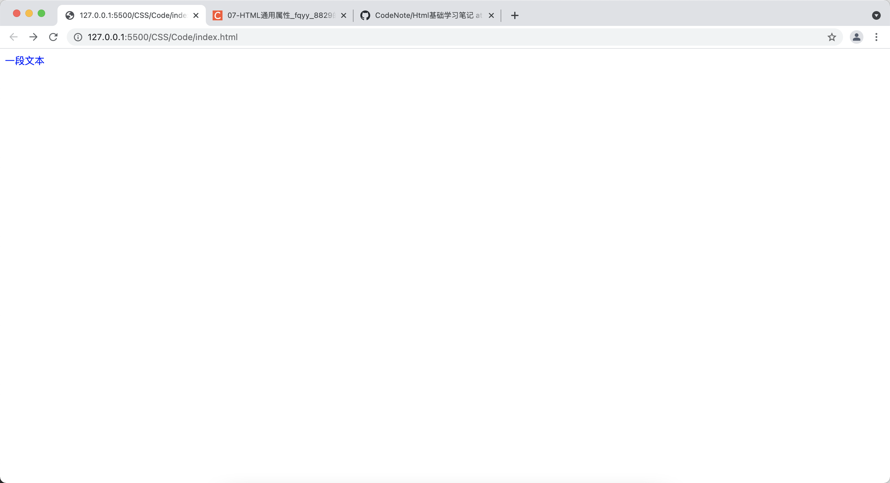
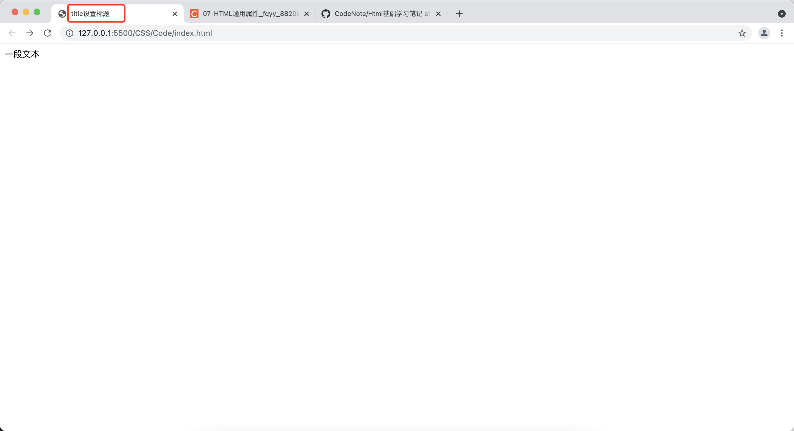

[toc]

# 概述

&emsp;&emsp;使用 head 元素可以定义 HTML 文档头，该元素可以包含以下子元素：

+ <font color=orange>**script：**</font> 该元素可以包含 JavaScript 脚本
+ <font color=orange>**noscript：**</font> 该元素用于向禁用了 JavaScript 脚本或不支持 JavaScript 脚本的浏览器显示提示信息
+ <font color=orange>**style：**</font> 该元素用于定义内部 CSS 样式
+ <font color=orange>**link：**</font> 该元素用于定义链接图标、 CSS 样式文件等各种外部资源
+ <font color=orange>**title：**</font> 该元素用于定义文档标题
+ <font color=orange>**base：**</font> 该元素用于指定该页面中所有链接的基准路径
+ <font color=orange>**meta：**</font> 该元素用于定义 HTML 页面的元数据

# link元素

&emsp;&emsp;link 元素用于链接图标、CSS 样式文件等各种外部资源，可以指定以下属性：

+ <font color=orange>**href：**</font> 指定所链接资源的 URL
+ <font color=orange>**hreflang：**</font> 该属性指定所链接资源的语言
+ <font color=orange>**media：**</font> 设置所链接的资源仅适用哪些设备

media属性值 | 说明
-|-
screen | 计算机屏幕
tty | 使用等宽字符的显示设备
tv | 电视机类型的显示设备（低分辨率、有限的滚屏能力）
projection | 投影仪
handheld | 小型手持设备
print | 打印页面或打印预览模式
embossed | 适用于凸点字符（盲文）的印刷设备
braille | 盲人点字法反馈设备
aural | 语音合成器
all | 全部设备

+ <font color=orange>**rel：**</font> 设置文档与所链接资源的关系，该属性设置的值会决定浏览器处理外部资源的方式

rel属性值 | 说明
-|-
alternate | 指明链接的文档是本文档的替代版本
author | 指定链接的文档是本文档的作者
copyright | 指定链接的文档是关于文本档的版权信息
help | 指定链接的文档是关于本文档的帮助
icon | 指定链接的图标是本文档的图标
license | 指定链接的文档是关于本文档的授权信息
prefetch | 指定用于预先加载资源
stylesheet | 指定链接的文档是外部样式单

+ <font color=orange>**sizes：**</font> 指定图标的大小，<font color=red>**仅当 rel 为 icon 时该属性才有效**</font>
+ <font color=orange>**type：**</font> 指定所链接资源的 MIME 类型

<font color=skyblue size=3>**1. 载入CSS样式单**</font>

&emsp;&emsp;首先准备一个外部的 css 文件：

```css
div {
    color: blue;
}
```

&emsp;&emsp;然后在 html 文件中引入 css 文件：

```html
<!-- 引入 index.css 文件-->
<html>
<head>
    <meta charset="UTF-8">
    <title></title>
    <link rel="stylesheet" href="./index.css">
</head>
<body>
    <div>一段文本</div>
</body>
</html>
```



<font color=skyblue size=3>**2. 定义页面的图标**</font>

```html
<html>
<head>
    <meta charset="UTF-8">
    <title>document</title>
    <link rel="icon" type="/image/x-icon" href="./moniqi.ico">
</head>
<body>
    <div>一段文本</div>
</body>
</html>
```


<font color=skyblue size=3>**3. 预先加载资源**</font>

```html
<!DOCTYPE html>
<html lang="en">
<head>
    <meta charset="UTF-8">
    <title></title>
    <link href="base.html" rel="prefetch" type="text/html">
</head>
<body>
   <a href="base.html">base</a>
</menu>
</body>
</html>
```

# base元素

&emsp;&emsp;base 元素必须是空元素，可以指定以下属性：

+ <font color=orange>**href：**</font> 指定所有链接的基准路径
+ <font color=orange>**target：**</font> 指定超链接默认在哪个窗口打开链接

```html
<!DOCTYPE html>
<html lang="en">
<head>
    <meta charset="UTF-8">
    <meta name="viewport" content="width=device-width, initial-scale=1.0">
    <title>base标签</title>
    <!-- 指定默认行为: 在本页面打开百度-->
    <base href="http://www.baidu.com" target="_self">
</head>
<body>
    <h3>默认行为: 在本页面打开百度</h3>
    <!-- 使用默认行为 -->
    <a href="">使用默认行为</a>

    <!-- 只改变打开方式 -->
    <a href="" target="_blank">只改变打开方式</a>

    <!-- 只改变地址 -->
    <a href="http://www.qq.com">只改变地址</a>

    <!-- 同时改变地址和打开方式 -->
    <a href="http://www.qq.com" target="_blank">同时改变地址和打开方式</a>
</body>
</html>
```


# meta元素

&emsp;&emsp;meta 用于定义页面元信息，定义元信息也就是指定一些 name-value 对，可以指定如下属性：

+ <font color=orange>**http-equiv：**</font> 指定元信息的名称，该属性指定的名称具有特殊意义，它可以向浏览器传回一些有用的信息，帮助浏览器正确的处理网页内容
+ <font color=orange>**name：**</font> 指定元信息的名称
+ <font color=orange>**content：**</font> 指定元信息的内容
+ <font color=orange>**charset；**</font> 指定页面的字符集

> <font color=red>**注意：**</font> http-equiv 和 name 属性的作用基本相同，只是 http-equiv 属性值通常规定为应该是浏览器可以识别的、具有特殊意义的名称。

```html
<head>
    <meta charset="utf-8">
    <meta name="author" content="Jack">
</head>
```

&emsp;&emsp;http-equiv 属性支持的值主要有以下几个：

+ <font color=orange>**expires：**</font> 指定网页的过期时间，一旦网页过期，必须重新从服务器上下载

```html
<meta http-equiv="expires" content="Sat Sep 27 16:12:36 CST 2008">
```

+ <font color=orange>**pragma：**</font> 指定禁止浏览器从本地磁盘缓冲中获取该页面内容，浏览器一旦离开该网页就无法脱机访问该页面

```html
<meta http-equiv="pragma" content="no-cache">
```

+ <font color=orange>**refresh：**</font> 指定浏览器多长时间后自动刷新指定页面

```html
<meta http-equiv="refresh" content="2">
<meta http-equiv="refresh" content="2;URL=http://www.baidu.com">
```

+ <font color=orange>**set-cookie：**</font> 设置Cookie，如果网页过期，那么客户端上的Cookie也将被删除

```html
<meta http-equiv="set-cookie" content="name=value,expires=Sat Sep 27 16:12:36 CST 2008,path=/">
```

+ <font color=orange>**content-type：**</font> 设置该页面的内容类型和所用的字符集

```html
<meta http-equiv="content-type" content="text/html; charset=utf-8">
```

# script 元素

&emsp;&emsp;首先定义一个外部的 js 文件：

```javascript
window.onload = function() {
    document.getElementById("box").style.backgroundColor = "red"
}
```

&emsp;&emsp;通过 html 调用外部的 js 文件：

```html
<html>
<head>
    <meta charset="UTF-8">
    <title>document</title>
    <script src="./index.js"></script>
</head>
<body>
    <div id="box">一段文本</div>
</body>
</html>
```


# style 元素

```html
<html>
<head>
    <meta charset="UTF-8">
    <title>document</title>
    <style>
        #box {
            background-color: red;
        }
    </style>
</head>
<body>
    <div id="box">一段文本</div>
</body>
</html>
```


# title 元素

```html
<html>
<head>
    <meta charset="UTF-8">
    <title>title设置标题</title>
</head>
<body>
    <div id="box">一段文本</div>
</body>
</html>
```


