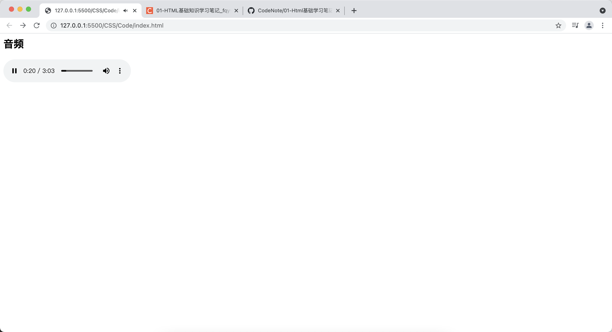
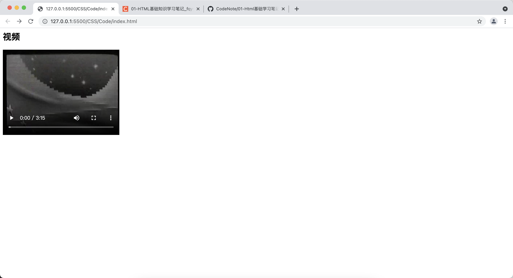

[toc]

# 使用 audio 和 video 元素
## 基本用法

&emsp;&emsp;使用 audio 元素播放音频：

```html
<html>
<head>
    <meta charset="UTF-8">
    <title></title>
</head>
<body>
    <h2>音频</h2>
    <audio src="./johann_sebastian_bach_air.mp3" controls>不支持audio</audio>
</body>
</html>
```



&emsp;&emsp;当浏览器不支持 audio 元素的时候就会显示开始标签和结束标签之间放置的文本内容。

&emsp;&emsp;使用 video 播放视频：

```html
<html>
<head>
    <meta charset="UTF-8">
    <title></title>
</head>
<body>
    <h2>视频</h2>
    <video src="./Intermission-Walk-in_512kb.mp4" controls>不支持audio</video>
</body>
</html>
```



&emsp;&emsp;当浏览器不支持 video 元素的时候就会显示开始标签和结束标签之间放置的文本内容。

## 相关属性

&emsp;&emsp;audio 和 video 元素支持的属性如下：

+ <font color=orange>**src：**</font> 指定播放的音视频的 URL 地址
+ <font color=orange>**autoplay：**</font> 如果设置为 true，当音视频装载完成后会自动播放
+ <font color=orange>**controls：**</font> 如果设置为 true，播放音视频时显示播放控制条
+ <font color=orange>**loop：**</font> 如果设置为 true，音视频播放完后会再次重复播放
+ <font color=orange>**preload：**</font> 该属性指定是否预加载音视频，如果指定了 autoplay 属性，该属性会被忽略
  + <font color=orange>**auto：**</font> 预加载音视频
  + <font color=orange>**metadata：**</font> 只预加载音视频元数据，如媒体字节数、第一帧、播放列表、持续时间等
  + <font color=orange>**none：**</font> 不预加载 
+ <font color=orange>**poster：**</font> 只对 video 有效，该属性指定一张图片的 URL 地址，在视频下载完成、开始播放之前，该元素将会显示该属性所指定的图片。当视频不可播放的时候也显示这张图片
+ <font color=orange>**width：**</font> 只对 video 有效，指定视频播放器的宽度
+ <font color=orange>**height：**</font> 只对 video 有效，指定视频播放器的高度

## source 元素

&emsp;&emsp;考虑到各浏览器对音视频的支持互不相同，开发者可能希望为 audio 元素、video 元素指定多个媒体源，此时可以借助 <font color=orange>**source**</font> 子元素来实现，它有两个重要的属性：

+ <font color=orange>**src：**</font> 该属性指定音视频文件的 URL 地址
+ <font color=orange>**type：**</font> 该属性指定音视频文件的类型，该属性值既可以是简单的MIME字符串（<font color=green>*__audio/ogg、audio/mpeg__*</font> 等），也可以是MIME字符串并带codecs属性，codecs属性用于指定该音视频文件的编码格式（<font color=green>*__audio/ogg;codecs'vobis'__*</font>）。指定codecs属性可以提供更多信息，便于浏览器判断是否能播放此种类型的音视频

> <font color=red>**注意：**</font> 一般推荐为 source 指定 type 属性，否则浏览器为判断音视频文件的类型必须先下载一小段音视频，这样就会浪费网络流量。

```html
<html>
<head>
    <meta charset="UTF-8">
    <title></title>
</head>
<body>
    <audio controls>
        <source src="./johann_sebastian_bach_air.ogg" type="audio/ogg">
        <source src="./johann_sebastian_bach_air.mp3" type="audio/mpeg">
    </audio>
</body>
</html>
```

&emsp;&emsp;对于上面页面代码来说，只要浏览器支持 audio 元素，无论浏览器是支持 OGG Vobis 压缩格式，还是 MP3 压缩格式，该浏览器总可以找到合适的音频文件。

## 使用 JavaScript 脚本控制媒体播放
### HTMLAudioElement 与 HTMLVideoElement

&emsp;&emsp;在脚本中获取 audio 元素对应的对象为 HTMLAudioElement 对象，video 元素对应的对象为 HTMLVideoElement 对象，支持的方法如下：

+ <font color=orange>**play()：**</font> 播放音视频
+ <font color=orange>**pause()：**</font> 暂停播放
+ <font color=orange>**load()：**</font> 重新装载音视频文件
+ <font color=orange>**canPlayType(type)：**</font> 判断该元素是否可播放 type 类型的音视频，该属性指定该音视频文件的类型，该方法返回如下 3 个值：
  + <font color=orange>**probably：**</font> 该浏览器支持播放此种类型的音视频
  + <font color=orange>**maybe：**</font> 该浏览器可能支持播放此种类型的音视频
  + <font color=orange>**空字符串：**</font> 该浏览器不支持播放此种类型的音视频

```html
<!DOCTYPE html>
<html lang="en">
<head>
    <meta charset="UTF-8">
    <title></title>
    <script>
        // 定义能播放的所有音乐
        var musics = [
            "demo1.ogg",
            "demo2.ogg",
            "demo3.ogg"
        ]
        // 定义正在播放的索引
        var index = 0;
        // 记录随机播放、顺序播放的变量
        var playType;
        window.onload = function(){
            var typeSel = document.getElementById("typeSel");
            typeSel.onchange = function(){
                window.playType = typeSel.value;
            }
            var player = document.getElementById("player");
            player.src = musics[index];
            player.onended = function(){
                if (playType == "random") {
                    index = Math.floor(Math.random() * musics.length);
                    player.src = musics[index];
                }
                else {
                    player.src = musics[++index % musics.length];
                }
            }
            player.play();
        }
    </script>
</head>
<body>
    <h2>音乐播放器</h2>
    <select id="typeSel" style="width: 160px;">
        <option value="random">随机播放</option>
        <option value="sequence">顺序播放</option>
    </select><br/>    
    <audio id="play" controls>
        您的浏览器不支持audio元素
    </audio>
</body>
</html>
```

&emsp;&emsp;通过 HTMLAudioElement 与 HTMLVideoElement 的属性可以了解状态，主要属性如下表：

属性名 | 只读 | 意义
-|-|-
buffered | 是 | 该属性返回一个 TimeRanges 对象，通过该对象可以获取浏览器已经缓存的媒体数据
currentSrc | 是 | 返回播放器正在播放的音视频文件的 URL 
currentTime | 否 | 返回播放器正在播放的音视频文件所处的时间点，以秒为单位
defaultPlaybackRate | 否 | 该属性返回 HTMLAudioElement 或 HTMLVideoElement 对象默认播放速度，可以通过脚本来修改
duration | 是 | 音视频的持续时间，以秒为单位
ended | 是 | 当播放结束范围 true，否则返回 false
error | 是 | 在读取音视频正常的情况下，返回 null。只要出现错误就返回 MediaError 对象，该对象的 code 属性代表错误状态：MEDIA_ERR_ABORTED（数值1，媒体下载过程中被终止）、MEDIA_ERR_NETWORK（数值2，下载媒体资源时由于网络原因被中断）、MEDIA_ERR_DECODE（数值3，媒体下载完成，但是尝试对媒体解码时出现错误）、MEDIA_ERR_NOT_SUPPORTED（数值4，媒体资源不可用或当前浏览器不支持该媒体格式）
muted | 否 | 该属性返回播放器是否处于静音状态，可以通过脚本来修改 
networkState | 是 | 获取下载音视频的网络状态：NETWORK_EMPTY（数值0，处于初始状态）、NETWORK_IDLE（数值1，处于空闲状态，还未建立网络连接）、NETWORK_LOADING（数值2，正在加载音视频数据）、NETWORK_NO_SOURCE（数值3，媒体资源不可用或当前浏览器不支持该媒体格式，不执行加载）
paused | 是 | 是否处于暂停状态
playbackRate | 否 | 该属性返回 HTMLAudioElement 或 HTMLVideoElement 对象当前播放速度，可以通过脚本来修改
played | 是 | 该属性返回一个 TimeRanges 对象，通过该对象可以获取音视频已经播放部分的时间段，开始时间为已经播部分的开始时间，结束时间为已播部分的结束时间
readyState | 是 | 返回音视频文件的准备状态，可能返回如下几个属性值：HAVE_NOTHING（数值0，还没有得到音视频的任何数据）、HAVE_MEtADATA（数值1，已经获取到音视频元数据，但是还没有获取到媒体数据，还不能播放）、HAVE_CURRENT_DATA（数值2，已经获取到当前播放位置的媒体数据，但是还没有获取到继续播放的媒体数据。对于视频来说，也就是已经获取当前帧的数据，但是还没有获取下一帧的数据，或者当前帧已经是最后一帧）、HAVE_FUTURE_DATA（数值3，已经获取到当前播放位置的媒体数据，也获取到下一个位置的播放数据。对于视频来说，也就是已经获取当前帧的数据，也获取下一帧的数据，如果当前正处于最后一帧，不会返回该结果）、HAVE_ENOUGH_DATA（数值4，已经获取足够的媒体数据，可以顺利向下播放）
seelable | 是 | 该属性返回一个 TimeRanges 对象，通过该对象可以获取音视频定位的时间段。一般来说，可定位的开始时间是该音视频的开始时间；可定位的结束时间就是该音视频的结束时间
seeking | 是 | 该属性返回播放器是否正在尝试定位到指定时间点，返回 true 表示播放器正在定位
startTime | 是 | 该属性范围播放器播放音视频的开始时间，通常为 0
volume | 否 | 返回播放的音量，可以通过脚本修改

&emsp;&emsp;关于 TimeRanges 对象，这是一个类似数组的对象，可能包含多个时间段（实际上通常只包含一个），提供了<font color=orange> **length** </font>属性查看包含多少个时间段，还提供了两个方法：

+ <font color=orange>**start(index)：**</font> 返回第 index+1 个时间段的开始时间，如果获取的是第一个时间段的开始时间，index 参数设为 0
+ <font color=orange>**end(index)：**</font> 返回第 index + 1 个时间段的结束时间，如果获取的是第一个时间段的结束时间，index 参数设为 0

### 事件监听

&emsp;&emsp;常见的事件如下：

事件名 | 说明
-|-
onabort | 当播放器还未下载完媒体数据而被中止下载时触发
oncanplay | 当播放器目前能播放音视频，但播放中间可能需要缓冲时触发该事件
oncanplaythrough | 当播放器目前能播放音视频，而且播放中间不需要缓冲时触发
ondurationchange | 当音视频的长度改变时触发
onemptied | 当音视频元素突然为空（网络错误、加载错误等）触发
onended | 当音视频播放结束时触发
onerror | 记载音视频出错时触发
onloadeddata | 播放器加载音视频的媒体数据完成后触发
onloadedmetadata | 播放加载音视频的元数据完成后触发
onloadstart | 播放器开始加载音视频时触发
onpause | 暂停播放音视频时触发
onplay | 即将开始播放音视频时触发
onplaying | 正在播放音视频时触发
onprogress | 播放器正在加载音视频数据时触发
onratechange | 当播放速度改变时触发
onreadystatechange | 当播放器的 readystate 状态发生改变时触发
onseeked | 已经成功定位到音视频的指定位置，且 seeking 属性为 false 是触发
onseeking | 当 seeking 变为 true（尝试定位音视频指定位置）的时候触发
onstalled | 播放器获取音视频数据的过程中（延迟）发生错误时触发
onsuspend | 播放器并未取得全部音视频数据之前中途停止时触发
ontimeupdate | 当播放完位置发生改变时触发该事件，可能原因：播放过程中自然改变、人为拖动导致播放位置改变、播放不连续导致时间跳跃
onvolumechange | 当播放器的音量被改变时触发
onwaiting | 播放过程中由于暂时得不到下一帧数据而暂停时触发

```html
<body>
    <h2>视频播放器</h2>
    <video src="movie.webm" id="mv" loop>您的浏览器不支持</video>
    <input type="button" value="播放" id="bn"><span id="detail"></span>秒
    <script>
        var bn = document.getElementById("bn");
        var mv = document.getElementById("mv");
        var detail = document.getElementById("detail");
        mv.ontimeupdate = function(){
            detail.innerHTML = mv.currentTime + '/' + mv.duration;
        }
        bn.onclick = function(){
            if (mv.paused){
                mv.play();
                bn.value="暂停";
            } else {
                mv.pause();
                bn.value="播放";
            }
        }
    </script>
</body>
```

# track元素

&emsp;&emsp;HTML5 新增了 track 元素，该元素可以从文本文件中加载字幕，添加到视频的播放界面上。track 元素可以加载 WebVTT 文件的内容，用于为视频添加字幕、章节标题或元数据等附加信息，WebVTT 文件包含了一系列带时间标记的文本内容，这些时间标记控制文本内容的出现位置。

&emsp;&emsp;track 通常是一个空元素，通常放在 video 元素内，如果使用了 source 元素，则 track 元素应该放在 souce 元素之后。

```html
<body>
    <h2>视频播放器</h2>
    <video id="video" controls>
        <source src="movie.webm">
        <track id="track" src="content.vtt" kind="subtitles" default>
    </video>
</body>
```

&emsp;&emsp;下面是content.vtt文件的内容：

```
WEBVTT FILE

1
00:00:02.100 --> 00:00:08.334
<b>第一段内容</b>

2
00:00:16.100 --> 00:00:18.334
<b>第二段内容</b>

3
00:00:20.100 --> 00:00:28.334
第三段内容
```

&emsp;&emsp;第一行以<font color=orange> **WEBVTT FILE** </font>开头，表示它是一个 WebVTT 文件，接下来是一条条字幕信息，多条字幕之间用空行隔开，每条字幕信息由三个部分组成：

+ 字幕信息ID：ID独占一行
+ 字幕的开始时间和结束时间：开始时间和结束时间独占一行
+ 字幕的内容：可以有多行字幕内容

&emsp;&emsp;每条字幕信息应该满足如下格式：

```
[id]
[hh...:]mm:ss.msmsms --> [hh...:]mm:ss.msmsms [settings]
第一行字幕
第二行字幕
...
```

&emsp;&emsp;<font color=orange>**[id]** </font>是可选的，但是为字幕信息指定 id 之后，在 JavaScript 中就可以更有效的访问这些字幕信息了。

&emsp;&emsp;每条字幕信息中由<font color=orange>**[hh...:]mm:ss.msmsms --> [hh...:]mm:ss.msmsms** </font>时间段控制这些字幕出现的实现，其中小时部分可以省略，代表0小时。

&emsp;&emsp;每条字幕信息第一行的 settings 也可以省略，settings 用于控制字幕信息的位置：

设置 | 支持的值 | 说明
-|-|-
vertical | rl或lr | 垂直对齐文字或右对齐文字
line | 整数值或百分比 | 当整数值的时候表示设置字母出现在视频的第几行，正数表示从顶部开始，负数表示从底部开始；百分比的时候表示相对于视频顶部的百分之多少的位置
position | 百分比 | 设置字幕开始出相对于视频边沿的百分比位置
size | 百分比 | 设置字幕边框的宽度占视频宽度的百分比
align |  start、middle、end | 设置字幕的对齐方式，分别是左上、居中、右下

```
1
00:00:02.100 --> 00:00:08.334 align:start line:-5
<b>第一段内容</b>
```

&emsp;&emsp;WebVTT 文件中的字幕内容除了可以是简单的文本内容外，还可以添加一些简单的标记，这些标记和 HTML 元素类似，用于为字幕内容添加一些语义和样式：

标记 | 作用
-|-
i | 设置斜体字
b | 设置粗体字
u | 设置下划线
ruby |类似于HTML5的ruby的元素，通过该标记，允许添加一个或多个rt子元素
c | 用于匹配CSS样式中的class选择器，例如：&lt;c.fkClass&gt;字幕内容&lt;/c&gt;表示该字幕内容应用fkClass类选择器对应的CSS样式
v | 通常用于指定这段字幕是谁说的，如&lt;v 孙悟空&gt;妖怪!&;lt;/v7gt;表示这段文本是孙悟空说的，v仅仅是一个语义标记，并不会在视频上显示出来

```
1
00:00:02.100 --> 00:00:08.334 align:start line:-5
<v 大傻><b><i>二狗子</i></b>,<c.em>来耍一会啊~~~</c></v>
```

> <font color=red>**注意：**</font> 兼容性的问题。

# embed 和 object

&emsp;&emsp;embed 和 object 都表示能够嵌入一些多媒体，如 flash动画、插件等。基本上使用时没有区别的，主要是为了兼容不同的浏览器：

```html
<!DOCTYPE html>
<html lang="en">
<head>
    <meta charset="UTF-8">
    <meta http-equiv="X-UA-Compatible" content="IE=edge">
    <meta name="viewport" content="width=device-width, initial-scale=1.0">
    <title>Document</title>
    <style>
     
    </style>
</head>
<body>
    <embed src="./img2/flash.swf" type="">
</body>
</html> 
```

&emsp;&emsp;object 需要配合 param 元素使用：

```html
<!DOCTYPE html>
<html lang="en">
<head>
    <meta charset="UTF-8">
    <meta http-equiv="X-UA-Compatible" content="IE=edge">
    <meta name="viewport" content="width=device-width, initial-scale=1.0">
    <title>Document</title>
    <style>
     
    </style>
</head>
<body>
    <object>
        <param name="movie" value="./img2/flash.swf">
    </object>
</body>
</html> 
```
