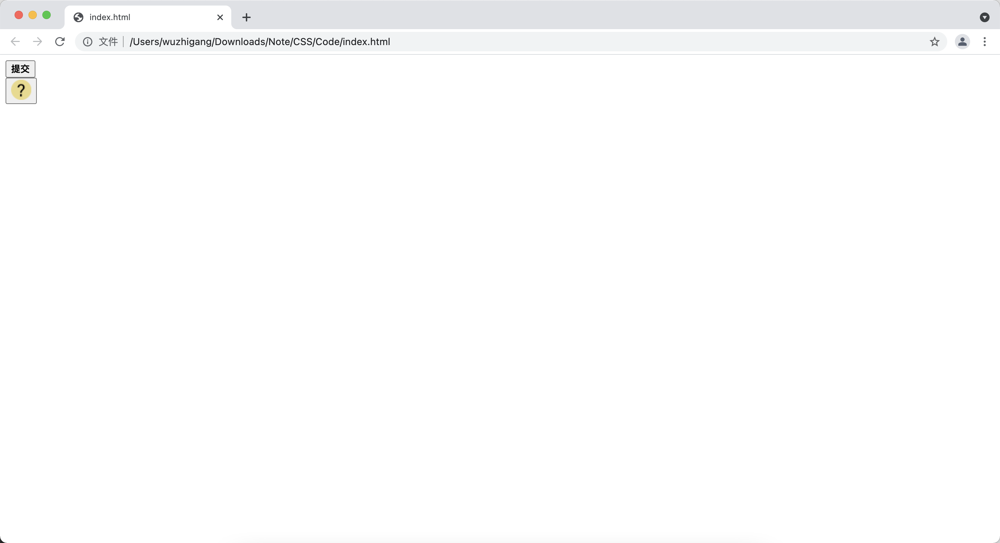

[toc]

# HTML 原有的表单及表单控件
## form 元素

&emsp;&emsp;form 元素用于生成输入表单，该元素不会生成可视化部分。在 HTML5 之前，其它表单控件，如：单行文本框、多行文本域、单选按钮、复选框等都需要放在 form 元素之内。form 元素主要的属性如下：

+ <font color=orange>**action：**</font> 指定当单击表单内的确认按钮时候，表单被提交到哪个地址，可以是绝对地址或相对地址，该属性必填
+ <font color=orange>**method：**</font> 指定提交表单时发送何种类型的请求，可以为<font color=green> **post 或 get** </font>
+ <font color=orange>**enctype：**</font> 指定对表单内容进行编码所使用的字符集
+ <font color=orange>**name：**</font> 指定表单的唯一名称，建议该属性值与 id 值保持一致
+ <font color=orange>**target：**</font> 指定使用哪种方式打开目标URL（<font color=green> **\_self、\_parent、\_blank、\_top** </font>）

> <font color=red>**Get 方式的请求和 POST 方式请求的区别：**</font>
> + <font color=orange>**Get：** </font>直接在浏览器地址栏中输入访问地址所发送的请求，或提交表单发送请求时，该表单对应的 form 没有设置 method 或设置为 get 的时候的请求。get 方式的请求会将请求参数名和值转换成字符串，并附加在 URL 之后，因此可以在地址栏中看到请求参数名和值。Get 请求传送的数据量较小，一般不能大于 2KB
> + <font color=orange>**POST：** </font>通常使用表单的方式来发送，并且需要设置 form 元素的 method 属性为 post。POST 方式传送的数据量较大，通常认为是不受限制的，但这往往取决于服务器的限制。POST 请求参数以对应的值放在 HTML HEADER 中，用户不能在地址栏里看到请求参数值，安全性相对较高

&emsp;&emsp;表单的 enctype 属性用于指定表单数据的编码方式，该属性有如下 3 个值：

+ <font color=orange>**application/x-www-form-urlencoded：**</font> 这是默认的编码方式，它只处理表单空间里的 value 属性值，采用这种编码方式的表单会将表单控件的值处理成 URL 编码方式
+ <font color=orange>**multipart/form-data：**</font> 这种编码方式会以二进制流的方式来处理表单数据，这种编码方式会把文件域指定文件的内容也封装到请求参数里。当需要通过表单上传文件时使用该属性值
+ <font color=orange>**text/plain：**</font> 当表单的 action 属性值为 mailto:URL 的形式时使用这种编码方式比较方便，这种编码方式主要适用于直接通过表单发送邮件的方式

&emsp;&emsp;当在 form 元素里定义一个或多个表单控件时，一旦提交该表单，该表单里的表单控件将会转换成请求参数。关于表单控件转换成请求参数的规则如下：

+ 每个有 name 属性的表单控件对应一个请求参数，没有 name 属性的表单控件不会生成请求参数
+ 如果多个表单控件有相同的 name 属性，则多个表单控件只能生成一个请求参数，只是该参数有多个值
+ 表单控件的 name 属性指定请求参数名，value 属性指定请求参数值
+ 如果某个表单控件设置了 disabled 或 disabled="disabled" 属性，则该表单控件不再生成请求参数

## input元素

&emsp;&emsp;下面几种输入元素都是通过 input 元素生成的：

+ <font color=orange>**单行文本框：**</font> input的 *__type__* 属性设置为 <font color=green>*__text__*</font> 即可
+ <font color=orange>**密码输入框：**</font> input的 *__type__* 属性设置为 <font color=green>*__password__*</font> 即可
+ <font color=orange>**隐藏域：**</font> input的 *__type__* 属性设置为 <font color=green>*__hidden__*</font> 即可
+ <font color=orange>**单选框：**</font> input的 *__type__* 属性设置为 <font color=green>*__radio__*</font> 即可
+ <font color=orange>**复选框：**</font> input的 *__type__* 属性设置为 <font color=green>*__checkbox__*</font> 即可
+ <font color=orange>**图像域：**</font> input的 *__type__* 属性设置为 <font color=green>*__image__*</font> 即可
+ <font color=orange>**文件上传域：**</font> input的 *__type__* 属性设置为 <font color=green>*__file__*</font> 即可
+ <font color=orange>**提交、重设、无动作按钮：**</font> input的 *__type__* 属性分别设置为 <font color=green>*__submit、reset 或 button__*</font> 即可

&emsp;&emsp;常用的主要属性：

+ <font color=orange>**checked：**</font> 设置单选框、复选框初始状态是否处于选中状态，<font color=red>**只有当 type 属性为 checkbox 或 radio 的时候才能确定该属性**</font>
+ <font color=orange>**disabled：**</font> 设置首次加载时禁止此元素，<font color=red>**当 type 是 hidden 时不能指定该属性**</font>
+ <font color=orange>**maxlength：**</font> 指定文本框所允许输入的最大字符数
+ <font color=orange>**readonly：**</font> 指定该文本内的值不允许用户修改
+ <font color=orange>**size：**</font> 指定元素的宽度，<font color=red>**当 type 为 hidden 的时候没有意义**</font>
+ <font color=orange>**src：**</font> 指定图像域所显示图像的 URL，<font color=red>**只有 type 是 image 的时候才有效**</font>
+ <font color=orange>**width：**</font> 指定图像域所显示图像的宽度，<font color=red>**只有 type 是 image 的时候才有效**</font>
+ <font color=orange>**height：**</font> 指定图像域所显示图像的高度，<font color=red>**只有 type 是 image 的时候才有效**</font>

```html
<!DOCTYPE html>
<html lang="en">
<head>
    <meta charset="UTF-8">
    <title></title>
</head>
<body>
   <form action="#" method="GET">
       单行文本框：<input type="text" id="username" name="username"> <br>       
       不能编辑的文本框：<input type="text" id="username2" name="username2" readonly><br>       
       密码框：<input type="password" id="password" name="password"><br >       
       单选框：<br >       
       男性：<input type="text" name="gender" value="male" checked>
       女性：<input type="text" name="gender" value="female"><br >       
       隐藏域：<input type="hidden" name="hidden"><br>       复选框：<br>       
       足球：<input type="checkbox" name="hab" value="football" checked>
       篮球：<input type="checkbox" name="hab" value="basketball"><br>       
       文件上传域：<input type="file" name="file"><br>      
       图像域：<input type="image" width="40" height="40" src="01.png"><br >       
       <input type="submit" value="提交">
       <input type="submit" value="提交" disabled>
       <input type="reset" value="重填">
       <input type="button" value="无动作">
   </form>
</body>
</html>
```


## 使用label定义标签

&emsp;&emsp;label 用于定义表单中的标签，这些标签可以对其它可生成请求参数的表单控件进行说明。让标签和表单控件关联的两种方法：

+ <font color=orange>**隐式使用for属性：**</font> 指定 label 的 for 属性值为所关联表单控件的 id 属性值
+ <font color=orange>**显式关联：**</font> 将普通文本、表单控件一起放在 label 元素内部即可

```html
<!DOCTYPE html>
<html lang="en">
<head>
    <meta charset="UTF-8">
    <title></title>
    
</head>
<body>
    <!-- 方法一 -->
    <label>
        姓名：<input type="text" name="username" id="username">
    </label><br> 
    <!-- 方法二 -->
    <label for="password">密码：</label>
    <input type="password" name="password" id="password">
</body>
</html>
```


## 使用button定义按钮

&emsp;&emsp;button 元素用于定义一个按钮，在 button 元素的内部可以包含普通文本、文本格式化标签、图像等内容，与 &lt;input type="button"&gt; 相比提供了更强大的功能和更丰富的内容。可以指定以下几个主要的属性：

+ <font color=orange>**disabled：**</font> 是否禁用此按钮
+ <font color=orange>**name：**</font> 指定该按钮的唯一名称，该属性值应该和 id 保持一致
+ <font color=orange>**type：**</font> 指定按钮属于哪种按钮，支持<font color=green> **button、reset、submit** </font>
+ <font color=orange>**value：**</font> 指定初始值

```html
<!DOCTYPE html>
<html lang="en">
<head>
    <meta charset="UTF-8">
    <title></title>
    
</head>
<body>
    <button type="button">
        <b>提交</b>
    </button><br>    
    <button type="submit"></button>
</body>
</html>
```



## select与option元素

&emsp;&emsp;select 用于创建列表框或下拉菜单，该元素必须和 option 元素结合使用，每一个 option 元素代表一个列表项或菜单项。select 本身不包含 value 属性，对应的参数由 option 元素来生成。除此之外，select 包含的几个主要的属性：

+ <font color=orange>**disabled：**</font> 设置禁用该列表框和下拉菜单
+ <font color=orange>**multiple：**</font> 设置是否允许多选
+ <font color=orange>**size：**</font> 指定同时可以显示多少个列表项，一旦设置该属性，select 元素就会自动生成列表框

> <font color=red>**注意：**</font> 生成列表框还是下拉菜单，由 size 或 multiple 属性来决定，只要设置了其中的一个，就会生成列表框，否则生成下拉菜单（ size 还是单选，multiple 是可以多选的 ）。

&emsp;&emsp;select 只能包含下面两个子元素：

+ <font color=orange>**option：**</font> 用于定义列表框选项或下拉菜单项
  + <font color=orange>**disabled：**</font> 禁用该选项
  + <font color=orange>**selected：**</font> 初始状态是否处于选中状态
  + <font color=orange>**value：**</font> 该选项对应的请求参数值
+ <font color=orange>**optgroup：**</font> 用于定义列表项或菜单项组，该元素只能包含 option 子元素
  + <font color=orange>**label：**</font> 指定该选项组的标签，该属性必填
  + <font color=orange>**disabled：**</font> 设置禁用该选项组里的所有选项

```html
<!DOCTYPE html>
<html lang="en">
<head>
    <meta charset="UTF-8">
    <title></title>
    
</head>
<body>
    下面是简单的下拉菜单：<br>    
    <select name="skills" id="skills">
        <option value="java">Java语言</option>
        <option value="c">C语言</option>
        <option value="C#">C#语言</option>
    </select><br>    
    下面是允许多选的列表框：<br>    
    <select name="books" id="books" multiple>
        <option value="sg">三国演义</option>
        <option value="sh">水浒传</option>
        <option value="xy">西游记</option>
        <option value="hl">红楼梦</option>
    </select>
    下面是允许多选的列表框：<br>    
    <select name="bklist" id="bklist" multiple size="6">
        <optgroup label="技术">
            <option value="c++">C++深入浅出</option>
            <option value="c">C深入浅出</option>
        </optgroup>
        <optgroup label="小说">
            <option value="sg">三国演义</option>
            <option value="sh">水浒传</option>
        </optgroup>
    </select>
</body>
</html>
```


## HTML 5增强的 textarea

&emsp;&emsp;textarea 元素用于生成多行文本域，它有以下几个重要属性：

+ <font color=orange>**cols：**</font> 指定文本域的宽度
+ <font color=orange>**rows：**</font> 指定文本域的高度
+ <font color=orange>**disabled：**</font> 指定禁用该文本域
+ <font color=orange>**readonly：**</font> 指定文本域只读
+ <font color=orange>**maxlength：**</font> 设置该行文本域最多可以输入的字符数
+ <font color=orange>**wrap：**</font> 指定多行文本域是否添加换行符，支持 **soft** 和 **hard** 两个属性值，指定hard属性值时必须指定cols属性，如果用户输入的字符超过了cols指定的宽度导致文本换行，那么提交该表单时该多行文本域将会自动在换行处添加换行符（注意浏览器的支持度）

```html
<!DOCTYPE html>
<html lang="en">
<head>
    <meta charset="UTF-8">
    <title></title>
</head>
<body>
    <textarea name="txt1" id="txt1" cols="20" rows="2"></textarea>
</body>
</html>
```


## fieldset与legend元素

&emsp;&emsp;fieldset 元素用于对表单内表单元素进行分组，如果将一组表单元素放在 fieldset 元素内，浏览器会以特殊的方式来显示它们，它们可能有特殊的边界效果。该元素的主要属性：

+ <font color=orange>**name：**</font> 指定元素的名称
+ <font color=orange>**form：**</font> 该属性的属性值必须是一个有效的 form 元素的id，用于指定 fieldset 属性该指定表单
+ <font color=orange>**disabled：**</font> 该属性用于禁用该组表单元素

&emsp;&emsp;legend 元素应该放在 fieldset 元素内，用于为 fieldset 元素设置标题：

```html
<!DOCTYPE html>
<html lang="en">
<head>
    <meta charset="UTF-8">
    <title></title>
    
</head>
<body>
    <fieldset name="basic">
        <legend>用户基本信息</legend>
        用户名：<input type="text" name="username" id="username"><br>        
        密码：<input type="password" name="password" id="password">
    </fieldset>
    <fieldset name="extra">
        <legend>附加信息</legend>
        身高：<input type="text" name="tall" id="tall">
    </fieldset>
</body>
</html>
```


# HTML5新增的表单元素
## 功能丰富的input元素

&emsp;&emsp;HTML5 为 input 元素的 type 属性新增了如下几种类型：

+ <font color=orange>**color：**</font> 生成一个颜色选择器
+ <font color=orange>**date：**</font> 生成一个日期选择器
+ <font color=orange>**time：**</font> 生成一个时间选择器
+ <font color=orange>**datetime-local：**</font> 生成一个本地日期、时间选择器
+ <font color=orange>**week：**</font> 生成一个供用户选择第几周的文本框
+ <font color=orange>**month：**</font> 生成一个月份选择器
+ <font color=orange>**email：**</font> 生成一个 E-mail 输入框，浏览器会自动检查 value，如果用户输入的不符合 E-mail 格式，浏览器将不允许提交表单
  + <font color=orange>**multiple：**</font> 是否支持输入多个 email 地址，中间用英文逗号隔开
+ <font color=orange>**tel：**</font> 只能输入电话号码的文本框，浏览器不会做额外检查，但是手持设备的时候会有特殊的效果
+ <font color=orange>**url：**</font> 生成一个 URL 输入框，浏览器会自动检查 value，如果不是 URL 格式则不允许提交表单
+ <font color=orange>**number：**</font> 生成一个只能输入数值的文本框
  + <font color=orange>**min：**</font> 指定数值的最小值
  + <font color=orange>**max：**</font> 指定数值的最大值
  + <font color=orange>**step：**</font> 指定数值的步长
  + <font color=orange>**valueAsNumber：**</font> 该属性主要在 JavaScript 脚本中使用，用于获取该文本框输入的数值
+ <font color=orange>**range：**</font> 生成一个拖动条
  + <font color=orange>**min：**</font> 指定拖动条的最小值
  + <font color=orange>**max：**</font> 指定拖动条的最大值
  + <font color=orange>**step：**</font> 指定拖动条的步长
+ <font color=orange>**search：**</font> 生成一个专门用于输入搜索关键字的文本框，对手持设备有特殊的作用

&emsp;&emsp;当是时间、日期选择器的时候额外支持一下几个属性：

+ <font color=orange>**min：**</font> 指定日期、时间最小值
+ <font color=orange>**max：**</font> 指定日期、时间最大值
+ <font color=orange>**step：**</font> 指定日期、时间的步长
+ <font color=orange>**valueAsDate：**</font> 该属性主要在 JavaScript 中使用，用于获取从1970年1月1日0时0分0秒到该时间经过了多少毫秒

```html
<!DOCTYPE html>
<html lang="en">
<head>
    <meta charset="UTF-8">
    <title></title>
    
</head>
<body>
    color：<input type="color"><br>    
    date：<input type="date"><br>    
    time: <input type="time"><br>    
    datetime-local: <input type="datetime-local"><br>    month: <input type="month"><br>    
    week: <input type="week"><br>    
    email: <input type="email" multiple><br>    
    tel: <input type="tel"><br>    
    url: <input type="url"><br>   
    number: <input type="number" min="0" max="100" step="5"><br>    
    range: <input type="range" min="0" max="100" step="5"><br>    
    search: <input type="search">
</body>
</html>
```


## meter元素

&emsp;&emsp;该元素可用于表示一个已知最大值和最小值的计数仪表，可以指定以下属性：

+ <font color=orange>**value：**</font> 当前值，默认是0，可以指定浮点数
+ <font color=orange>**min：**</font> 最小值，默认是0，可以指定浮点数
+ <font color=orange>**max：**</font> 最大值，默认是1，可以指定浮点数
+ <font color=orange>**low：**</font> 指定计数仪表指定范围的最小值，该属性值必须大于等于min属性的值
+ <font color=orange>**high：**</font> 指定计数仪表指定范围的最大值，该属性值必须小于等于max属性的值
+ <font color=orange>**optimum：**</font> 指定计数仪表有效范围的最佳值，如果该值大于high属性指定的值，则意味着越大越好，如果该值小于low属性指定的值，则意味着越小越好

```html
<!DOCTYPE html>
<html lang="en">
<head>
    <meta charset="UTF-8">
    <title></title>
    
</head>
<body>
    <meter name="speed" value="120" min="0" max="220" low="0" high="160">120</meter>
</body>
</html>
```


## progress元素

&emsp;&emsp;用于生成一个进度条，可以指定以下主要属性：

+ <font color=orange>**max：**</font> 指定进度条完成时候的值
+ <font color=orange>**value：**</font> 指定进度条当前完成的值

```html
<!DOCTYPE html>
<html lang="en">
<head>
    <meta charset="UTF-8">
    <title></title>
    
</head>
<body>
    <progress value="30" max="100">30/100</progress>
</body>
</html>
```


## output元素

&emsp;&emsp;该元素用于显示输出，比如计算结果或脚本的输出，可以指定以下主要属性：

+ <font color=orange>**for：**</font> 该属性指定该元素会显示哪个或哪些元素的值

&emsp;&emsp;该表单元素并不会生成请求参数，只是用于输出：

```html
<!DOCTYPE html>
<html lang="en">
<head>
    <meta charset="UTF-8">
    <title></title>
    
</head>
<body>
    <form action="#">
        <input type="range" id="range1" min="0" max="100" step="5" onchange="b.value=this.value">
        <output name="b" for="range1"></output>
    </form>
</body>
</html>
```


> <font color=red>**注意：**</font> 只是作为输出元素，不会接受用户输入，提交表单时候不会生成请求参数。

## keygen元素

&emsp;&emsp;用于生成公钥和密钥对，当提交表单的时候，私钥存储在本地，公钥发送到服务器，可以指定以下主要属性：

+ <font color=orange>**name：**</font> 该表单元素的名称，该名称作为请求参数的名称
+ <font color=orange>**keytype：**</font> 指定生成公钥和密钥对的算法，目前只支持rsa属性值
+ <font color=orange>**disabled：**</font> 设置是否禁用

```html
<!DOCTYPE html>
<html lang="en">
<head>
    <meta charset="UTF-8">
    <title></title>
    
</head>
<body>
    <form action="#">
        <input type="text" name="name">
        <keygen name="security">
    </form>
</body>
</html>
```