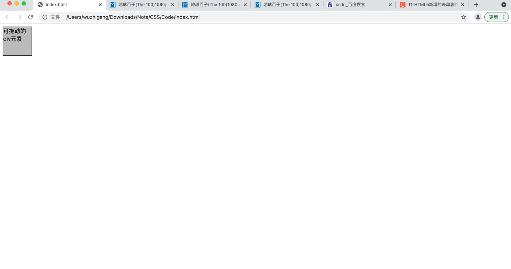
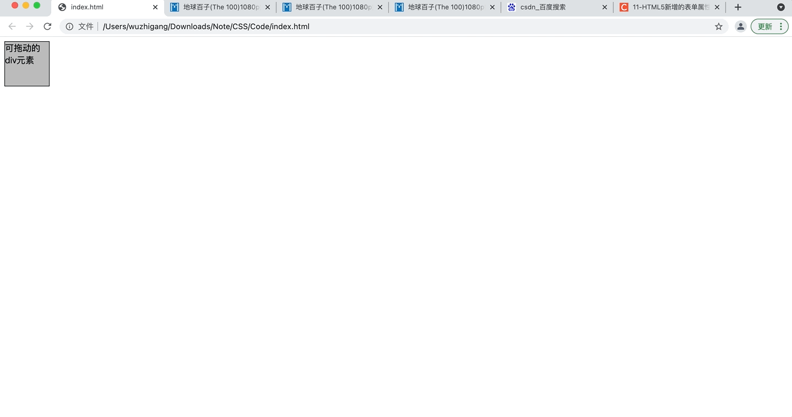
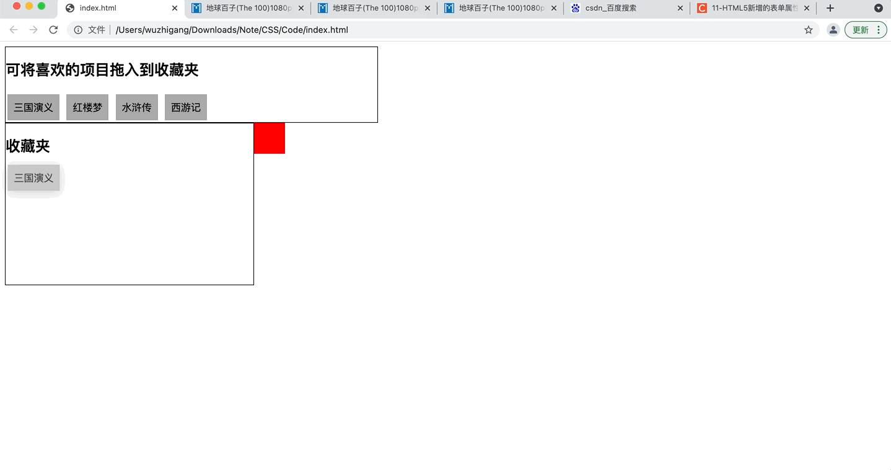
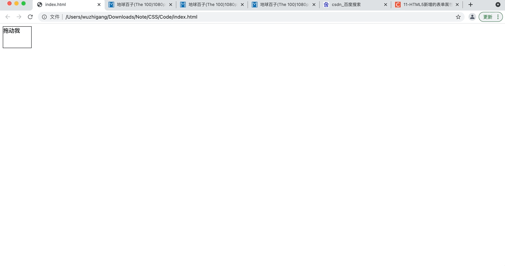

[toc]

&emsp;&emsp;拖放操作可以分为两个动作：在某个元素上按下鼠标并移动鼠标（没有松开鼠标），此时开始拖动；在拖动过程中，只要没有松开鼠标，将会不断产生拖放事件---整个过程被称为 **拖**；把被拖动的元素拖动到另外一个元素上并松开鼠标---这个动作被称为 **放**。

# 启动拖放

&emsp;&emsp;在HTML5中，**img** 元素默认就是可以拖动的；**a** 元素只要设置了 **href** 属性，它默认也是可以拖动的。对于普通元素，如果希望把它变成可拖动的，开发者只要把该元素的<font color=orange> **draggable** </font>属性设置为 **true** 即可，仅仅设置 draggable 为 true 只能表示该元素可拖动，但拖动的时候并没有携带数据，因此用户看不到拖动效果。为了让拖动携带数据，应该为被拖动元素的<font color=orange> **ondragstart** </font>事件指定监听器，在监听器中让它携带数据：

```html
<!DOCTYPE html>
<html lang="en">
<head>
    <meta charset="UTF-8">
    <title></title>
</head>
<body>
    <div id="source" style="width: 80px;height: 80px;border: 1px solid black;background-color: #bbb;" draggable="true">
        可拖动的div元素
    </div>
    <script>
        var source = document.getElementById("source");
        source.ondragstart = function(evt){
            evt.dataTransfer.setData("text", "div元素");
        }
    </script>
</body>
</html>
```



# 接受放

&emsp;&emsp;上面的案例在拖动的时候显示禁止的标志，这表明被拖动到的目的地并不接受被拖动的元素，上面的案例是因为元素被拖过 document 对象时候， document 对象阻止了默认的拖动事件，而其他 HTML 组件也是位于 document 对象内的，因此它们也不接受放。为了让 document 可以接受放，应该为 document 的<font color=orange> **ondragover** </font>事件指定监听器，在监听器中取消 document 对拖动事件的默认行为：

```html
<!DOCTYPE html>
<html lang="en">
<head>
    <meta charset="UTF-8">
    <title></title>
</head>
<body>
    <div id="source" style="width: 80px;height: 80px;border: 1px solid black;background-color: #bbb;" draggable="true">
        可拖动的div元素
    </div>
    <script>
        var source = document.getElementById("source");
        source.ondragstart = function(evt){
            evt.dataTransfer.setData("text", "div元素");
        }

        document.ondragover = function(evt){
            return false;
        }
    </script>
</body>
</html>
```

&emsp;&emsp;不同的浏览器对于拖放操作的默认动作是不同的，如果想取消该默认动作，可以为 document 的<font color=orange> **ondrop** </font>事件绑定监听器：

```html
<!DOCTYPE html>
<html lang="en">
<head>
    <meta charset="UTF-8">
    <title></title>
</head>
<body>
    <div id="source" style="width: 80px;height: 80px;border: 1px solid black;background-color: #bbb;" draggable="true">
        可拖动的div元素
    </div>
    <script>
        var source = document.getElementById("source");
        source.ondragstart = function(evt){
            evt.dataTransfer.setData("text", "div元素");
        }

        document.ondragover = function(evt){
            return false;
        }

        document.ondrop = function(evt) {
            return false;
        }
    </script>
</body>
</html>
```

&emsp;&emsp;在用户拖放 HTML 元素的过程中，可以触发的事件如下表：

事件 | 事件源 | 描述
-|-|-
ondragstart | 被拖动的HTML元素 | 开始拖动操作时触发该事件
ondrag | 被拖动的HTML元素 | 拖动过程中会不断触发该事件
ondragend | 被拖动的HTML元素 | 拖动结束时候触发该事件
ondragenter | 拖动时鼠标经过的元素 | 被拖动的元素进入本元素的范围内时触发该事件
ondragover | 拖动时鼠标经过的元素 | 被拖动的元素进入本元素的范围内拖动时会不断地触发该事件
ondragleave | 拖动时鼠标经过的元素 | 被拖动的元素离开被元素的时候会触发该事件
ondrop | 拖动时鼠标经过的元素 | 其它元素被放到本元素中的时候触发该事件

```html
<!DOCTYPE html>
<html lang="en">
<head>
    <meta charset="UTF-8">
    <title></title>
</head>
<body>
    <div id="source" style="width: 80px;height: 80px;border: 1px solid black;background-color: #bbb;" draggable="true">
        可拖动的div元素
    </div>
    <script>
        var source = document.getElementById("source");
        source.ondragstart = function(evt){
            evt.dataTransfer.setData("text", "div元素");
        }

        document.ondragover = function(evt){
            return false;
        }

        document.ondrop = function(evt) {
            source.style.position = "absolute";
            source.style.left = evt.pageX + "px";
            source.style.top = evt.pageY + "px";
            return false;
        }
    </script>
</body>
</html>
```



# DataTransfer 对象

&emsp;&emsp;拖放触发的拖放事件有一个<font color=orange> **dataTransfer** </font>属性，该属性值是一个<font color=orange> **DataTransfer** </font>对象，该对象包含如下属性和方法：

+ <font color=orange>**dropEffect：**</font> 设置或返回拖放目标上允许发生的拖放行为，如果此处设置的拖放行为不在 effectAllowed属性设置的多种拖放行为之内，拖放操作将会失败。该属性值允许为 <font color=green>**none、copy、link、move**</font>
+ <font color=orange>**effectAllowed：**</font> 设置或返回被拖动元素允许发生的拖动行为，该属性值可以设置为：<font color=green>**none、copy、copyLink、copyMove、link、linkMove、move、all、uninitialized**</font>
+ <font color=orange>**items：**</font> 该属性返回DataTransferItems对象，该对象代表了拖动数据
+ <font color=orange>**setDragImage(element, x, y)：**</font> 设置拖放操作的自定义图标
+ <font color=orange>**addElement(element)：**</font> 添加自定义图标
+ <font color=orange>**types：**</font> 该属性返回一个DOMStringList对象，该对象包括了存入dataTransfer中数据的所有类型
+ <font color=orange>**getData(format)：**</font> 获取DataTransfer对象中设置format格式的数据
+ <font color=orange>**setData(format, data)：**</font> 向DataTransfer对象中设置format格式的数据
+ <font color=orange>**clearData([format])：**</font> 清除DataTransfer中的format格式的数据，如果省略format，则清除所有的数据

```html
<!DOCTYPE html>
<html lang="en">
<head>
    <meta charset="UTF-8">
    <title></title>
    <style>
        div > div {
            display: inline-block;
            padding: 10px;
            background-color: #aaa;
            margin: 3px;
        }
    </style>
</head>
<body>
   <div style="width: 600px;border: 1px solid black;">
        <h2>可将喜欢的项目拖入到收藏夹</h2>
        <div draggable="true" ondragstart="dsHandler(event);">三国演义</div>
        <div draggable="true" ondragstart="dsHandler(event);">红楼梦</div>
        <div draggable="true" ondragstart="dsHandler(event);">水浒传</div>
        <div draggable="true" ondragstart="dsHandler(event);">西游记</div>
    </div>
    <div id="dest" style="width: 400px;height: 260px;border: 1px solid black;float:left;">
        <h2>收藏夹</h2>
    </div>
    <div id="gb" style="width: 50px;height: 50px;background-color: #f00;float: left;"></div>
    <script>
        var dest = document.getElementById("dest");
        var dsHandler = function(evt) {
            evt.dataTransfer.setData("text/plain", "<item>" + evt.target.innerHTML);
        }
        dest.ondrop = function(evt) {
            evt.preventDefault();
            var text = evt.dataTransfer.getData("text/plain");
            if (text.indexOf("<item>") == 0) {
                var newEle = document.createElement("div");
                newEle.id = new Date().getUTCMilliseconds();
                newEle.innerHTML = text.substring(6);
                newEle.draggable = "true";
                newEle.ondragstart = function(evt){
                    evt.dataTransfer.setData("text/plain","<remove>" + newEle.id);
                }
                dest.appendChild(newEle);
            }
        }

        document.getElementById("gb").ondrop = function(evt){
            var id = evt.dataTransfer.getData("text/plain");
            if (id.indexOf("<remove>") == 0) {
                var target = document.getElementById(id.substring(8));
                dest.removeChild(target);
            }
        }

        document.ondragover = function(evt){
            return false;
        }

        document.ondrop = function(evt) {
            return false;
        }
    </script>
</body>
</html>
```



# 拖放行为

&emsp;&emsp;通过设置<font color=orange> **DataTransfer** </font>对象的<font color=orange> **effectAllowed、dropEffect** </font>两个属性可以控制拖放行为，effectAllowed 用于控制被拖动元素的拖动行为，因此通常建议在 ondragstart 事件监听器中设置 DataTransfer 对象的 effectAllowed 属性、而 dropEffect 则控制被放入的目标组件的行为，因此通常建议在 ondragover 事件监听器中设置 DataTransfer 对象的 dropEffect 属性。具体注意以下几点：

+ 如果 effectAllowed 设为 none，则不允许拖动该元素
+ 如果 dropEffect 设置为 none，则被拖动的元素不能放到本元素中
+ 如果 effectAllowed 设置为 all 或者不设置，则 dropEffect 可设置为任何属性值，而且将会遵守 dropEffect 指定的拖放行为
+ 如果 effectAllowed 指定了特定的拖放行为，例如 move、copy 等，那么 dropEffect 指定的属性值必须是 effectAllowed 指定的多个属性值的子集

```html
<!DOCTYPE html>
<html lang="en">
<head>
    <meta charset="UTF-8">
    <title></title>
    
</head>
<body>
   <div id="source" draggable="true" style="width: 80px;height: 60px;border: 1px solid black;">
    拖动我
   </div>
   <script>
       var source = document.getElementById("source");
       var dest = document.getElementById("text/plain");
       source.ondragstart = function(evt){
           var dt = evt.dataTransfer;
           dt.effectAllowed = "link";
           dt.setData("text/plain", "www.baidu.com");
       }

       document.ondragover = function(evt){return false;}
       document.ondrop = function(evt){return false;}
   </script>
</body>
</html>
```

# 拖动改变图标

&emsp;&emsp;通过调用 DataTransfer 对象的 setDragImage 还可以改变拖放图标：

```html
<!DOCTYPE html>
<html lang="en">
<head>
    <meta charset="UTF-8">
    <title></title>
    
</head>
<body>
   <div id="source" draggable="true" style="width: 80px;height: 60px;border: 1px solid black;">
    拖动我
   </div>
   <script>
       var source = document.getElementById("source");
       var myIcon = document.createElement("img");
       myIcon.src = "a.png";
       source.ondragstart = function(evt){
           var dt = evt.dataTransfer;
           dt.setDragImage(myIcon,0,0);
           dt.setData("text/plain", "www.baidu.com");
       }

       document.ondragover = function(evt){return false;}
       document.ondrop = function(evt){return false;}
   </script>
</body>
</html>
```

