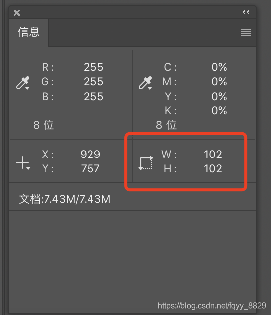
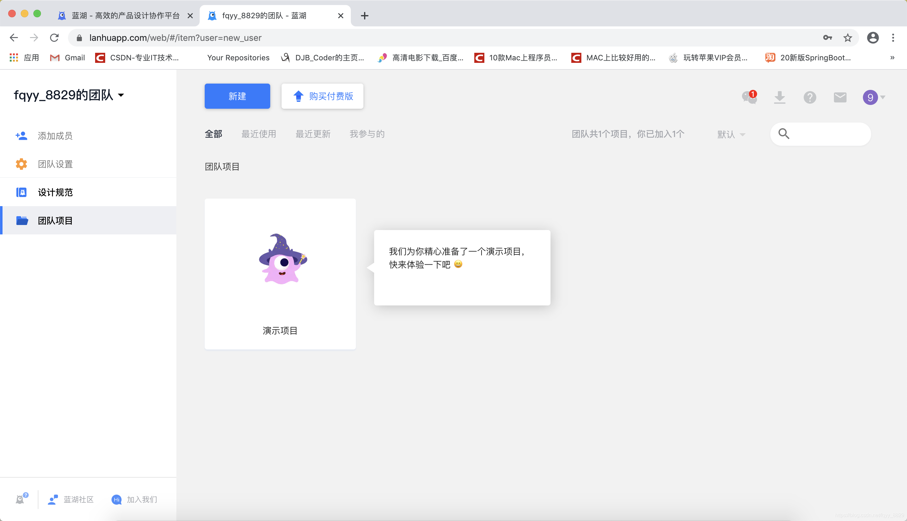

[toc]

&emsp;&emsp;作为网页前端的开发人员，需要对 Photoshop 工具有所了解，因为我们需要把设计师做好的设计图进行裁切，把它变成 HTML 的结构和量出 CSS 样式，从而还原设计稿。

&emsp;&emsp;Photoshop 工具由三个部分组成： **菜单项、工具栏和辅助面板：** 

# 标尺工具
&emsp;&emsp;通过 **视图 -> 标尺** 可以调出标尺工具：

> **提示：** 也可以通过快捷键  **command + r**  来调出和隐藏标尺工具。

&emsp;&emsp;通过标尺工具可以拉取出一些辅助线，通过这些辅助线可以帮助我们进行测量：

&emsp;&emsp;通过 **视图 -> 清除画布参考线** 可以清除界面上的辅助线：

&emsp;&emsp;通过选择工具栏中的 **移动工具** 就可以拖拽的方式改变这些辅助线的位置：

# 图片格式

&emsp;&emsp;常见的网页的图片格式有：

+  **jpg（jpeg）：** 非常适合做色彩丰富的图片
+  **png：** 一般可以用来做带透明的图片
+  **gif：**  一般用来做动图
+  **psd：**  是ps设计稿的源文件

# 切图
## PNG图片切图流程

&emsp;&emsp;一般设计师会提供 **.psd** 的源文件，这样子切起图来是比较方便的。但有时候我们会遇到没有  **.psd**  源文件的情况，比如仿照网站做一些效果，这时候就需要在 **.png** 图片的基础上做切图的工作。

### 矩形选框工具

+ 使用 photoshop 打开一张 **.png** 的图片
+ 选中工具栏中的 **矩形选框工具** 

+ 拖拽的方式选中需要切图的区域

+ 微调切图区域
  + 通过 **上下左右按键** 实现左对齐和上对齐
  + 通过  **⬆️ 键 + 鼠标拖拽** 实现添加区域	 
  + 通过  **option 键 + 鼠标拖拽** 实现减少区域 

&emsp;&emsp;此时就可以在右下角的图片属性信息中看到图片的宽度和高度：

&emsp;&emsp;如果默认的宽高的单位不是像素，可以通过下面的方法修改：

&emsp;&emsp;在打开的窗口中选择像素单位即可：

+ 使用  **command + c** 复制该选中区域

+ 使用  **command + n** 新建图片

+ 使用  **command + v** 粘贴图片

+ 选择  **文件 -> 导出 -> 导出为web所用格式** 导出图片
+ 在弹出的对话框中选择存储图片的格式进行存储即可

### 切片工具

+ 使用 photoshop 打开一张 **.png** 的图片
+ 选中工具栏中的  **切片工具**

+ 选中需要切片的区域，可以同时选择多个：
  

+ 微调切片区域：切片区域的微调直接通过拖拽的方式就可以了
+ 如果想要查看切片区域的大小，只要在对应的切片上点击鼠标右键：
  

&emsp;&emsp;然后在弹出的对话框中就可以看到对应的切片信息，包括切片的区域大小：

+ 选择  **文件 -> 导出 -> 导出为web所用格式** 导出图片
+ 当图中有切片的时候点击保存就会看到保存出来的是一个文件夹，内容如下：

&emsp;&emsp;此时保存的图片是以文件夹的形式保存的，里面包含了切片的图片（删除那些不是我们需要的即可）。

## PSD文件切图流程

&emsp;&emsp;对于 psd 图片，photoshop 提供了自动切图的功能：

+ 打开 psd 文件
+ 选择 **Photoshop -> 首选项 -> 增效工具**
  

+ 启用生成器

+ 选择  **文件 -> 生成 -> 图像资源**

&emsp;&emsp;这个时候会在你的 psd 的所在目录生成一个对应的 assets 的文件夹：

&emsp;&emsp;目前这个文件夹还是一个空的文件夹。

+ 选中工具栏中的  **选择工具**

+ 选择需要切图的图片，并且修改名称（  **带文件的后缀名** ）

&emsp;&emsp;此时在刚才生成的目录中就会生成该文件，与 .png 中的切图不同，这里生成的图片还可以是带透明的。

> **注意：** 可以通过文件名称的方式改变图片的大小，如： **200% icon2.png** ，此时就会生成一个原图大小放大2倍的图片。

# 测量段落的行高

&emsp;&emsp;行高所表示的区域是由 **上行高、文字和下行高** 组成，所以测量段落的行高的方式如下：

# 字体大小

&emsp;&emsp;在 *__.png__*  的图片中去测量文字的大小是不太准确的，有的时候需要靠自己去猜；但是在 *__.psd__*  文件中去测量字体的大小就比较方便了，直接选中工具栏中的 **文字工具** ：

&emsp;&emsp;然后选中需要测量的文字就可以看到字体的信息：

&emsp;&emsp;还可以通过字符面板去获取更详细的信息：

# 获取颜色信息

+ 打开一张图片
+ 选中工具栏中的 **吸管工具**

+ 然后在需要获取的图片位置点击就可以获取到颜色的值了：

# 利用工具快速获取样式

&emsp;&emsp;这里以蓝湖为例介绍，它的网址是：http://lanhuapp.com

+ 创建账号并创建一个团队

+ 新建项目

+ 选择 **Photoshop插件下载**

+ 下载安装好插件后，重启 Photoshop 就可以看到安装好的插件：

+ 上传 psd 文件，上传的时候可以将需要切片的涂层标记出来，被标记为切片的图片后期可以直接打包下载：

&emsp;&emsp;在打开的窗口中选择  **切图**  标签，然后选中需要标记为切图的图层，并点击  **标记为切图**  按钮将该图层标记为切图：

&emsp;&emsp;完成这些工作后，就可以选择  **上传**  标签上传 psd 图片到蓝湖了：

+ 打开蓝湖并打开上传好的文件，就可以在页面中查看到该文件的详细信息，包括间距、大小、字体等：

+ 还可以将之前标记为切片的图片打包下载：

