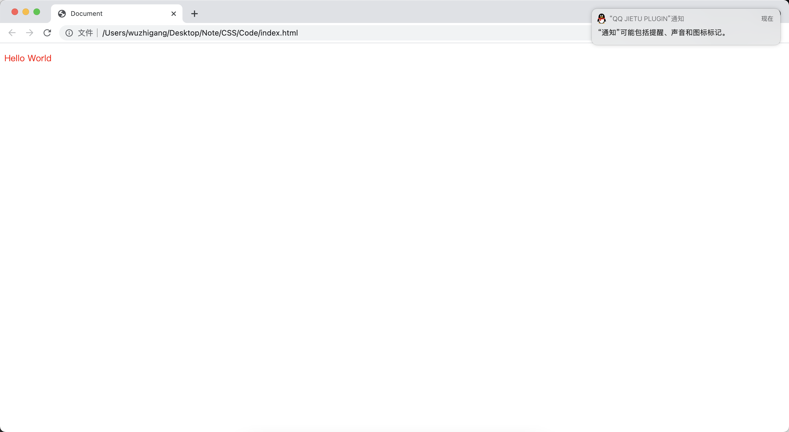
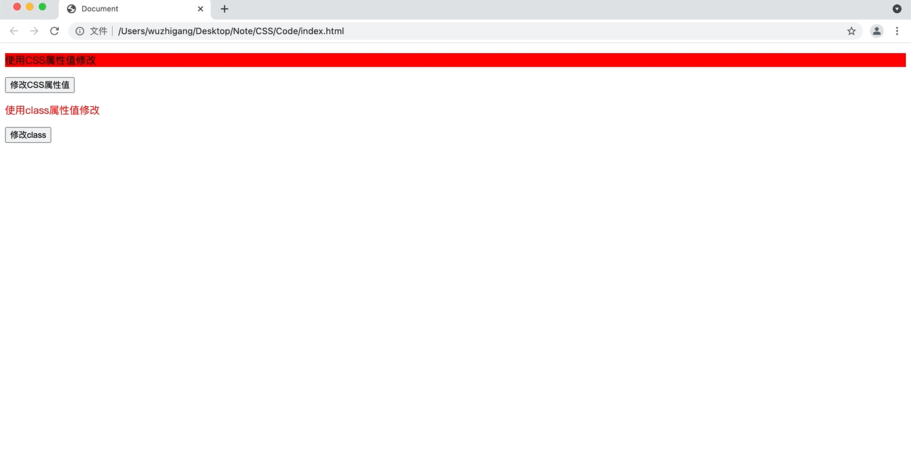

[toc]

# 样式单概述

&emsp;&emsp;样式单的优点：

+ <font color=orange> **表达效果丰富：** </font> 对于文档的表现力远远超过HTML中的标记，更重要的是样式单的标准规范独立于其它文档结构的规范，当需要实现更丰富的表达效果时，仅需修改样式单即可，无需修改原始的数据文档内容
+ <font color=orange> **文档体积小：** </font> 在样式单中，对于同一类标记只需要进行一次格式定义即可，大大缩小了需要传输的文件体积
+ <font color=orange> **便于信息检索：** </font> 样式单的显示逻辑与数据逻辑分离，显示细节的描述不会影响文档中数据的内在结构。因此，网络搜索引擎对文档进行检索时，更容易检索到有用信息
+ <font color=orange> **可读性好：** </font> 样式单对各种标记的显示进行集中定义，且定义方式直观易读

&emsp;&emsp;级联样式单是一系列格式规则，这些规则用于控制网页内容的外观，它可以将数据逻辑和显示逻辑分离，从而提高文件的可读性。它主要提供如下两个功能：

+ 对页面的字体、颜色控制更加细腻，让页面内容更富表现力
+ 通过CSS样式单可以同时控制整个站点所有页面的风格

# CSS样式单的基本使用

<font color=skyblue>**1. 引入外部样式文件**</font>

&emsp;&emsp;HTML 文档中使用<font color=orange> **link** </font>元素来引入外部样式文件：

```html
<link type="text/css" rel="stylesheet" href="CSS 样式文件的URL">
```

1. 创建一个外部的CSS文件

```css
p {
    color: red;
}
```

2. 创建一个html文件，引入上面的CSS文件

```html
<!DOCTYPE html>
<html lang="en">
<head>
    <meta charset="UTF-8">
    <title>Document</title>
    <!-- 引入外部文件 -->
    <link rel="stylesheet" href="./index.css">
</head>
<body>
    <!-- 使用p显示一段文本 -->
    <p>Hello World</p>
</body>
</html>
```



<font color=skyblue>**2. 导入外部样式单**</font>

&emsp;&emsp;与链接外部样式单的功能差不多，只是语法上存在差别，导入外部样式单需要在<font color=orange> **style** </font>元素中使用<font color=orange> **@import** </font>来执行导入：

```html
<style type="text/css">
    @import url (样式单地址) sMedia;
</style>
```

1. 创建外部的CSS文件

```css
p {
    color: red;
}
```

2. 创建一个html文件，引入上面的CSS文件

```html
<!DOCTYPE html>
<html lang="en">
<head>
    <meta charset="UTF-8">
    <title>Document</title>
    <!-- 导入外部文件 -->
    <style>
        @import url(./index.css);
    </style>
</head>
<body>
    <!-- 使用p显示一段文本 -->
    <p>Hello World</p>
</body>
</html>
```


&emsp;&emsp;<font color=orange> **sMedia** </font>用于指定样式单仅对某种显示设备有效（<font color=red> **注意：浏览器支持不是很好** </font>），<font color=orange> **media** </font>属性支持的常用属性值如下：

media属性值 | 说明
-|-
screen | 计算机屏幕
tty | 使用等宽字符的显示设备
tv | 电视机类型的显示设备（低分辨率、有限的滚屏能力）
projection | 投影仪
handheld | 小型手持设备
print | 打印页面或打印预览模式
embossed | 适用于凸点字符（盲文）印刷设备
braille | 盲人点字法反馈设备
aural | 语音合成器
all | 全部设备

<font color=skyblue>**3. 使用内部CSS样式**</font>

&emsp;&emsp;内部CSS样式需要放在<font color=orange> **style** </font>元素中定义：

```html
<!DOCTYPE html>
<html lang="en">
<head>
    <meta charset="UTF-8">
    <title>Document</title>
    <!-- 内部样式 -->
    <style>
        p {
            color: red;
        }
    </style>
</head>
<body>
    <!-- 使用p显示一段文本 -->
    <p>Hello World</p>
</body>
</html>
```


<font color=skyblue>**4. 行内样式**</font>

&emsp;&emsp;行内CSS样式只对单个标签有效，可以精确控制某个HTML元素的外观表现。为了使用行内样式，CSS扩展了HTML元素，几乎所有的HTML元素都增加了一个<font color=orange> **style** </font>通用属性：

```html
<!DOCTYPE html>
<html lang="en">
<head>
    <meta charset="UTF-8">
    <title>Document</title>
</head>
<body>
    <!-- 使用p显示一段文本 -->
    <!-- 使用行内样式设置样式 -->
    <p style="color: red;">Hello World</p>
</body>
</html>
```


# 在脚本中修改样式

&emsp;&emsp;常用的方式：

+ 修改行内CSS属性值：<font color=orange> **obj.style.属性名=属性值** </font>
+ 修改HTML元素的class属性值：<font color=orange> **obj.className=class选择器** </font>

```html
<!DOCTYPE html>
<html lang="en">
<head>
    <meta charset="UTF-8">
    <title>Document</title>
    <style>
        .red {
            color: red;
        }
        .blue {
            color: blue;
        }
    </style>
</head>
<body>
    <!-- 使用CSS属性值修改 -->
    <p style="background-color: red;" id="p1">使用CSS属性值修改</p>
    <button onclick="changeCSS()">修改CSS属性值</button>
    <!-- 使用class属性值修改 -->
    <p class="red" id="p2">使用class属性值修改</p>
    <button onclick="changeCLS()">修改class</button>

    <script>
        function changeCSS() {  
            var p1 = document.getElementById("p1");
            p1.style.backgroundColor = p1.style.backgroundColor == "red" ? "blue" : "red";
        }

        function changeCLS() {  
            var p2 = document.getElementById("p2");
            p2.className = p2.className == "red" ? "blue" : "red";
        }
    </script>
</body>
</html>
```



> <font color=red> **注意：** </font>脚本中的CSS属性名与页面中的属性名不完全相同，比如CSS属性名<font color=orange> *__background-color__* </font>在脚本中的属性名为<font color=orange> *__backgroundColor__* </font>。