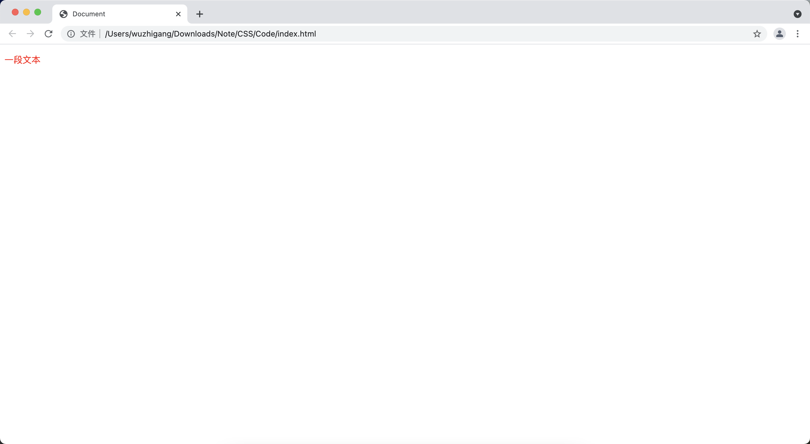

[toc]

# color

&emsp;&emsp;<font color=orange>**color 属性**</font> 用来设置字体的颜色：

```html
<!DOCTYPE html>
<html lang="en">
<head>
    <meta charset="UTF-8">
    <meta http-equiv="X-UA-Compatible" content="IE=edge">
    <meta name="viewport" content="width=device-width, initial-scale=1.0">
    <title>Document</title>
</head>
<body>
    <p style="color: red;">一段文本</p>
</body>
</html>
```



> <font color=red>**颜色的几种表示方法**</font>
> 1. <font color=orange>**颜色名：**</font> 如 white等
> 2. <font color=orange>**十六进制：**</font> 如 #000、#FF0000
> 3. <font color=orange>**rgb(r,g,b)：**</font> 分别代表红、绿、蓝
> 4. <font color=orange>**hsl(Hue,Saturation,Lightness)：**</font>这是用色调、饱和度、亮度控制颜色
> 5. <font color=orange>**rgba(r,g,b,a)：**</font> 最后一个 a 是在 0-1 之间，表示透明度，0 是完全透明
> 6. <font color=orange>**hsla(Hue,Saturation,Lightness,alpha)**</font>：最后一个 a 是在 0-1 之间，表示透明度，0 是完全透明

# font-family

&emsp;&emsp;<font color=orange>**font-family 属性**</font> 用来设置文字的字体。该属性可以同时设置多个字体，浏览器按该属性指定的多个字体依次搜索，以优先找到的字体来显示文字，多个属性值之间以英文逗号隔开：

```html
<!DOCTYPE html>
<html lang="en">
<head>
    <meta charset="UTF-8">
    <meta http-equiv="X-UA-Compatible" content="IE=edge">
    <meta name="viewport" content="width=device-width, initial-scale=1.0">
    <title>Document</title>
</head>
<body>
    <p style="font-family:Verdana, 楷体;">一段文本</p>
</body>
</html>
```


# font-size

&emsp;&emsp;<font color=orange>**font-size 属性**</font> 用来设置字体的大小，该属性支持以下属性值：

属性值|说明
-|-
xx-small | 绝对字体尺寸，最小字体
x-small | 绝对字体尺寸，较小字体
small | 绝对字体尺寸，小字体
medium | 绝对字体尺寸，正常大小的字体，这是默认值
large | 绝对字体尺寸，大字体
x-large | 绝对字体尺寸，较大字体
xx-large | 绝对字体尺寸，最大字体
larger | 相对字体尺寸，相对于父元素中的字体进行相对增大
smaller | 相对字体尺寸，相对于父元素中的字体进行相对减少
length | 直接设置字体大小，既可以是百分比值，页可以设置为一个数值+长度单位（11pt、11px）

```html
<!DOCTYPE html>
<html lang="en">
<head>
    <meta charset="UTF-8">
    <meta http-equiv="X-UA-Compatible" content="IE=edge">
    <meta name="viewport" content="width=device-width, initial-scale=1.0">
    <title>Document</title>
</head>
<body>
    <p style="font-size: 32px;">一段文本</p>
</body>
</html>
```


# font-style

&emsp;&emsp;<font color=orange>**font-style 属性**</font> 用于设置文字风格，如是否采用斜体等。该属性值有 

属性值 | 说明
-|-
normal | 文字正常
italic | 斜体
oblique | 倾斜文字

```html
<!DOCTYPE html>
<html lang="en">
<head>
    <meta charset="UTF-8">
    <meta http-equiv="X-UA-Compatible" content="IE=edge">
    <meta name="viewport" content="width=device-width, initial-scale=1.0">
    <title>Document</title>
</head>
<body>
    <p style="font-style: normal;">正常文字</p>
    <p style="font-style: italic;">斜体文字</p>
    <p style="font-style: oblique;">倾斜文字</p>
</body>
</html>
```


> <font color=red>**注意：**</font> 正常使用<font color=orange> **italic** </font>设置文字斜体就可以了，对于没有斜体的字体，该属性不会将文字倾斜。而<font color=orange> **oblique** </font>会强制字体倾斜。

# font-weight

&emsp;&emsp;<font color=orange> **font-weight 属性** </font>用来设置字体是否加粗，加粗的程度可以用<font color=green> *__lighter__* 、*__normal__*、*__bold__*、*__bolder__* </font>等常用属性值，也可以用<font color=orange> **数值** </font>来表示：

```html
<!DOCTYPE html>
<html lang="en">
<head>
    <meta charset="UTF-8">
    <meta http-equiv="X-UA-Compatible" content="IE=edge">
    <meta name="viewport" content="width=device-width, initial-scale=1.0">
    <title>Document</title>
</head>
<body>
    <p style="font-weight: lighter;">lighter</p>
    <p style="font-weight: normal;">normal</p>
    <p style="font-weight: bold;">bold</p>
    <p style="font-weight: bolder;">bolder</p>
    <p style="font-weight: 200;">200</p>
</body>
</html>
```


# font-variant

&emsp;&emsp;<font color=orange>**font-variant 属性** </font>用于设置文字的大写字母的格式：

属性值 | 说明
-|-
normal | 正常的字体
small-caps | 小型的大写字母字体

```html
<!DOCTYPE html>
<html lang="en">
<head>
    <meta charset="UTF-8">
    <meta http-equiv="X-UA-Compatible" content="IE=edge">
    <meta name="viewport" content="width=device-width, initial-scale=1.0">
    <title>Document</title>
</head>
<body>
    <p style="font-variant: normal;">normal</p>
    <p style="font-variant: small-caps;">small-caps</p>
</body>
</html>
```


# line-height

&emsp;&emsp;<font color=orange>**line-height 属性** </font>用于设置字体的行高，即字体最底端与字体内部顶端之间的距离：

```html
<!DOCTYPE html>
<html lang="en">
<head>
    <meta charset="UTF-8">
    <meta http-equiv="X-UA-Compatible" content="IE=edge">
    <meta name="viewport" content="width=device-width, initial-scale=1.0">
    <title>Document</title>
</head>
<body>
    <p>一段文本</p>
    <p style="line-height: 130px;">一段文本</p>
    <p>一段文本</p>
</body>
</html>
```


# font

&emsp;&emsp;<font color=orange>**font 属性** </font>是一个复合属性，其属性值形如：<font color=green> *__font-style font-variant font-weight font-size line-height font-family__* </font>的复合属性值：

```html
<!DOCTYPE html>
<html lang="en">
<head>
    <meta charset="UTF-8">
    <meta http-equiv="X-UA-Compatible" content="IE=edge">
    <meta name="viewport" content="width=device-width, initial-scale=1.0">
    <title>Document</title>
</head>
<body>
    <p style="font: italic 30px '楷体';">一段文本</p>
</body>
</html>
```


> <font color=red>**注意：**</font>
> + 不要混合使用单一样式和复合样式，否则会出现问题
> + 注意顺序
> + 至少有：size family

# font-size-adjust

&emsp;&emsp;对于西方文字来说，相同字号、不同字体的字母大小也是不同的。<font color=orange>**font-size-adjust 属性** </font>用于控制对不同字体的字体尺寸进行微调，可以指定为<font color=green> *__none（不进行任何调整）__* </font>或用<font color=green> *__一个数值代表调整比例__* </font>：

```html
<!DOCTYPE html>
<html lang="en">
<head>
    <meta charset="UTF-8">
    <meta http-equiv="X-UA-Compatible" content="IE=edge">
    <meta name="viewport" content="width=device-width, initial-scale=1.0">
    <title>Document</title>
</head>
<body>
    <p style="font-size: 16pt;font-family: 'Courier New';">Our domain is</p>
    <p style="font-size: 16pt;font-family: 'Roma';">Our domain is</p>
    <p style="font-size: 16pt;font-family: 'Impact';">Our domain is</p>
</body>
</html>
```


&emsp;&emsp;虽然字体大小都是 16pt，但是它们的长度并不相同，为了解决这个问题，可以使用<font color=orange> *__font-size-adjust__* </font>属性进行控制。该属性值应设为<font color=orange> **字体的 aspect 值** </font>，每种字体的 aspect 值等于<font color=orange> **该字体中小写字母 x 的高度除以该字体的大小**</font>：

```html
<!DOCTYPE html>
<html lang="en">
<head>
    <meta charset="UTF-8">
    <meta http-equiv="X-UA-Compatible" content="IE=edge">
    <meta name="viewport" content="width=device-width, initial-scale=1.0">
    <title>Document</title>
</head>
<body>
    <p style="font-size: 16pt;font-family: 'Courier New';font-size-adjust: 0.41;">Our domain is</p>
    <p style="font-size: 16pt;font-family: 'Roma';font-size-adjust: 0.66">Our domain is</p>
    <p style="font-size: 16pt;font-family: 'Impact';font-size-adjust: 0.93">Our domain is</p>
</body>
</html>
```


# text-decoration

&emsp;&emsp;<font color=orange>**text-decoration 属性** </font>控制文字是否有修饰线，属性值有：

属性值 | 说明
-|-
none | 无修饰
underline | 下划线
line-through | 中划线
overline | 上划线

&emsp;&emsp;可以同时设置多个，中间用空格隔开：

```html
<!DOCTYPE html>
<html lang="en">
<head>
    <meta charset="UTF-8">
    <title>Document</title>
</head>
<body>
    <p style="text-decoration: none;">none</p>
    <p style="text-decoration: underline;">underline</p>
    <p style="text-decoration: line-through;">line-through</p>
    <p style="text-decoration: overline;">overline</p>
</body>
</html>
```


# text-transform

&emsp;&emsp;<font color=orange>**text-transform 属性** </font>用来设置文字的大小写，该属性值可以是：

属性值 | 说明值
-|-
none | 不转换
capitalize | 首字母大写
uppercase | 全部大写
lowercase | 全部小写

```html
<!DOCTYPE html>
<html lang="en">
<head>
    <meta charset="UTF-8">
    <title>Document</title>
</head>
<body>
    <p style="text-transform: none;">stephen Curry</p>
    <p style="text-transform: capitalize;">stephen Curry</p>
    <p style="text-transform: uppercase;">stephen Curry</p>
    <p style="text-transform: lowercase;">stephen Curry</p>
</body>
</html>
```


# letter-spacing 和 word-spacing

+ <font color=orange>**letter-spacing：** </font>用于设置字符之间的间隔，该属性将指定的间隔添加到每个字符之后，但最后一个文字不会受该属性的影响，支持<font color=green> *__normal__*  和 *__数值 + 长度单位__* </font>两种属性值
+ <font color=orange>**word-spacing：** </font>该属性用于设置单词之间的间隔，支持<font color=green> *__normal__*  和 *__数值+长度单位__* </font>两种属性值（<font color=red>**只对英文有效**</font>）

```html
<!DOCTYPE html>
<html lang="en">
<head>
    <meta charset="UTF-8">
    <title>Document</title>
</head>
<body>
    <p style="letter-spacing: 10px;">This is a dog</p>
    <p style="letter-spacing: 10px;">这是条狗</p>
    <p style="word-spacing: 10px;">This is a dog</p>
    <p style="word-spacing: 10px;">这是条狗</p>
</body>
</html>
```


# 设置文字阴影

&emsp;&emsp;使用<font color=orange> **text-shadow** </font>可以设置文字阴影，该属性的值形如：<font color=green> *__color xoffset yoffset length__* </font>，或者<font color=green> *__xoffset yoffset radius color__* </font>：

+ <font color=orange>**color：**</font> 指定阴影的颜色
+ <font color=orange>**xoffset：**</font> 指定阴影在横向上的偏移
+ <font color=orange>**yoffset：**</font> 指定阴影在纵向上的偏移
+ <font color=orange>**radius：**</font> 指定阴影的模糊半径，模糊半径越大，阴影看上去越模糊

```html
<!DOCTYPE html>
<html lang="en">
<head>
    <meta charset="UTF-8">
    <title>Document</title>
</head>
<body>
    text-shadow: red 5px 5px 2px:
    <p style="text-shadow: red 5px 5px 2px;">一段文本</p>
</body>
</html>
```


&emsp;&emsp;可以为 <font color=orange>**text-shadow**</font> 属性多设置几组阴影，多组阴影之间使用逗号隔开：

```html
<!DOCTYPE html>
<html lang="en">
<head>
    <meta charset="UTF-8">
    <title>Document</title>
</head>
<body>
    text-shadow: 5px 5px 2px #222,30px 30px 2px #555, 50px 50px 2px #888 :
    <p style="text-shadow:5px 5px 2px #222, 30px 30px 2px #555,50px 50px 2px #888;">一段文本</p>
</body>
</html>
```


# CSS3 新增的服务器字体

&emsp;&emsp;CSS3 允许使用服务器字体，如果客户端没有安装这种字体，客户端将会自动下载这种字体。

## 使用服务器字体

&emsp;&emsp;使用服务器字体只要使用<font color=orange> **@font-face** </font>定义服务器字体即可：

```css
@font-face {
  font-family: name;
  src: url() format(fontformat);
  sRules
}
```

+ <font color=orange>**font-family：**</font> 设置服务器字体的名称，这个名称可以随意定义
+ <font color=orange>**src：**</font> 通过url指定字体文件的绝对路径或相对路径；format用于指定字体的字体格式（ <font color=orange>**\*.ttf（TrueType）和\*.otf（OpenType）**</font>）

&emsp;&emsp;使用服务器字体，可以按照如下步骤：

1. 下载需要使用的服务器字体文件
2. 使用<font color=orange> **@font-face** </font>定义服务器字体
3. 通过<font color=orange> **font-family** </font>属性指定使用服务器字体

```html
<!DOCTYPE html>
<html lang="en">
<head>
    <meta charset="UTF-8">
    <title>Document</title>
    <style>
       @font-face {
           font-family: MyFont;
           src: url("Blazed.ttf") format("TrueType");
       }
    </style>
</head>
<body>
   <div style="font-family: MyFont;">aaaaaaa</div>
</body>
</html>
```

## 定义粗体、斜体字

&emsp;&emsp;在网页上指定字体时，除了可以指定特定字体之外，还可以指定使用粗体字、斜体字，但是在使用服务器字体时候，需要为粗体、斜体使用不同的字体文件（需要相应地下载不同的字体文件）：

```css
@font-face {
  font-family: myfont;
  src: url("Delicious-Bold.otf") format("OpenType");
  font-weight:bold;
}
```

&emsp;&emsp;从上面代码看，定义粗体、斜体的服务器字体主要注意两点：

+ 使用粗体字、斜体字专门的字体
+ 在<font color=orange> **@font-face** </font>中增加 <font color=orange> **font-weight、font-style** </font>等定义

```html
<!DOCTYPE html>
<html lang="en">
<head>
    <meta charset="UTF-8">
    <title>Document</title>
    <style>
        /* 普通字体 */
       @font-face {
           font-family: myfont;
           src: url("Delicious-Roman.otf") format("OpenType");
       }
       /* 粗体字体 */
       @font-face {
           font-family: myfont;
           src: url("Delicious-Bold.otf") format("OpenType");
           font-weight: bold;
       }
       /* 斜体字体 */
       @font-face {
           font-family: myfont;
           src: url("Delicious-Italic.otf") format("OpenType");
           font-style: italic;
       }
       /* 粗斜体字体 */
       @font-face {
           font-family: myfont;
           src: url("Delicious-BoldItalic.otf") format("OpenType");
           font-weight: bold;
           font-style: italic;
       }
    </style>
</head>
<body>
   <div style="font-family: MyFont;">aaaaaaa</div>
   <div style="font-family: MyFont;font-weight: bold;">aaaaaaa</div>
   <div style="font-family: MyFont;font-style: italic;">aaaaaaa</div>
   <div style="font-family: MyFont;font-weight: bold;font-style: italic;">aaaaaaa</div>
</body>
</html>
```

## 优先使用客户端字体

&emsp;&emsp;因为使用服务器字体需要从远程服务器下载字体，因此效率不好。应该尽量考虑使用浏览者的客户端字体，只有当客户端字体不存在的时候，才考虑使用服务器字体作为替代方案。CSS3在使用 @font-face 定义服务器字体时，src 属性除了可以使用 url 来指定服务器字体的路径外，也可以使用<font color=orange> **local** </font>指定客户端字体名称：

```html
<!DOCTYPE html>
<html lang="en">
<head>
    <meta charset="UTF-8">
    <title>Document</title>
    <style>
       @font-face {
           font-family: myfont;
           src: local("Goudy Stout") url("Blazed.ttf") format("TrueType");
       }
    </style>
</head>
<body>
   <div style="font-family: myfont;">aaaaaaa</div>
</body>
</html>
```