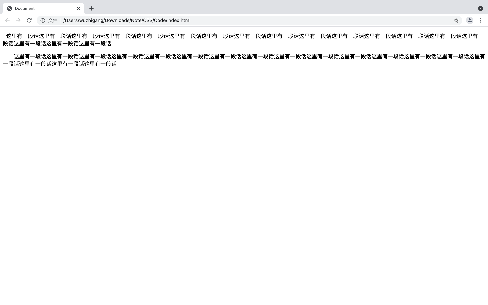
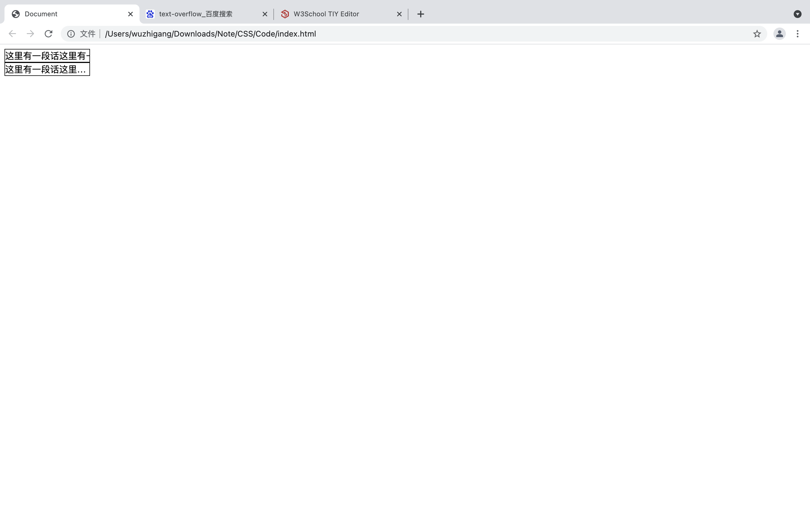
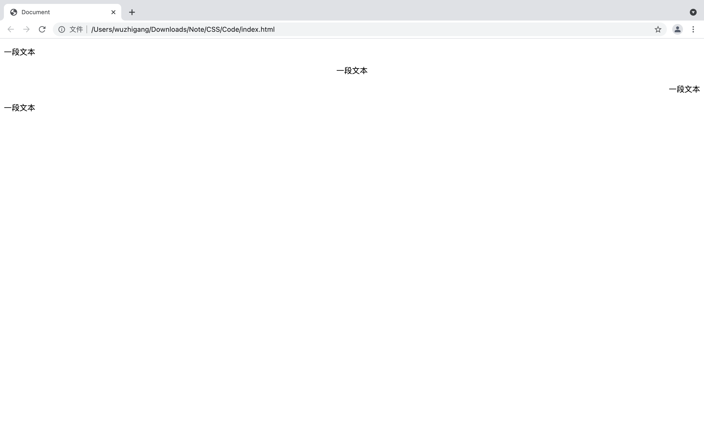
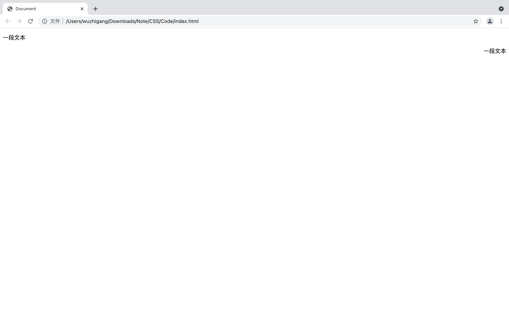
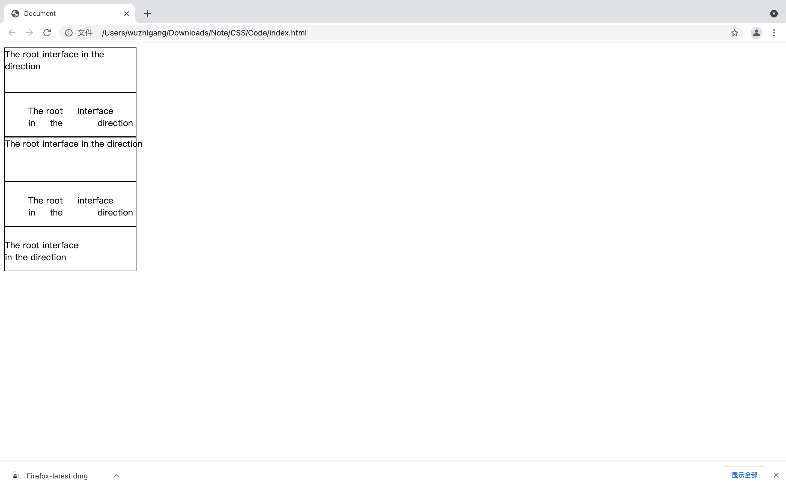
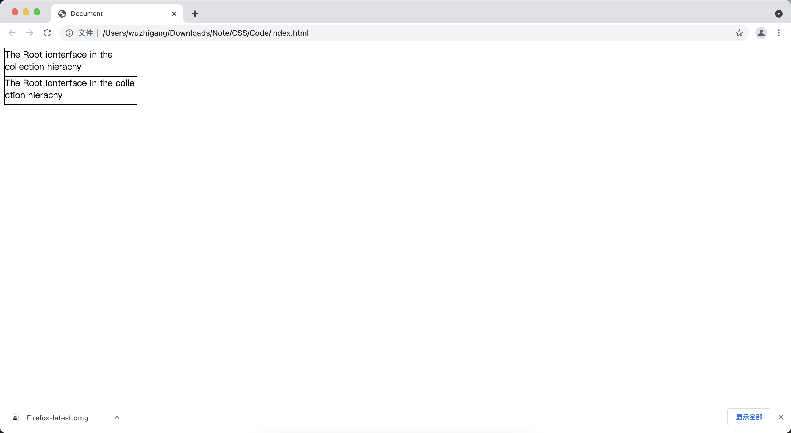
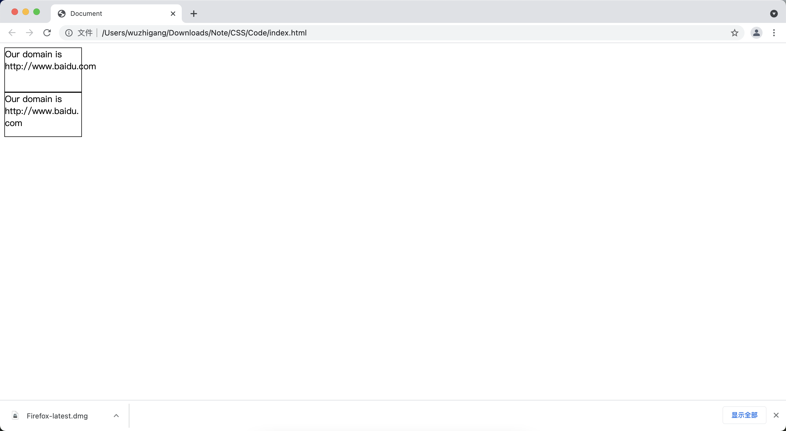

[toc]

# text-indent

&emsp;&emsp;<font color=orange>**text-indent 属性**</font> 用于设置段落文本的缩进，默认值是 0：

```html
<!DOCTYPE html>
<html lang="en">
<head>
    <meta charset="UTF-8">
    <title>Document</title>
</head>
<body>
    <p style="text-indent: 10px;">这里有一段话这里有一段话这里有一段话这里有一段话这里有一段话这里有一段话这里有一段话这里有一段话这里有一段话这里有一段话这里有一段话这里有一段话这里有一段话这里有一段话这里有一段话这里有一段话这里有一段话这里有一段话</p>
    <p style="text-indent: 2em;">这里有一段话这里有一段话这里有一段话这里有一段话这里有一段话这里有一段话这里有一段话这里有一段话这里有一段话这里有一段话这里有一段话这里有一段话这里有一段话这里有一段话这里有一段话这里有一段话这里有一段话这里有一段话</p>
</body>
</html>
```



> <font color=red>**注意：**</font>
> + 被另一个元素（如:br）断开的元素不能应用本属性
> + 建议使用 em 单位，这是一个相对单位，1em 永远都是跟字体大小相同（如果存在英文就有可能出现对不齐的情况）

# text-overflow

&emsp;&emsp;<font color=orange>**text-overflow 属性**</font> 用于控制溢出文本的处理方法，其属性值如下：

属性值 | 说明
-|-
clip | 如果该元素指定了<font color=orange> *__overflow:hidden__* </font>属性值，当该元素中文本溢出时候，clip指定只是简单地裁切溢出的文本
ellipsis | 如果该元素指定了<font color=orange> *__overflow:hidden__* </font>属性值，当该元素中文本溢出时候，ellipsis裁切溢出的文本，并显示溢出标记（...）

```html
<!DOCTYPE html>
<html lang="en">
<head>
    <meta charset="UTF-8">
    <title>Document</title>
</head>
<body>
    <div style="width: 150px;text-overflow: clip;overflow: hidden;border: 1px solid black;white-space: nowrap;">这里有一段话这里有一段话这里有一段话这里有一段话这里有一段话这里有一段</div>
    <div style="width: 150px;text-overflow: ellipsis;overflow: hidden;border: 1px solid black;white-space: nowrap;">这里有一段话这里有一段话这里有一段话这里有一段话这里有一段话这里有一段</div>
</body>
</html>
```



# vertical-align

&emsp;&emsp;<font color=orange>**vertical-align 属性**</font> 用于设置目标元素里的内容垂直对齐方式，其属性值如下：

属性值 | 说明
-|-
auto | 对元素的文本内容执行自动对齐
baseline | 将支持 valign 属性的元素的文本内容与基线对齐
sub | 将元素的内容与文本下标对齐
super | 将元素的内容与文本上标对齐
top | 将支持 valign 属性的元素的文本内容与元素的顶端对齐
middle | 将支持 valign 属性元素的文本内容对齐到元素的中间
bottom | 将支持 valign 属性元素的文本内容与元素的底端对齐
length | 指定文本内容相对于基线的偏移距离，既可以使用百分比形式，也可以使用绝对距离形式

```html
<!DOCTYPE html>
<html lang="en">
<head>
    <meta charset="UTF-8">
    <title>Document</title>
</head>
<body>
    <p style="vertical-align: auto;border: 1px solid red;">xyz</p>
    <p style="vertical-align: baseline;border: 1px solid red;">xyz</p>
    <p style="vertical-align: sub;border: 1px solid red;">xyz</p>
    <p style="vertical-align: super;border: 1px solid red;">xyz</p>
    <p style="vertical-align: top;border: 1px solid red;">xyz</p>
    <p style="vertical-align: middle;border: 1px solid red;">xyz</p>
    <p style="vertical-align: bottom;border: 1px solid red;">xyz</p>
    <p style="vertical-align: 10;border: 1px solid red;">xyz</p>
</body>
</html>
```

# text-align

&emsp;&emsp;<font color=orange>**text-align 属性**</font> 用于设置目标元素中文本的水平对齐方式，支持：<font color=green>*__left、right、center 和 justify__*</font>：

```html
<!DOCTYPE html>
<html lang="en">
<head>
    <meta charset="UTF-8">
    <title>Document</title>
</head>
<body>
    <p style="text-align: left;">一段文本</p>
    <p style="text-align: center;">一段文本</p>
    <p style="text-align: right;">一段文本</p>
    <p style="text-align: justify;">一段文本</p>
</body>
</html>
```



# direction

&emsp;&emsp;<font color=orange>**direction 属性**</font> 用于设置文本流入的方向（ <font color=green>**ltr 和 rtl**</font> ），此属性不会影响拉丁文字母、数字字符：

```html
<!DOCTYPE html>
<html lang="en">
<head>
    <meta charset="UTF-8">
    <title>Document</title>
</head>
<body>
    <p style="direction: ltr;">一段文本</p>
    <p style="direction: rtl;">一段文本</p>
</body>
</html>
```



# white-space

&emsp;&emsp;<font color=orange>**white-space 属性**</font> 用于设置目标元素对文本内容中空白的处理方式，该属性支持如下几个属性值：

属性值|说明
-|-
normal | 默认值，忽略文本中的空白
pre | 浏览器保留文本中的所有的空白
nowrap | 文本不会换行，文本会在同一行上继续，直到遇到br标签为止
pre-wrap | 保留空白字符序列，但可以正常地进行换行
pre-line | 合并空白符序列，但保留换行符
inherit | 指定从父元素继承 white-space属性的值

```html
<!DOCTYPE html>
<html lang="en">
<head>
    <meta charset="UTF-8">
    <meta http-equiv="X-UA-Compatible" content="IE=edge">
    <meta name="viewport" content="width=device-width, initial-scale=1.0">
    <title>Document</title>
    <style>
        div {
            border: 1px solid #000;
            height: 80px;
            width: 240px;
        }
    </style>
</head>
<body>
    <div style="white-space: normal;">
        The root     interface
        in     the            direction
    </div>
    <div style="white-space: pre;">
        The root     interface
        in     the            direction
    </div>
    <div style="white-space: nowrap;">
        The root     interface
        in     the            direction
    </div>
    <div style="white-space: pre-wrap;">
        The root     interface
        in     the            direction
    </div>
    <div style="white-space: pre-line;">
        The root     interface
        in     the            direction
    </div>
</body>
</html>
```



# word-break 和 word-wrap

<font color=skyblue size=3>**1. word-break**</font>

&emsp;&emsp;当 HTML 元素不足以显示它里面的所有文本的时候，浏览器会自动换行显示它里面的所有文本。如果希望改变浏览器的默认行为，则可以通过<font color=orange> *__word-break__* </font>来进行设置：

属性值 | 说明
-|-
normal | 靠浏览器的默认规则进行换行
keep-all | 只能在半角空格或连字符处换行
break-all | 设置允许在单词中间换行

```html
<!DOCTYPE html>
<html lang="en">
<head>
    <meta charset="UTF-8">
    <meta http-equiv="X-UA-Compatible" content="IE=edge">
    <meta name="viewport" content="width=device-width, initial-scale=1.0">
    <title>Document</title>
    <style>
        div {
            border: 1px solid #000;
            height: 50px;
            width: 240px;
        }
    </style>
</head>
<body>
    <!-- 不允许在单词中间换行 -->
    <div style="word-break: keep-all;">
        The Root ionterface in the collection hierachy
    </div>

    <!-- 允许在单词中间换行 -->
    <div style="word-break: break-all;">
        The Root ionterface in the collection hierachy
    </div>
</body>
</html>
```



<font color=skyblue size=3>**2. word-wrap**</font>

&emsp;&emsp;有时候文本内容中包含了特别长的单词或URL地址，此时浏览器下部会出现滚动条。如果想改变浏览器的默认行为，可以通过<font color=orange> *__word-wrap__* </font>属性进行设置：

属性值 | 说明
-|-
normal | 浏览器的默认行为
break-word | 设置允许在单词中间换行

```html
<!DOCTYPE html>
<html lang="en">
<head>
    <meta charset="UTF-8">
    <meta http-equiv="X-UA-Compatible" content="IE=edge">
    <meta name="viewport" content="width=device-width, initial-scale=1.0">
    <title>Document</title>
    <style>
        div {
            border: 1px solid #000;
            height: 80px;
            width: 140px;
        }
    </style>
</head>
<body>
    <div style="word-wrap: normal;">
        Our domain is http://www.baidu.com
    </div>

    <div style="word-wrap: break-word;">
        Our domain is http://www.baidu.com
    </div>
</body>
</html>
```



> <font color=red>**word-break 和 word-wrap 的区别**</font>
> + <font color=orange> **word-break：** </font>该属性设置为break-all，可以让元素内每一行文本的最后一个单词自动换行
> + <font color=orange> **word-wrap：** </font>该属性会尽量让长单词、URL地址不要换行。即使将该属性设为break-word，浏览器也尽量让长单词、URL地址独占一行，只有当一行文本都不足以显示这个仓单词、URL地址时，浏览器才会在长单词、URL地址中间换行。