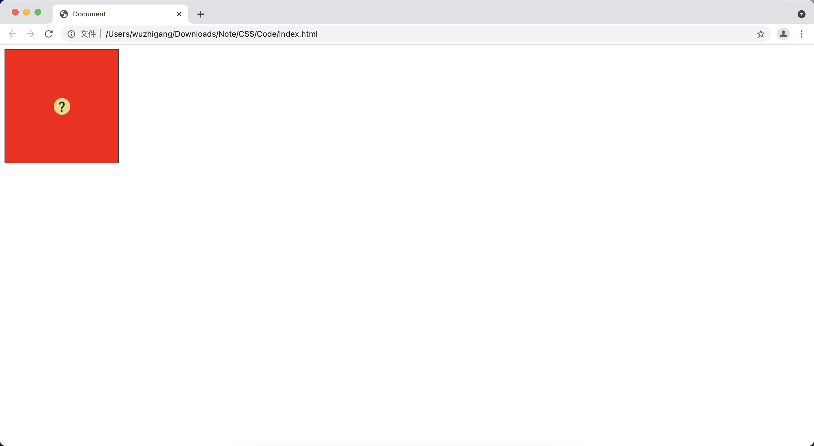

[toc]

# 背景相关的属性
## 设置背景颜色

&emsp;&emsp;通过 <font color=orange> **background-color** </font> 可以设置背景的颜色：

```html
<!DOCTYPE html>
<html>
<head>
    <meta charset="UTF-8">
    <title></title>
</head>
<body>
    <!-- 设置背景颜色 -->
    <div style="background-color: yellow;">Hello</div>
</body>
</html>
```


## 设置背景图片

<font color=skyblue>**1. background-image**</font>

&emsp;&emsp;使用该属性可以设置背景图片：

```html
<!DOCTYPE html>
<html>
<head>
    <meta charset="UTF-8">
    <title></title>
</head>
<body>
    <!-- 设置背景图片 -->
    <div style="background-image: url(./dog.jpg);width: 300px;height: 400px;"></div>
</body>
</html>
```


> <font color=red>**注意：**</font>如果同时设置了背景色和背景图片，则背景图片将覆盖背景色。

<font color=skyblue>**2. background-repeat**</font>

&emsp;&emsp;该属性用来设置背景是否平铺，<font color=red> **使用该属性之前必须先指定 background-image 属性** </font>，该属性支持的属性值如下：

+ <font color=orange>**repeat：**</font>在横、纵方向都平铺
+ <font color=orange>**no-repeat：**</font>在横、纵方向都不平铺
+ <font color=orange>**repeat-x：**</font>只在横方向都平铺
+ <font color=orange>**repeat：**</font>只在纵方向都平铺

```html
<!DOCTYPE html>
<html>
<head>
    <meta charset="UTF-8">
    <title></title>
</head>
<body>
    <!-- repeat -->
    <p>repeat</p>
    <div style="background-color: red;background-image: url(./tianqi_1.png);background-repeat: repeat;width: 90px;height: 90px;"></div>
    <!-- no-repeat -->
    <p>no-repeat</p>
    <div style="background-color: red;background-image: url(./tianqi_1.png);background-repeat: no-repeat;width: 90px;height: 90px;"></div>
    <!-- repeat-x -->
    <p>repeat-x</p>
    <div style="background-color: red;background-image: url(./tianqi_1.png);background-repeat: repeat-x;width: 90px;height: 90px;"></div>
    <!-- repeat-y -->
    <p>repeat-y</p>
    <div style="background-color: red;background-image: url(./tianqi_1.png);background-repeat: repeat-y;width: 90px;height: 90px;"></div>
</body>
</html>
```


&emsp;&emsp;如果 HTML 元素的长度不能整除背景图片的长度，或者 HTML 元素的宽度不能整除背景图片的宽度， repeat 选项将控制裁掉背景图片多出的部分，简单地说就是不能完整地显示出来。CSS3新增了<font color=orange> **space** </font>和<font color=orange> **round** </font>两个属性值来保证背景图片不会被裁剪：

+ <font color=orange>**round：**</font> 自动调整背景图片的大小，从而保证HTML元素内平铺的每个背景图片都能完整地显示出来
+ <font color=orange>**space：**</font> 不会调整背景图片的大小，只是调整背景图片的间距

```html
<!DOCTYPE html>
<html lang="en">
<head>
    <meta charset="UTF-8">
    <meta http-equiv="X-UA-Compatible" content="IE=edge">
    <meta name="viewport" content="width=device-width, initial-scale=1.0">
    <title>Document</title>
</head>
<body>
    <!-- round -->
    <p>round</p>
    <div style="background-color: red;background-image: url(./tianqi_1.png);background-repeat: round;width: 190px;height: 90px;"></div>

    <!-- round -->
    <p>round</p>
    <div style="background-color: red;background-image: url(./tianqi_1.png);background-repeat: space;width: 190px;height: 90px;"></div>
</body>
</html>
```


<font color=skyblue>**3. background-position**</font>

&emsp;&emsp;该属性用来设置对象的背景图片位置，<font color=red> **必须先指定 background-image 属性**</font>，该属性需要横坐标和纵坐标，其属性值可以<font color=orange>**指定长度值；也可以指定百分比；还可以指定单词：bottom left top center** </font>

```html
<!DOCTYPE html>
<html lang="en">
<head>
    <meta charset="UTF-8">
    <meta http-equiv="X-UA-Compatible" content="IE=edge">
    <meta name="viewport" content="width=device-width, initial-scale=1.0">
    <title>Document</title>
    <style>
        div {
            width: 100px;
            height: 100px;
            background-image: url(./tianqi_1.png);
            background-repeat: no-repeat;
            background-color: red;
        }
    </style>
</head>
<body>
    <div style="background-position: top left;"></div><br>
    <div style="background-position: 10px 10px;"></div><br>
    <div style="background-position: 50% 50%;"></div><br>
</body>
</html>
```


<font color=skyblue>**4. 多背景图片**</font>

&emsp;&emsp;CSS3 允许同时指定多个背景图片，这些背景图片会依次覆盖，多个属性值之间以英文逗号隔开：

```html
<!DOCTYPE html>
<html lang="en">
<head>
    <meta charset="UTF-8">
    <meta http-equiv="X-UA-Compatible" content="IE=edge">
    <meta name="viewport" content="width=device-width, initial-scale=1.0">
    <title>Document</title>
    <style>
        div {
            width: 100px;
            height: 100px;
            background-position: top;
            background-repeat: no-repeat;
        }
    </style>
</head>
<body>
    <div style="background-image: url(./tianqi_1.png),url(./dog.jpg);">

    </div>
</body>
</html>
```


<font color=skyblue>**5. background-attachment**</font>

&emsp;&emsp;该属性用来设置背景图片是随着对象内容滚动还是固定，<font color=red> **必须先设置 background-image 属性** </font>：

+ <font color=orange> **scroll：**</font> 指定背景图片会随元素里内容的滚动而滚动（<font color=red> **此时 background-position 按照当前元素进行偏移** </font>）
+ <font color=orange> **fixed：**</font> 背景图片固定，不会随元素里内容的滚动而滚动（<font color=red> **此时 background-position按照浏览器进行偏移** </font>）

```html
<!DOCTYPE html>
<html lang="en">
<head>
    <meta charset="UTF-8">
    <meta http-equiv="X-UA-Compatible" content="IE=edge">
    <meta name="viewport" content="width=device-width, initial-scale=1.0">
    <title>Document</title>
</head>
<body>
    <div style="background-attachment:scroll;background-image: url(./tianqi_1.png);background-repeat: no-repeat;">
        1aaaaaaa <br>1aaaaaaa <br>1aaaaaaa <br>1aaaaaaa <br>1aaaaaaa <br>1aaaaaaa <br>1aaaaaaa <br>1aaaaaaa <br>1aaaaaaa <br>1aaaaaaa <br>1aaaaaaa <br>1aaaaaaa <br>1aaaaaaa <br>1aaaaaaa <br>1aaaaaaa <br>1aaaaaaa <br>1aaaaaaa <br>1aaaaaaa <br>1aaaaaaa <br>1aaaaaaa <br>1aaaaaaa <br>1aaaaaaa <br>1aaaaaaa <br>1aaaaaaa <br>1aaaaaaa <br>1aaaaaaa <br>1aaaaaaa <br>1aaaaaaa <br>1aaaaaaa <br>1aaaaaaa <br>1aaaaaaa <br>1aaaaaaa <br>1aaaaaaa <br>1aaaaaaa <br>1aaaaaaa <br>1aaaaaaa <br>1aaaaaaa <br>1aaaaaaa <br>1aaaaaaa <br>1aaaaaaa <br>1aaaaaaa <br>1aaaaaaa <br>1aaaaaaa <br>1aaaaaaa <br>1aaaaaaa <br>1aaaaaaa <br>1aaaaaaa <br>1aaaaaaa <br>1aaaaaaa <br>1aaaaaaa <br>1aaaaaaa <br>1aaaaaaa <br>1aaaaaaa <br>1aaaaaaa <br>1aaaaaaa <br>1aaaaaaa <br>1aaaaaaa <br>1aaaaaaa <br>1aaaaaaa <br>1aaaaaaa <br>1aaaaaaa <br>1aaaaaaa <br>1aaaaaaa <br>
    </div>
</body>
</html>
```


```html
<!DOCTYPE html>
<html lang="en">
<head>
    <meta charset="UTF-8">
    <meta http-equiv="X-UA-Compatible" content="IE=edge">
    <meta name="viewport" content="width=device-width, initial-scale=1.0">
    <title>Document</title>
</head>
<body>
    <div style="background-attachment:fixed;background-image: url(./tianqi_1.png);background-repeat: no-repeat;">
        1aaaaaaa <br>1aaaaaaa <br>1aaaaaaa <br>1aaaaaaa <br>1aaaaaaa <br>1aaaaaaa <br>1aaaaaaa <br>1aaaaaaa <br>1aaaaaaa <br>1aaaaaaa <br>1aaaaaaa <br>1aaaaaaa <br>1aaaaaaa <br>1aaaaaaa <br>1aaaaaaa <br>1aaaaaaa <br>1aaaaaaa <br>1aaaaaaa <br>1aaaaaaa <br>1aaaaaaa <br>1aaaaaaa <br>1aaaaaaa <br>1aaaaaaa <br>1aaaaaaa <br>1aaaaaaa <br>1aaaaaaa <br>1aaaaaaa <br>1aaaaaaa <br>1aaaaaaa <br>1aaaaaaa <br>1aaaaaaa <br>1aaaaaaa <br>1aaaaaaa <br>1aaaaaaa <br>1aaaaaaa <br>1aaaaaaa <br>1aaaaaaa <br>1aaaaaaa <br>1aaaaaaa <br>1aaaaaaa <br>1aaaaaaa <br>1aaaaaaa <br>1aaaaaaa <br>1aaaaaaa <br>1aaaaaaa <br>1aaaaaaa <br>1aaaaaaa <br>1aaaaaaa <br>1aaaaaaa <br>1aaaaaaa <br>1aaaaaaa <br>1aaaaaaa <br>1aaaaaaa <br>1aaaaaaa <br>1aaaaaaa <br>1aaaaaaa <br>1aaaaaaa <br>1aaaaaaa <br>1aaaaaaa <br>1aaaaaaa <br>1aaaaaaa <br>1aaaaaaa <br>1aaaaaaa <br>
    </div>
</body>
</html>
```


&emsp;&emsp;通过该属性可以实现视觉差的效果：

```html
<!DOCTYPE html>
<html lang="en">
<head>
    <meta charset="UTF-8">
    <meta http-equiv="X-UA-Compatible" content="IE=edge">
    <meta name="viewport" content="width=device-width, initial-scale=1.0">
    <title>Document</title>
</head>
<body>
    <div style="width: 1400px;height: 800px;background-image:url(./1.jpg);background-attachment:fixed;"></div>
    <div style="width: 1400px;height: 800px;background-image:url(./2.jpg);background-attachment:fixed;"></div>
    <div style="width: 1400px;height: 800px;background-image:url(./3.jpg);background-attachment:fixed;"></div>
</body>
</html>
```


<font color=skyblue>**6. background-clip**</font>

&emsp;&emsp;在 CSS2 中，HTML 元素的背景默认只覆盖盒模型的内填充区和内容区，在 CSS3 中可以指定背景覆盖哪个范围：

属性值 | 说明
-|-
border-box | 指定背景覆盖盒模型的边框区、内填充区、内容区
no-clip | 指定背景覆盖盒模型的边框区、内填充区、内容区
padding-box | 指定背景覆盖盒模型的内填充区、内容区
content-box | 指定背景只覆盖盒模型的内容区

```html
<!DOCTYPE html>
<html lang="en">
<head>
    <meta charset="UTF-8">
    <meta http-equiv="X-UA-Compatible" content="IE=edge">
    <meta name="viewport" content="width=device-width, initial-scale=1.0">
    <title>Document</title>
    <style>
        div {
            width: 200px;
            height: 30px;
            border: 10px dotted #444;
            padding: 12px;
        }
    </style>
</head>
<body>
    <div style="background-image:url(./01.png);background-clip:border-box;">测试文字</div><br>
    <div style="background-image:url(./01.png);background-clip:no-clip;">测试文字</div><br>
    <div style="background-image:url(./01.png);background-clip:padding-box;">测试文字</div><br>
    <div style="background-image:url(./01.png);background-clip:content-box;">测试文字</div><br>
</body>
</html>
```


<font color=skyblue>**7. background-origin**</font>

&emsp;&emsp;该属性指定背景从哪里覆盖：

属性值 | 说明
-|-
border-box | 指定背景图片从边框区开始覆盖
padding-box | 指定背景图片从内填充区开始覆盖
content-box | 指定背景从内容区开始覆盖

```html
<!DOCTYPE html>
<html lang="en">
<head>
    <meta charset="UTF-8">
    <meta http-equiv="X-UA-Compatible" content="IE=edge">
    <meta name="viewport" content="width=device-width, initial-scale=1.0">
    <title>Document</title>
    <style>
        div {
            width: 200px;
            height: 30px;
            border: 10px dotted #444;
            padding: 12px;
            background-image: url(./01.png);
            background-repeat: no-repeat;
        }
    </style>
</head>
<body>
    <div style="background-origin:border-box;">测试文字</div><br>
    <div style="background-origin:padding-box;">测试文字</div><br>
    <div style="background-origin:content-box;">测试文字</div><br>
</body>
</html>
```


<font color=skyblue>**8. background-size**</font>

&emsp;&emsp;该属性可以控制背景图片的大小：

```html
<!DOCTYPE html>
<html lang="en">
<head>
    <meta charset="UTF-8">
    <meta http-equiv="X-UA-Compatible" content="IE=edge">
    <meta name="viewport" content="width=device-width, initial-scale=1.0">
    <title>Document</title>
    <style>
        div {
            width: 200px;
            height: 30px;
            border: 1px solid #444;
            background-image: url(./01.png);
            background-repeat: no-repeat;
        }
    </style>
</head>
<body>
    <div style="background-size: 100% 100%;"></div><br>
    <div style="background-size: 20px 20px;"></div><br>
</body>
</html>
```


## 使用 background 设置背景

&emsp;&emsp;可以使用<font color=orange> **background 属性** </font>设置对象的背景样式，该属性是一个复合属性，可用于同时设置背景色、背景图片、背景重复模式等属性，该属性格式如下：<font color=orange> *__background-color background-image background-repeat background-attachment background-position__* ：</font>

```html
<!DOCTYPE html>
<html lang="en">
<head>
    <meta charset="UTF-8">
    <meta http-equiv="X-UA-Compatible" content="IE=edge">
    <meta name="viewport" content="width=device-width, initial-scale=1.0">
    <title>Document</title>
    <style>
        div {
            width: 200px;
            height: 200px;
            border: 1px solid #444;
        }
    </style>
</head>
<body>
    <div style="background: red url(./01.png) no-repeat scroll 50% 50%"></div>
</body>
</html>
```



# 使用渐变背景
## 使用 linear-gradient 设置线性渐变

&emsp;&emsp;语法格式如下：

```css
linear-gradient(方向? 颜色列表)
```

&emsp;&emsp;这里的方向用于指定线性渐变的方向，该方向可以省略，如果省略指定方向，线性渐变的方向默认是从上到下的，方向参数支持如下参数值：

方向参数值 | 说明
-|-
to top | 代表从下到上
to bottom | 代表从上到下
to left | 代表从右到左
to right | 代表从左到右
to left top | 代表从右下角到左上角
to right top | 代表从左下角到右上角
to left bottom | 代表从右上角到左下角
to right bottom | 代表从左上角到右下角
Ndeg | 指定角度值，该角度值代表顺时针转过的角度

```html
<!DOCTYPE html>
<html lang="en">
<head>
    <meta charset="UTF-8">
    <meta http-equiv="X-UA-Compatible" content="IE=edge">
    <meta name="viewport" content="width=device-width, initial-scale=1.0">
    <title>Document</title>
    <style>
        div {
            width: 300px;
            height: 300px;
        }
    </style>
</head>
<body>
    <div id="div1" style="background:linear-gradient(red, blue)"></div>
    <button onclick="change(this.innerHTML);">to top</button>
    <button onclick="change(this.innerHTML);">to bottom</button>
    <button onclick="change(this.innerHTML);">to left</button>
    <button onclick="change(this.innerHTML);">to right</button>
    <button onclick="change(this.innerHTML);">to left top</button>
    <button onclick="change(this.innerHTML);">to right top</button>
    <button onclick="change(this.innerHTML);">to left bottom</button>
    <button onclick="change(this.innerHTML);">to right bottom</button>
    <script>
        function change(val) {
            document.getElementById("div1").style.background = "linear-gradient(" + val + ",red,blue)";
        }
    </script>
</body>
</html>
```


&emsp;&emsp;除了使用简单地<font color=orange> **to xxx** </font>控制线性渐变的方向外，CSS3也允许通过角度来指定线性渐变的方向：

```html
<!DOCTYPE html>
<html lang="en">
<head>
    <meta charset="UTF-8">
    <meta http-equiv="X-UA-Compatible" content="IE=edge">
    <meta name="viewport" content="width=device-width, initial-scale=1.0">
    <title>Document</title>
    <style>
        div {
            width: 300px;
            height: 300px;
        }
    </style>
</head>
<body>
    <div id="div1" style="background:linear-gradient(0deg,red, blue)"></div>
    角度：<input type="range" style="width: 360px;" min="0" max="360" value="0" onchange="change(this.value)">
    <script>
        function change(val) {
            var s = "linear-gradient(" + val + "deg,red,blue)";
            document.getElementById("div1").style.background = s;
        }
    </script>
</body>
</html>
```


&emsp;&emsp;可以依次为线性渐变指定多种颜色，而且可以为各种颜色指定位置（<font color=orange> **位置可以使用百分比，也可以使用长度值** </font>）：

```html
<!DOCTYPE html>
<html lang="en">
<head>
    <meta charset="UTF-8">
    <meta http-equiv="X-UA-Compatible" content="IE=edge">
    <meta name="viewport" content="width=device-width, initial-scale=1.0">
    <title>Document</title>
    <style>
        div {
            width: 300px;
            height: 90px;
            border: 1px solid black;
        }
    </style>
</head>
<body>
    <div style="background:linear-gradient(30deg,red,green, blue)"></div>
    <div style="background:linear-gradient(45deg,red,green, blue),yellow"></div>
    <div style="background:linear-gradient(90deg,rgba(255,0,0,0),rgba(255,0,0,1))"></div>
    <div style="background:linear-gradient(135deg,red 20%,green 40%, blue 70%)"></div>
</body>
</html>
```


## 使用 repeating-linear-gradient 设置循环线性渐变

&emsp;&emsp;这种线性渐变将会循环利用给出的渐变颜色：

```html
<!DOCTYPE html>
<html lang="en">
<head>
    <meta charset="UTF-8">
    <meta http-equiv="X-UA-Compatible" content="IE=edge">
    <meta name="viewport" content="width=device-width, initial-scale=1.0">
    <title>Document</title>
    <style>
        div {
            width: 400px;
            height: 400px;
        }
    </style>
</head>
<body>
    <div id="div1" style="background:repeating-linear-gradient(red, blue 10%,magenta 20%)"></div>
    角度: <input type="range" min="0" max="360" style="width: 360px;" value="0" onchange="change(this.value)">
    <script>
        function change(val) {
            document.getElementById("div1").style.background = "repeating-linear-gradient(" + val + "deg,red,blue 40%,magenta 20%)";
        }
    </script>
</body>
</html>
```


## 使用 radial-gradient 设置径向渐变

&emsp;&emsp;该函数的语法格式如下：

```css
radial-gradient(形状? 大小? at x坐标 y坐标, 颜色列表)
```

+ <font color=orange>**形状：**</font> 指定径向渐变的形状（circle、ellipse）
+ <font color=orange>**大小：**</font> 指定径向渐变的大小，这部分可以省略，如果省略，则径向渐变的大小由浏览器决定，通常会占满整个HTML元素
+ <font color=orange>**圆心：**</font> 圆心部分必须由at关键字开头，后面紧跟圆心的x坐标和y坐标，这部分可以省略
  + <font color=green>left：</font>代表x坐标的最左边
  + <font color=green>center：</font>代表x坐标和y坐标的中间
  + <font color=green>right：</font>代表x坐标的最右边
  + <font color=green>top：</font>代表y坐标的最顶部
  + <font color=green>bottom：</font>代表y坐标的最底部
  + <font color=green>数值：</font>该数值支持长度值和百分比，可代表x坐标或y坐标的值
+ <font color=orange>**颜色列表：**</font> 径向渐变的颜色列表与线性渐变的颜色列表的用法完全相同

```html
<!DOCTYPE html>
<html lang="en">
<head>
    <meta charset="UTF-8">
    <title>Document</title>
    <style>
        div {
            height: 300px;
            width: 300px;
        }
    </style>
</head>
<body>
    <div id="dv1" style="background: radial-gradient(red, blue);"></div>
    <button onclick="change(this.innerHTML);">left top</button>
    <button onclick="change(this.innerHTML);">left center</button>
    <button onclick="change(this.innerHTML);">left bottom</button>
    <button onclick="change(this.innerHTML);">center top</button>
    <button onclick="change(this.innerHTML);">center center</button>
    <button onclick="change(this.innerHTML);">center bottom</button>
    <button onclick="change(this.innerHTML);">right top</button>
    <button onclick="change(this.innerHTML);">right center</button>
    <button onclick="change(this.innerHTML);">right bottom</button>
    <script>
        function change(val) {  
            document.getElementById("dv1").style.background = "radial-gradient(at " + val + ",red,blue)";
        }
    </script>
</body>
</html>
```


&emsp;&emsp;也可以使用数值来指定径向渐变的圆心：

```html
<!DOCTYPE html>
<html lang="en">
<head>
    <meta charset="UTF-8">
    <title>Document</title>
    <style>
        div {
            height: 300px;
            width: 300px;
        }
    </style>
</head>
<body>
    <div id="dv1" style="background: radial-gradient(red, blue);"></div>
    x: <input id="x" style="width: 360px;" type="range" min="0" max="500" value="250" onchange="change();"><br/>
    y: <input id="y" style="width: 360px;" type="range" min="0" max="300" value="150" onchange="change();">
    <script>
        function change() {  
            var x = document.getElementById("x").value;
            var y = document.getElementById("y").value;
            document.getElementById("dv1").style.background = "radial-gradient(at " + x + "px " + y + "px" + ",red,blue)";
        }
        
    </script>
</body>
</html>
```


&emsp;&emsp;该语法的大小部分会根据形状发生改变，如果径向渐变的形状是圆形，那么大小部分只需指定一个值；如果径向渐变的形状是椭圆，那么大小部分需指定两个值，分别代表椭圆的 x 半轴和 y 半轴。其大小支持如下值：

+ <font color=orange>**closet-side：**</font> 渐变大小到最近的边
+ <font color=orange>**farthest-side：**</font> 渐变大小到最远的边
+ <font color=orange>**closet-corner：**</font> 渐变大小到最近的角
+ <font color=orange>**farthest-corner：**</font> 渐变大小到最远的角
+ <font color=orange>**数值：**</font> 该数值既支持百分比也支持长度值，用于指定渐变的实际半径

```html
<!DOCTYPE html>
<html lang="en">
<head>
    <meta charset="UTF-8">
    <title>Document</title>
    <style>
        div {
            height: 300px;
            width: 600px;
        }
    </style>
</head>
<body>
    <div id="dv1" style="background: radial-gradient(red, blue);"></div>
    <button onclick="change(this.innerHTML);">closest-side</button>
    <button onclick="change(this.innerHTML);">farthest-side</button>
    <button onclick="change(this.innerHTML);">closest-corner</button>
    <button onclick="change(this.innerHTML);">farthest-corner</button>
    <script>
        function change(val) {  
            document.getElementById("dv1").style.background = "radial-gradient(circle " + val + ",red,blue)";
        }
    </script>
</body>
</html>
```


&emsp;&emsp;CSS3 同样支持使用数值来指定径向渐变的大小：

```html
<!DOCTYPE html>
<html lang="en">
<head>
    <meta charset="UTF-8">
    <title>Document</title>
    <style>
        div {
            height: 300px;
            width: 600px;
        }
    </style>
</head>
<body>
    <div id="dv1" style="background: radial-gradient(red, blue);"></div>
   
    椭圆渐变：<input type="checkbox" id="shape" onchange="change()"><br/>
    横向半径：<input id="x" style="width: 360px;" type="range" min="0" max="300" value="150" onchange="change()"><br/>
    径向半径：<input id="y" style="width: 360px;" type="range" min="0" max="150" value="75" onchange="change()"><br/>
    <script>
        function change() {  
            var xSize = document.getElementById("x").value;
            var ySize = document.getElementById("y").value;
            var isEllipse = document.getElementById("shape").checked;
            if (isEllipse) {
                document.getElementById("dv1").style.background = "radial-gradient(ellipse " + xSize + "px " + ySize + "px" + ",red,blue)";
            } else {
                document.getElementById("dv1").style.background = "radial-gradient(circle " + xSize + "px" + ",red,blue)";
            }
        }
    </script>
</body>
</html>
```


&emsp;&emsp;这样可以依次为径向渐变指定多种颜色，而且可以为各种颜色指定位置（位置既可以是百分比，也可以是长度值），如果为这些颜色指定位置，那么径向渐变将会平均分布这些颜色：

```html
<!DOCTYPE html>
<html lang="en">
<head>
    <meta charset="UTF-8">
    <title>Document</title>
    <style>
        div {
            height: 90px;
            width: 300px;
            border: 1px solid black;
        }
    </style>
</head>
<body>
    <div style="background: radial-gradient(at 40px 100px,red,green,blue);"></div>
    <div style="background: radial-gradient(ellipse,red,green,blue);"></div>
    <div style="background: radial-gradient(20px,red,green,blue);"></div>
    <div style="background: radial-gradient(at 100px 50px,red,green,blue,yellow);"></div>
    <div style="background: radial-gradient(ellipse at 100px 50px,rgba(255,0,0,0),rgba(255,0,0,1));"></div>
    <div style="background: radial-gradient(circle 50px,red 20%,green 40%,blue 70%);"></div>
</body>
</html>
```


## 使用 repeating-radial-gradient 设置循环径向渐变

&emsp;&emsp;这种渐变会循环利用给出的渐变颜色：

```html
<!DOCTYPE html>
<html lang="en">
<head>
    <meta charset="UTF-8">
    <title>Document</title>
    <style>
        div {
            height: 300px;
            width: 400px;
        }
    </style>
</head>
<body>
    <div id="dv1" style="background: repeating-radial-gradient(red, blue 30px,magenta 50px);"></div>
    x: <input id="x" style="width: 360px;" type="range" min="0" max="400" value="200" onchange="change()"><br/>
    y: <input id="y" style="width: 360px;" type="range" min="0" max="300" value="150" onchange="change()">
    <script>
        function change() {  
            var x = document.getElementById("x").value;
            var y = document.getElementById("y").value;
            document.getElementById("dv1").style.background = "repeating-radial-gradient(at " + x + "px " + y + "px" + ",red,blue 30px,magenta 50px)"
        }
    </script>
</body>
</html>
```


# 使用 opacity 控制透明度

&emsp;&emsp;该属性用于设置整个 HTML 元素的透明度，一旦设置了元素的opacity 属性，整个 HTML 元素的透明度都会受到影响（ <font color=orange> **0表示完全透明，1表示完全不透明** </font>）：

```html
<!DOCTYPE html>
<html lang="en">
<head>
    <meta charset="UTF-8">
    <title>Document</title>
    <style>
        div {
            height: 300px;
            width: 400px;
        }
    </style>
</head>
<body>
    <div style="background-color: red;opacity: 0.1;">
        <button>按钮</button>
    </div>
</body>
</html>
```


> <font color=red>**注意：**</font>
> + 即使设为0也是占空间的
> + 所有的子内容也会透明