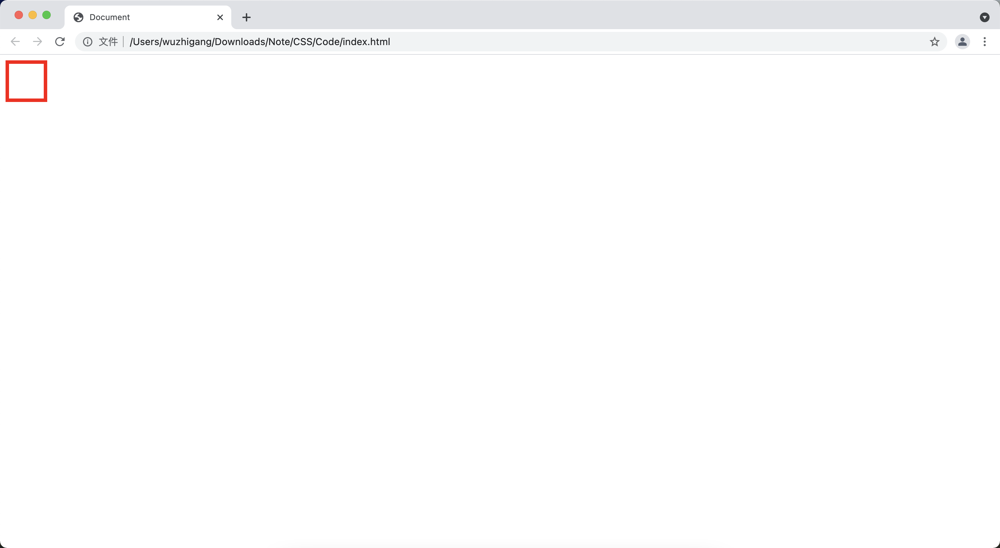
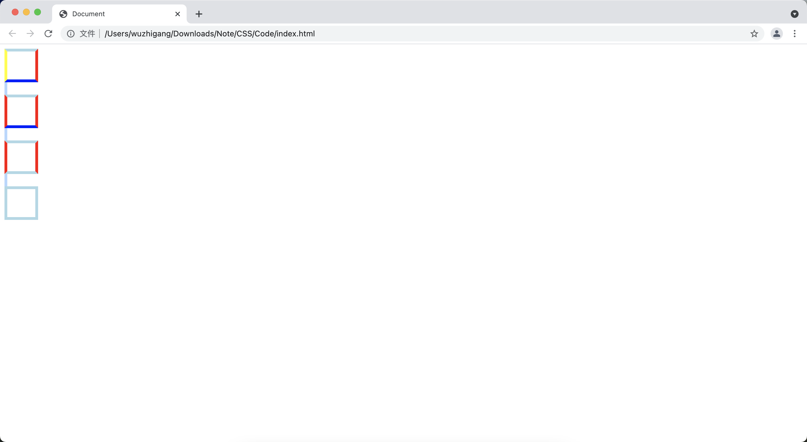
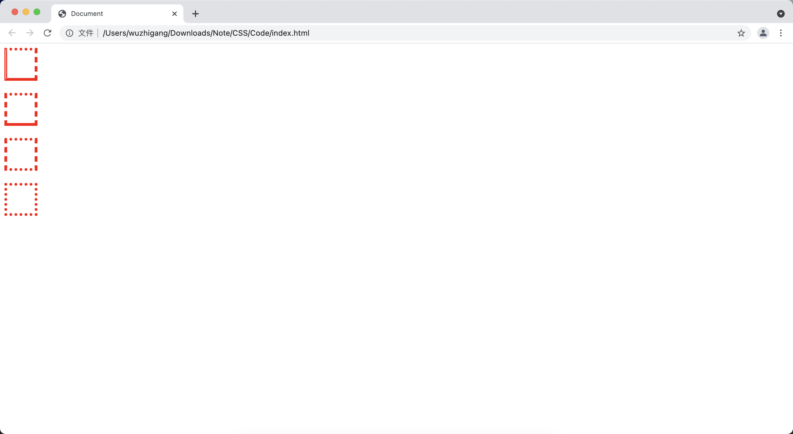
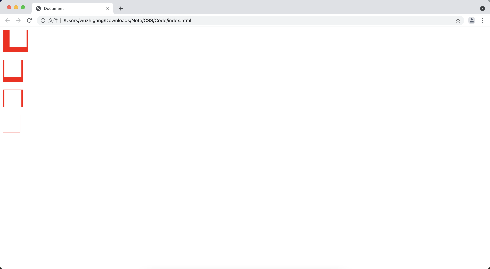
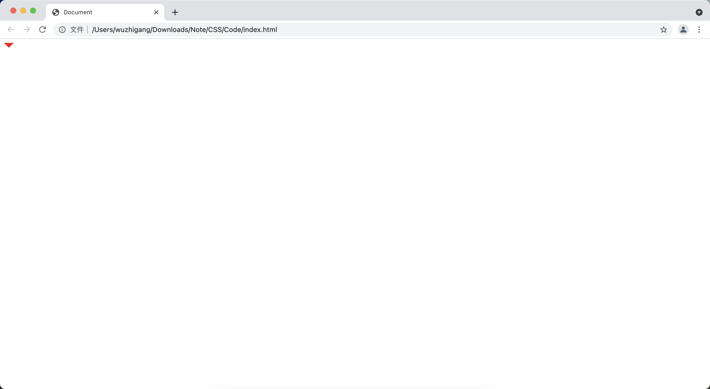
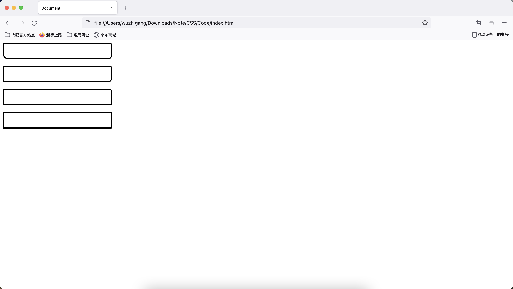
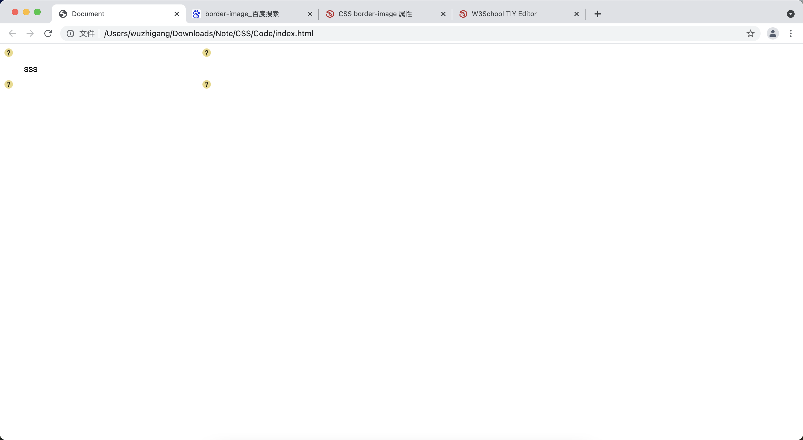
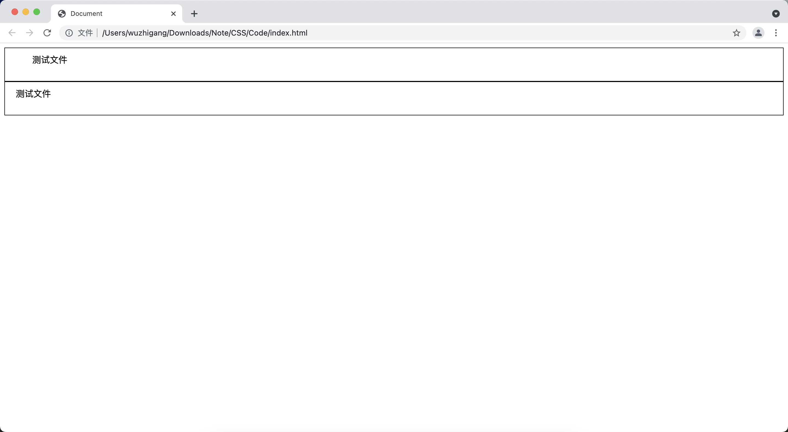
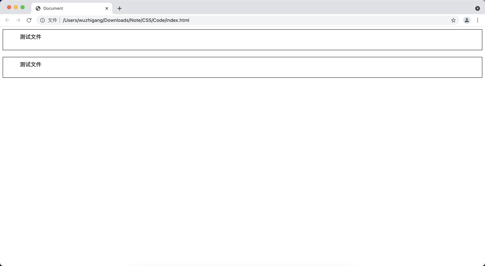

[toc]

# 边框相关属性
## border

&emsp;&emsp;这是一个复合属性，用于设置目标元素的边框样式，可以同时设置边框的粗细、线型、颜色：

```html
<!DOCTYPE html>
<html lang="en">
<head>
    <meta charset="UTF-8">
    <title>Document</title>
    <style>
        div {
            width: 50px;
            height: 50px;
        }
    </style>
</head>
<body>
    <div style="border: 5px solid red;"></div>
</body>
</html>
```

> <font color=red>**注意：**</font> 还可以通过<font color=orange> **border-top、border-right、border-bottom 和 border-left** </font>分别设置四个边的样式。



## 设置边框颜色

&emsp;&emsp;<font color=orange>**border-color 属性**</font> 用于设置元素的边框颜色：

+ 如果是4个参数，分别代表上、右、下、左
+ 如果是1个参数，则代表四个边
+ 如果是2个参数，则代表上下、左右
+ 如果是3个参数，则代表上、左右、下

```html
<!DOCTYPE html>
<html lang="en">
<head>
    <meta charset="UTF-8">
    <title>Document</title>
    <style>
        div {
            width: 50px;
            height: 50px;
            border: 5px solid red;
        }
    </style>
</head>
<body>
    <div style="border-color: lightblue red blue yellow;"></div><br>
    <div style="border-color: lightblue red blue;"></div><br>
    <div style="border-color: lightblue red;"></div><br>
    <div style="border-color: lightblue;"></div><br>
</body>
</html>
```



> <font color=red>**注意：**</font> 还可以通过<font color=orange> **border-top-color、border-right-color、border-bottom-color 和 border-left-color** </font>分别设置四个边的颜色。

## 设置边框线型

&emsp;&emsp;<font color=orange>**border-style 属性**</font> 用于设置元素的边框线型，规则同边框颜色。线型支持的值如下所示：

属性值 | 说明
-|-
none | 无边框
hidden | 隐藏边框
dotted | 点线边框
dashed | 虚线边框
solid | 实线边框
double | 双线边框
groove | 3D凹槽边框
ridge | 3D凸槽边框
inset | 3D凹入边框
outset | 3D凸出边框

```html
<!DOCTYPE html>
<html lang="en">
<head>
    <meta charset="UTF-8">
    <title>Document</title>
    <style>
        div {
            width: 50px;
            height: 50px;
            border: 5px solid red;
        }
    </style>
</head>
<body>
    <div style="border-style: dotted dashed solid double; "></div><br>
    <div style="border-style: dotted dashed solid ; "></div><br>
    <div style="border-style: dotted dashed; "></div><br>
    <div style="border-style: dotted ; "></div><br>
</body>
</html>
```



> <font color=red>**注意：**</font> 还可以通过<font color=orange> **border-top-style、border-right-style、border-bottom-style 和 border-left-style** </font>分别设置四个边的颜色。

## 设置边框宽度

&emsp;&emsp;<font color=orange>**border-width 属性**</font> 用于设置目标元素的边框线宽，规则同边框颜色：

```html
<!DOCTYPE html>
<html lang="en">
<head>
    <meta charset="UTF-8">
    <title>Document</title>
    <style>
        div {
            width: 50px;
            height: 50px;
            border: 5px solid red;
        }
    </style>
</head>
<body>
    <div style="border-width: 1px 5px 15px 20px; "></div><br>
    <div style="border-width: 1px 5px 15px; "></div><br>
    <div style="border-width: 1px 5px; "></div><br>
    <div style="border-width: 1px; "></div><br>
</body>
</html>
```



> <font color=red>**注意：**</font> 还可以通过<font color=orange> **border-top-width、border-right-width、border-bottom-width 和 border-left-width** </font>分别设置四个边的宽度。

## 小案例

&emsp;&emsp;实现三角形的效果：

```html
<!DOCTYPE html>
<html lang="en">
<head>
    <meta charset="UTF-8">
    <title>Document</title>
    <style>
        div {
            width: 0px;
            height: 0px;
        }
    </style>
</head>
<body>
    <div style="border-top:10px solid red;border-bottom: 10px solid transparent;border-left: 10px solid transparent;border-right: 10px solid transparent;"></div><br>
</body>
</html>
```



## CSS3 提供的渐变边框

+ <font color=orange>**border-top-colors：**</font> 该属性用于设置目标元素的上边框颜色，如果设置上边框的宽度是Npx，那么就可以为该属性设置N种，每种颜色显示1px的宽度。但如果设置的颜色数量小于边框的宽度，那么最后一个颜色将会覆盖边框剩下的宽度
+ <font color=orange>**border-right-colors：**</font> 该属性用于设置目标元素的右边框颜色
+ <font color=orange>**border-bottom-colors：**</font> 该属性用于设置目标元素的底边框颜色
+ <font color=orange>**border-left-colors：**</font> 该属性用于设置目标元素的左边框颜色

```html
<!DOCTYPE html>
<html lang="en">
<head>
    <meta charset="UTF-8">
    <title>Document</title>
    <style>
        div {
            height: 40px;
            width: 300px;
        }
    </style>
</head>
<body>
    <div style="border: 10px solid gray;-moz-border-bottom-colors:#555 #666 #aaa"></div>
    <div style="border: 10px solid gray;-moz-border-top-colors:#555 #666 #aaa"></div>
    <div style="border: 10px solid gray;-moz-border-left-colors:#555 #666 #aaa"></div>
    <div style="border: 10px solid gray;-moz-border-right-colors:#555 #666 #aaa"></div>
</body>
</html>
```

## CSS3 提供的圆角边框

&emsp;&emsp;<font color=orange>**border-radius 属性**</font> 用于指定圆角边框的圆角半径（半径越大，圆角的程度越大），规则如下：

+ 如果该属性指定 1 个长度，则 4 个圆角都使用该长度作为半径
+ 如果指定 2 个长度，则第一个长度作为左上角、右下角，第二个长度将作为右上角、左下角的半径
+ 如果指定 3 个长度，则第一个长度作为左上角、第二个作为右上角、左下角的半径，第三个长度作为右下角的半径
+ 如果指定 4 个值，分别对应左上角、右上角、右下角、左下角

```html
<!DOCTYPE html>
<html lang="en">
<head>
    <meta charset="UTF-8">
    <title>Document</title>
    <style>
        div {
            height: 40px;
            width: 300px;
            border: 3px solid black;
        }
    </style>
</head>
<body>
    <div style="border-radius: 2px 5px 10px 15px;"></div><br>
    <div style="border-radius: 2px 5px 10px;"></div><br>
    <div style="border-radius: 2px 5px ;"></div><br>
    <div style="border-radius: 2px;"></div><br>
</body>
</html>
```



> <font color=red>**注意：**</font> 还可以通过<font color=orange> **border-top-left-radius、border-top-right-radius、border-bottom-right-radius 和 border-bottom-left-radius** </font>分别设置四个角的圆角半径。

## CSS3提供的图片边框

&emsp;&emsp;该属性应该遵守如下格式：

```css
<border-image-source> <border-image-slice> [<border-image-wdith>]? <border-image-repeat>
```

+ <font color=orange>**border-image-source：**</font> 指定边框图片，可以是 <font color=green>**none**</font> 或者 <font color=green>**url()**</font>
+ <font color=orange>**border-image-slice：**</font> 该属性值可指定 <font color=green>**1-4 个数值或百分比数值**</font>，这4个数值用于控制如何对边框图片进行切割（除非指定&&fill后缀，否则中间区域将会被抛弃）
+ <font color=orange>**border-image-width：**</font> 指定图片边框的宽度
+ <font color=orange>**border-image-repeat：**</font> 指定边框图片的覆盖方式（ <font color=green>**stretch、repeat、round**</font> ）

```html
<!DOCTYPE html>
<html lang="en">
<head>
    <meta charset="UTF-8">
    <title>Document</title>
    <style>
        div
        {
            border:15px solid transparent;
            width:300px;
            padding:10px 20px;
        }   
    </style>
</head>
<body>
    <div style="-webkit-border-image:url(./01.png) 30 round">sss</div>
</body>
</html>
```



# padding 和 margin 相关属性
## 内填充相关属性

&emsp;&emsp;<font color=orange>**padding 属性**</font> 可以同时设置上、下、左、右4个边的内填充距离：

```html
<!DOCTYPE html>
<html lang="en">
<head>
    <meta charset="UTF-8">
    <title>Document</title>
    <style>
        div {
            height: 300px;
            height: 40px;
            border: 1px solid black;
        }
    </style>
</head>
<body>
    <div style="padding: 10px 50px;">测试文件</div>
    <div style="padding: 10px 20px;">测试文件</div>
</body>
</html>
```



> <font color=red>**注意：**</font> 还可以通过<font color=orange> **padding-top、padding-left、padding-right 和 padding-bottom** </font>分别设置四个边的内填充距离。

## 外边距相关属性

&emsp;&emsp;<font color=orange>**margin 属性**</font> 用于同时设置上、下、左、右4个外边距距离：

```html
<!DOCTYPE html>
<html lang="en">
<head>
    <meta charset="UTF-8">
    <title>Document</title>
    <style>
        div {
            height: 300px;
            height: 40px;
            border: 1px solid black;
        }
    </style>
</head>
<body>
    <div style="padding: 10px 50px;">测试文件</div>
    <div style="padding: 10px 50px;margin-top: 20px;">测试文件</div>
</body>
</html>
```



> <font color=red>**注意：**</font> 还可以通过<font color=orange> **margin-top、margin-left、margin-right 和 margin-bottom** </font>分别设置四个边的外边距距离。

# CSS 默认样式

&emsp;&emsp;CSS 元素存在默认的样式，如：<font color=orange>**body（默认外边距）、h系列（上下边距）、p（上下边距）、ul（上下边距和左边的padding）等**</font>。有时候需要将默认的样式去掉，最简单的方法如下所示：

```css
*{
    margin:0;
    padding: 0;
}
ul {
    list-style: none;
}
a {
    text-decoration:none;
    color:#666;
}
/*默认是以文字的基线进行对齐，导致图片和文字底部有一些空隙*/
img {
    display: block;
}
```

> <font color=red>**提示：**</font> 如果需要更复杂、更完整的，可以去一些大的网站上借鉴别人写好的方法。

# 鼠标样式

&emsp;&emsp;可以使用<font color=orange> **cursor 属性** </font> 设置鼠标样式，常用的属性值如下：

属性值 | 说明
-|-
default | 默认光标（通常是一个箭头）
auto | 默认。浏览器设置的光标
crosshair | 光标呈现为十字线
pointer	| 光标呈现为指示链接的指针（一只手）
move | 此光标指示某对象可被移动
e-resize | 此光标指示矩形框的边缘可被向右（东）移动。
ne-resize | 此光标指示矩形框的边缘可被向上及向右移动（北/东）
nw-resize | 此光标指示矩形框的边缘可被向上及向左移动（北/西）
n-resize | 此光标指示矩形框的边缘可被向上（北）移动
se-resize | 此光标指示矩形框的边缘可被向下及向右移动（南/东）
sw-resize | 此光标指示矩形框的边缘可被向下及向左移动（南/西）
s-resize | 此光标指示矩形框的边缘可被向下移动（南）
w-resize | 此光标指示矩形框的边缘可被向左移动（西）
text | 此光标指示文本
wait | 此光标指示程序正忙（通常是一只表或沙漏）
help | 此光标指示可用的帮助（通常是一个问号或一个气球）

```html
<!DOCTYPE html>
<html lang="en">
<head>
    <meta charset="UTF-8">
    <title>Document</title>
    <style>
        div {
            height: 300px;
            height: 40px;
            background-color: red;
        }
    </style>
</head>
<body>
    <div style="cursor: pointer;"></div><br>
    <div style="cursor: help;"></div><br>
    <div style="cursor: wait;"></div><br>
</body>
</html>
```

&emsp;&emsp;也可以通过 <font color=orange>**url()**</font> 设置自定义的鼠标样式：

```html
<!DOCTYPE html>
<html lang="en">
<head>
    <meta charset="UTF-8">
    <title>Document</title>
    <style>
        div {
            height: 300px;
            height: 40px;
            background-color: red;
        }
    </style>
</head>
<body>
    <div style="cursor: url(./moniqi.ico), auto;"></div><br>
</body>
</html>
```

> <font color=red>**注意：**</font> 图片格式必须是<font color=orange>**.cur</font> 或者 <font color=orange>**.ico</font>。
