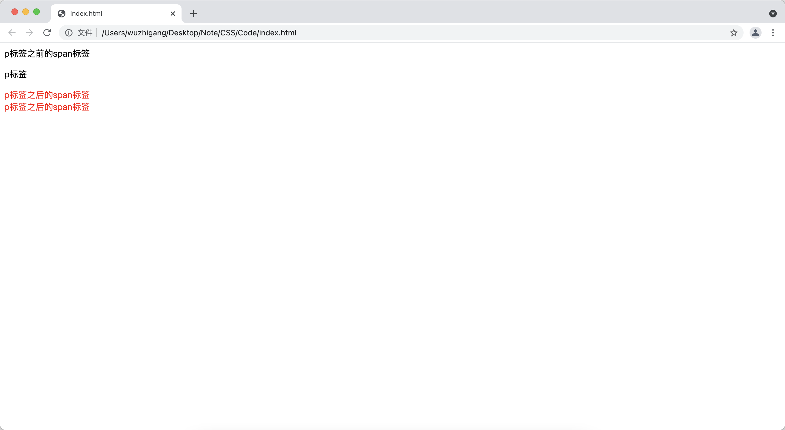

[toc]

# 元素选择器

&emsp;&emsp;元素选择器的语法格式如下：

```css
 /* E代表有效的 HTML 元素名 */
E { ... }
```

> <font color=red>**提示：**</font> 可以使用<font color=orange> \* </font>代表匹配 HTML 文档中的任意元素。

```html
<!DOCTYPE html>
<html>
<head>
    <meta charset="UTF-8">
    <title></title>
    <style>
        /* 使用元素选择器指定样式 */
        p { color: red;}
    </style>
</head>
<body>
    <p>一段文本</p>
</body>
</html>
```


# ID 选择器

&emsp;&emsp;用来对具有指定<font color=orange> **id 属性值** </font>的 HTML 元素起作用，语法格式如下：

```css
[E]#idValue { ... }
```

> <font color=red>**注意：**</font> 
> + id 是唯一的值，在一个页面中只能出现一次，出现多次是不符合规范的
> + 命名只能是字母、数字、下划线，且不能以数字开头

```html
<!DOCTYPE html>
<html>
<head>
    <meta charset="UTF-8">
    <title></title>
    <style>
        /* 使用元素选择器指定样式 */
        #red { color: red; }
    </style>
</head>
<body>
    <p id="red">一段文本</p>
</body>
</html>
```


# class 选择器

&emsp;&emsp;class选择器指定CSS样式对具有指定<font color=orange> **class属性** </font>的元素起作用：

```css
[E].classValue { ... }
```

&emsp;&emsp;class是可以复用的，可以添加多个class样式：

```html
<!DOCTYPE html>
<html>
<head>
    <meta charset="UTF-8">
    <title></title>
    <style>
        /* 使用class选择器定义样式 */
        .a {
            color: red;
        }
        /* 使用class选择器定义样式 */
        .b {
            background-color: yellow;
        }
    </style>
</head>
<body>
    <p class="a b">一段文本</p>
</body>
</html>
```


&emsp;&emsp;多个样式的时候，样式的优先级<font color=orange> **根据CSS决定，而不是Class属性中的顺序** </font>：

```html
<!DOCTYPE html>
<html>
<head>
    <meta charset="UTF-8">
    <title></title>
    <style>
        /* 使用class选择器定义样式 */
        .a {
            color: red;
            background-color: blue;
        }
        /* 使用class选择器定义样式 */
        .b {
            background-color: yellow;
        }
    </style>
</head>
<body>
    <!-- 虽然 a 在后面，但是在定义css的时候，b 在后面，所有背景色是黄色 -->
    <p class="b a">一段文本</p>
</body>
</html>
```


&emsp;&emsp;可以使用<font color=orange> **元素 + 类** </font> 的方法对具有的class属性的指定元素设定样式：

```html
<!DOCTYPE html>
<html>
<head>
    <meta charset="UTF-8">
    <title></title>
    <style>
        /* 对定义class为a的p标签有效 */
        p.a {
            color: red;
            background-color: blue;
        }
    </style>
</head>
<body>
    <p class="a">一段文本</p>
    <div class="a">div定义的一段文本</div>
</body>
</html>
```


# 属性选择器

选择器 | 说明
-|-
E {...} | 指定该CSS样式对所有的E元素起作用
E[attr] {...} | 指定该CSS样式对具有attr属性的E元素起作用
E[attr = value] {...} | 指定CSS样式对所有包含attr属性，且attr属性值为value的E元素起作用
E[attr ~= value] {...} | 指定CSS样式对所有包含attr属性，且attr属性的值为以空格隔开的系列值，其中某个值为value的E元素起作用
E[attr \|= value] {...} | 指定CSS样式对所有包含attr属性，且attr属性的值为以连字符分割的系列值，其中第一个值为value的E元素起作用
E[attr ^= value] {...} | 指定CSS样式对所有包含attr属性，且attr属性的值为以value开头的字符串的E元素起作用
E[attr $= value] {...} | 指定CSS样式对所有包含attr属性，且attr属性的值为以value结尾的字符串的E元素起作用
E[attr \*= value] {...} | 指定CSS样式对所有包含attr属性，且attr属性的值为包含value的字符串的E元素起作用
E[value][value] {...} | 同时满足多个属性的E元素

```html
<!DOCTYPE html>
<html>
<head>
    <meta charset="UTF-8">
    <title></title>
    <style>
        /* p 元素设置样式 */
        p { color: red;}
        /* 具有id属性的p元素 */
        p[id] {color: yellow;}
        /* class=aclass的p标签 */
        p[class=aclass]{ color: green;}
        /* class值空格隔开，里面有个值是t */
        p[class~=t] {color: grey;}
        /* class值连字符隔开，t开头 */
        p[class|=t] {color: darkblue;}
        /* class值以o开头 */
        p[class^=o] {color: pink;}
        /* class值以o结尾 */
        p[class$=o] {color: blueviolet;}
        /* class值包含l */
        p[class*=l] {color:brown;}
        /* 同时具备id和class属性的p */
        p[class][id]{color: cyan;}
    </style>
</head>
<body>
    <p>没有任何属性的p元素：红色</p>
    <p id="p1">具有id属性的p标签：黄色</p>
    <p class="aclass">class=aclass的p标签：绿色</p>
    <p class="a t h">class值空格隔开，里面有个值是t : 灰色</p>
    <p class="t-h">class值连字符隔开，t开头: 深蓝</p>
    <p class="ok">class值以o开头：粉色</p>
    <p class="ko">class值以o结尾：紫色</p>
    <p class="hello">class包含l：棕色</p>
    <p class="pp" id="p2">同时具备id和class属性：天蓝</p>
</body>
</html>
```


> <font color=red>**注意：**</font> 上面这几个选择器匹配规则越严格优先级就越高。

# 层次选择器
## 包含选择器

&emsp;&emsp;语法格式如下：

```css
Selector1 Selector2 { ... }
```

&emsp;&emsp;包含选择器用于指定目标选择器必须处于某个选择器对应的元素内部：

```html
<!DOCTYPE html>
<html>
<head>
    <meta charset="UTF-8">
    <title></title>
    <style>
        /* div里面直接包含的span子元素，以及后代span子元素 */
        div span {
            color: red;
        }
    </style>
</head>
<body>
    <div>
        <span>直接包含的span元素</span>
        <p>
            <span>间接包含的span元素</span>
        </p>
    </div>
</body>
</html>
```


## 子选择器

&emsp;&emsp;语法格式如下：

```css
Selector1 > Selector2 { ... }
```

&emsp;&emsp;子选择器用于指定目标选择器必须是某个选择器对应的元素的直接子元素：

```html
<!DOCTYPE html>
<html>
<head>
    <meta charset="UTF-8">
    <title></title>
    <style>
        /* div里面直接包含的span子元素 */
        div > span {
            color: red;
        }
    </style>
</head>
<body>
    <div>
        <span>直接包含的span元素</span>
        <p>
            <span>间接包含的span元素</span>
        </p>
    </div>
</body>
</html>
```


> <font color=red>**包含选择器与子选择器的区别：** </font>
> + 对于包含选择器，只要目标选择器位于外部选择器对应的元素内部，即便是其 “孙子元素” 也可以
> + 对于子选择器，要求目标选择器必须作为外部选择器对应的元素的直接子元素才行。

## 兄弟选择器

&emsp;&emsp;语法格式如下：

```css
Selector1 ~ Selector2 { ... }
```

&emsp;&emsp;兄弟选择器匹配与Selector1对应的元素后面、能够匹配Selector2的兄弟节点：

```html
<!DOCTYPE html>
<html>
<head>
    <meta charset="UTF-8">
    <title></title>
    <style>
        /* p同层级，并且在p之后的span元素 */
        p ~ span {
            color: red;
        }
    </style>
</head>
<body>
    <div>
        <span>p标签之前的span标签</span>
        <p>p标签</p>
        <span>p标签之后的span标签</span><br/>
        <span>p标签之后的span标签</span>
    </div>
</body>
</html>
```



## 相邻选择器

&emsp;&emsp;语法格式如下：

```css
Selector1 + Selector2 { ... }
```

&emsp;&emsp;相邻选择器匹配与Selector1对应的元素后面、且能够匹配Selector2的相邻节点：

```html
<!DOCTYPE html>
<html>
<head>
    <meta charset="UTF-8">
    <title></title>
    <style>
        /* p元素之后的与之相邻的span元素 */
        p + span {
            color: red;
        }
    </style>
</head>
<body>
    <div>
        <span>p标签之前的span标签</span>
        <p>p标签</p>
        <span>p标签之后的span标签</span><br/>
        <span>p标签之后的span标签</span>
    </div>
</body>
</html>
```


# 选择器组合

&emsp;&emsp;如果需要让一份CSS样式对多个选择器起作用，那就可以利用选择器组合来实现：

```css
Selector1 , Selector2 , Selector3,... {...}
```

```html
<!DOCTYPE html>
<html>
<head>
    <meta charset="UTF-8">
    <title></title>
    <style>
       .a , div {
           color: red;
       }
    </style>
</head>
<body>
    <div>
        <p class="a">p标签</p>
        <div>div标签</div>
    </div>
</body>
</html>
```


# CSS 继承

&emsp;&emsp;默认情况下：<font color=orange> **文字相关的样式可以被继承，布局相关的样式不能被继承：** </font>

```html
<!DOCTYPE html>
<html lang="en">
<head>
    <meta charset="UTF-8">
    <title>Document</title>
    <style>
        div {
            width: 300px;
            height: 300px;
            border: 1px solid red;
            /*下面是文字类的样式，会被继承*/
            color: red;
            font-size: 30px;
        }
    </style>
</head>
<body>
    <div>
        <p>这是一个段落</p>
    </div>
</body>
</html>
```


&emsp;&emsp;通过设置<font color=orange> **inherit属性** </font>，可以使得布局相关的样式也能被继承：

```html
<!DOCTYPE html>
<html lang="en">
<head>
    <meta charset="UTF-8">
    <title>Document</title>
    <style>
        div {
            width: 300px;
            height: 300px;
            border: 1px solid red;
            /*下面是文字类的样式，会被继承*/
            color: red;
            font-size: 30px;
        }
        p {
            /* 设置边框样式能继承 */
            border: inherit;
        }
    </style>
</head>
<body>
    <div>
        <p>这是一个段落</p>
    </div>
</body>
</html>
```


# CSS 优先级
## 相同样式的优先级

&emsp;&emsp;当设置相同样式时，后面的优先级较高，但不建议出现重复设置样式的情况：

```html
<!DOCTYPE html>
<html lang="en">
<head>
    <meta charset="UTF-8">
    <title>Document</title>
    <style>
        div {
            color: red;
        }
        div {
            /* 覆盖前面的 */
            color: blue;
        }
    </style>
</head>
<body>
    <!-- 最终颜色的是蓝色 -->
    <div>这是一个段落</div>
</body>
</html>
```


## 内部样式和外部样式

&emsp;&emsp;内部样式与外部样式优先级相同，如果都设置了相同的样式，那么后写的引入方式优先级高：

1. 先编写外部的css样式文件

```css
div {
    color: blue;
}
```

2. 编写html文件

```html
<!DOCTYPE html>
<html lang="en">
<head>
    <meta charset="UTF-8">
    <title>Document</title>
    <style>
        div {
            color: red;
        }
    </style>
    <!-- 后引入外部文件 -->
    <link rel="stylesheet" href="./index.css">
</head>
<body>
    <!-- 最终颜色的是蓝色 -->
    <div>这是一个段落</div>
</body>
</html>
```


## 单一样式优先级

&emsp;&emsp;单一样式的优先级顺序：<font color=orange> **style行间 > id > class > tag > * > 继承** </font>：

```html
<!DOCTYPE html>
<html lang="en">
<head>
    <meta charset="UTF-8">
    <title>Document</title>
    <style>
        div {
            color: red;
            background-color: blue;
            font-weight: bold;
            font-style: normal;
            font-size: 10px;
        }
        * {
            color: white;
            background-color: blue;
            font-weight: bold;
            font-style: normal;
            font-size: 10px;
        }
        p {
            background-color: yellow;
            font-weight: bold;
            font-style: normal;
            font-size: 10px;
        }
        .pc {
            font-weight: normal;
            font-style: normal;
            font-size: 10px;
        }
        #pc {
            font-style: italic;
            font-size: 10px;
        }
    </style>
</head>
<body>
    <div>
        <p id="pv" class="pc" style="font-size: 80px;">第一段文本</p>
    </div>
</body>
</html>
```


&emsp;&emsp;也可以使用权重方法表示：

样式 | 权重
-|-
style行间|1000
id|100
class|10
tag|1

&emsp;&emsp;可以通过<font color=orange> **!important** </font>提升样式优先级：

```html
<!DOCTYPE html>
<html lang="en">
<head>
    <meta charset="UTF-8">
    <title>Document</title>
    <style>
        #dv {
            color: red;
            background-color: yellow;
        }
        div {
            color: blue !important;
            border-color:thistle;
        }
    </style>
</head>
<body>
    <div id="dv">一段文本</div>
</body>
</html>
```


> <font color=red>**注意：**</font>
> + 该方法是非规范方式，不建议使用
> + 对继承是无效的

## 群组优先级

&emsp;&emsp;群组选择器与单一选择器的优先级相同，越靠后的优先级越高：

```html
<!DOCTYPE html>
<html lang="en">
<head>
    <meta charset="UTF-8">
    <title>Document</title>
    <style>
        div, p {
            color: red;
        }
        p {
            color: blue;
        }
    </style>
</head>
<body>
    <div>一段div文本</div>
    <p>一段p文档</p>
</body>
</html>
```


## 层级优先级

&emsp;&emsp;通过权重的方式来比较，假如下面两个选择器作用于同一个元素：

```css
/* 第一个选择器，权重 : 1 + 1 + 10 */
div p .text {}

/* 第二个选择器，权重： 100 + 1 */
#container span {}
```

&emsp;&emsp;所以第二个选择器中的样式内容会覆盖第一个选择器中的：

```html
<!DOCTYPE html>
<html lang="en">
<head>
    <meta charset="UTF-8">
    <title>Document</title>
    <style>
        /* 第一个选择器，权重 : 1 + 1 + 10 */
        div p .text {
            color: red;
        }

        /* 第二个选择器，权重： 100 + 1 */
        #container span {
            color: blue;
        }
    </style>
</head>
<body>
    <div id="container">
        <p><span class="text">一段内容</span></p>
    </div>
</body>
</html>
```


> <font color=red> **注意：** </font>累加只会在自己的等级里面相加，不会越级，如：100个标签加起来也没有一个class的优先级高。