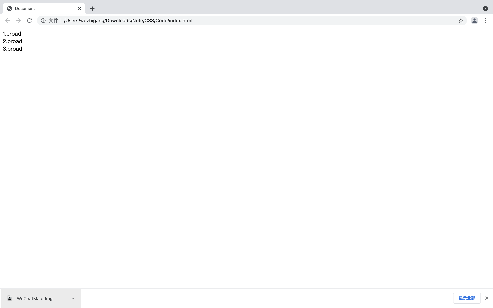
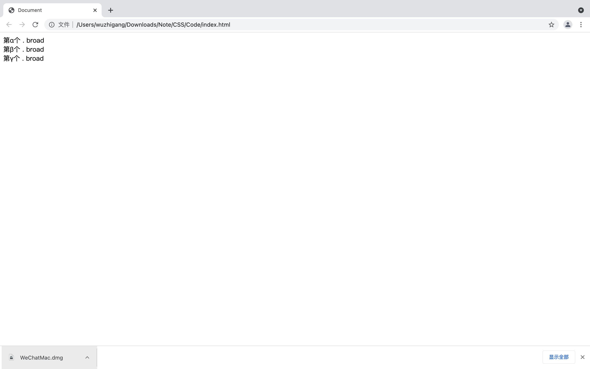
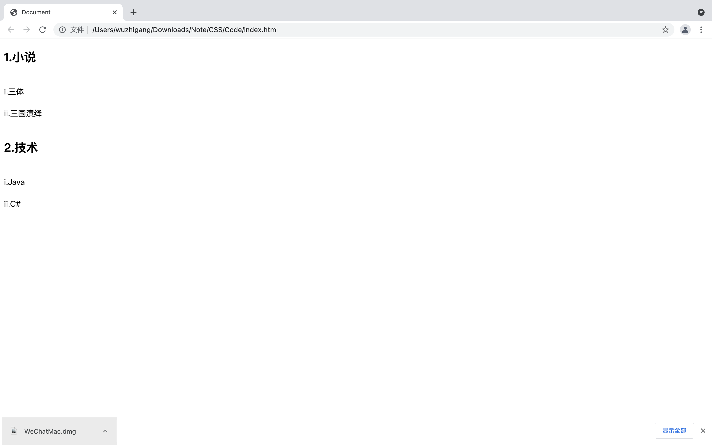

[toc]

# 伪元素选择器

&emsp;&emsp;伪元素选择器并不是针对真正的元素使用的选择器，伪元素选择器只能针对CSS中已有的伪元素起作用。

## :first-letter 和 :first-line

+ <font color=orange>**:first-letter：**</font> 该选择器对应的CSS样式对指定对象内的第一个字符起作用
+ <font color=orange>**:first-line：**</font> 该选择器对应的CSS样式对指定对象内的第一行内容起作用

```html
<!DOCTYPE html>
<html lang="en">
<head>
    <meta charset="UTF-8">
    <title>Document</title>
    <style>
        span {
            display: block;
        }
        span:first-letter {
           color: red;
           font-size: 20px;
           font-weight: bold;
        }
        p::first-line {
            color: red;
        }
    </style>
</head>
<body>
    <span>一段文本</span>
    <p>
        第一行 <br/>
        第二行
    </p>
</body>
</html>
```


> <font color=red>**注意：**</font> <font color=orange> *__:first-letter__* 、 *__:first-line__* **仅对块元素（如 div、p等）起作用** </font>。如果想对行内元素使用，必须先<font color=orange> **设定对象的height、width属性，或者设定position属性为absolute，或者设定display属性为block** </font>。

## :before 和 :after

+ <font color=orange>**:before：**</font> 该选择器与内容相关的属性结合使用，用于在指定对象内部的前端插入内容
+ <font color=orange>**:after：**</font> 该选择器与内容相关的属性结合使用，用于在指定对象内部的尾端插入内容

&emsp;&emsp;CSS支持的内容相关的属性：

+ <font color=orange>**include-source：**</font> 该属性的值为url(url)，插入绝对或相对URL地址所对应的文档
+ <font color=orange>**content：**</font> 该属性的值可以是字符串、url(url)、attr(alt)、counter(name)等格式，该属性用于向指定元素之前或之后插入指定内容
+ <font color=orange>**quotes：**</font> 该属性用于为content属性定义open-quote和close-quote，该属性可以是两个以空格分隔的字符串，前面的是open-quote，后面的是close-quote
+ <font color=orange>**counter-increment：**</font> 该属性用于定义一个计数器，该属性值是所定义的计数器的名称
+ <font color=orange>**counter-reset：**</font> 该属性用于对指定的计数值复位

```html
<!DOCTYPE html>
<html lang="en">
<head>
    <meta charset="UTF-8">
    <title>Document</title>
    <style>
        div::before {
            content: "a";
            font-size: 20px;
            font-weight: bold;
            color: red;
        }
    </style>
</head>
<body>
    <div>broad</div>
    <div>broad</div>
    <div>broad</div>
</body>
</html>
```


<font color=skybkue>**1. 插入图像**</font>

&emsp;&emsp;content属性的值除了支持普通的字符串之外，还可以使用url插入图像：

```html
<!DOCTYPE html>
<html lang="en">
<head>
    <meta charset="UTF-8">
    <title>Document</title>
    <style>
        div::before {
            content: "a";
            font-size: 20px;
            font-weight: bold;
            color: red;
        }
        div::after {
            content: url("./tianqi_1.png");
        }
    </style>
</head>
<body>
    <div>broad</div>
    <div>broad</div>
    <div>broad</div>
</body>
</html>
```


<font color=skybkue>**2. 只插入部分元素**</font>

&emsp;&emsp;可以在使用 :before、:after 伪元素之前先使用更严格的CSS选择器：

```html
<!DOCTYPE html>
<html lang="en">
<head>
    <meta charset="UTF-8">
    <title>Document</title>
    <style>
        div::before {
            content: "a";
            font-size: 20px;
            font-weight: bold;
            color: red;
        }
        div.no::after {
            content: url("./tianqi_1.png");
        }
    </style>
</head>
<body>
    <div class="no">broad</div>
    <div class="no">broad</div>
    <div>broad</div>
</body>
</html>
```


<font color=skybkue>**3. 配合quotes属性执行插入**</font>

```html
<!DOCTYPE html>
<html lang="en">
<head>
    <meta charset="UTF-8">
    <title>Document</title>
    <style>
        div {
            quotes: "<<" ">>";
        }
        div::before {
            content: open-quote;
        }
        div::after {
            content: close-quote;
        }
    </style>
</head>
<body>
    <div>broad</div>
    <div>broad</div>
    <div>broad</div>
</body>
</html>
```


<font color=skybkue>**4. 配合counter-increment属性添加编号**</font>

```html
<!DOCTYPE html>
<html lang="en">
<head>
    <meta charset="UTF-8">
    <title>Document</title>
    <style>
        div {
            counter-increment: mycounter;
        }
        div::before {
            content: counter(mycounter) ".";
        }
    </style>
</head>
<body>
    <div>broad</div>
    <div>broad</div>
    <div>broad</div>
</body>
</html>
```



&emsp;&emsp;可以通过 <font color=orange>**counter(name, list-style-type)**</font> 用法来实现自定义编号，其中 *__list-style-type__* 指定编号风格：

数值 | 说明
-|-
decimal | 阿拉伯数字
disc | 实心圆
circle | 空心圆
square | 实心方块
lower-roman | 小写罗马数字
upper-roman | 大写罗马数字
lower-alpha | 小写英文字母
upper-alpha | 大写英文字母
none | 不使用项目符号
cjk-ideographic | 浅白的表意数字
georgian | 传统的乔治数字
lower-greek | 基本的希腊小写字母
hebrew | 传统的希伯来数字
hiragana | 日文平假名字符
hiragana-iroha | 日文平假名序号
katakana | 日文片假名字符
katakana-iroha | 日文片假名序号
lower-latin | 小写拉丁字母
upper-latin | 大写拉丁字母

```html
<!DOCTYPE html>
<html lang="en">
<head>
    <meta charset="UTF-8">
    <title>Document</title>
    <style>
        div {
            counter-increment: mycounter;
        }
        div::before {
            content: "第" counter(mycounter, lower-greek) "个 . ";
        }
    </style>
</head>
<body>
    <div>broad</div>
    <div>broad</div>
    <div>broad</div>
</body>
</html>
```



&emsp;&emsp;还可以指定多级编号：

```html
<!DOCTYPE html>
<html lang="en">
<head>
    <meta charset="UTF-8">
    <title>Document</title>
    <style>
        div > h2 {
            counter-increment: fcounter;
            /* 重置序列 */
            counter-reset: scounter;
        }
        div > div {
            counter-increment: scounter;
        }
        div>h2::before {
            content: counter(fcounter) ".";
        }
        div>div::before {
            content: counter(scounter, lower-roman) ".";
        }
    </style>
</head>
<body>
    <div>
        <h2>小说</h2>
        <div>三体</div>
        <div>三国演绎</div>
        <h2>技术</h2>
        <div>Java</div>
        <div>C#</div>
    </div>
</body>
</html>
```



# CSS3新增的伪类选择器
## 结构性伪类选择器

<font color=skyblue>**1. :root**</font>

&emsp;&emsp;用于匹配HTML文档的根元素，根元素只能是<font color=orange> *__html__* 元素</font>：

```html
<!DOCTYPE html>
<html lang="en">
<head>
    <meta charset="UTF-8">
    <title>Document</title>
    <style>
        :root {
            background-color: red;
        }
        body {
            background-color: yellow;
        }
    </style>
</head>
<body>
    <div>
        <h2>小说</h2>
    </div>
</body>
</html>
```


<font color=skyblue>**2. :first-child、:last-child、:nth-child、:nth-last-child和:only-child**</font>

&emsp;&emsp;这组伪类选择器依次要求匹配该选择器的元素必须是其父元素的第一个子节点、最后一个子节点、第n个子节点、倒数第n个子节点、唯一的子节点：

```html
<!DOCTYPE html>
<html lang="en">
<head>
    <meta charset="UTF-8">
    <meta http-equiv="X-UA-Compatible" content="IE=edge">
    <meta name="viewport" content="width=device-width, initial-scale=1.0">
    <title>Document</title>
    <style>
        li:first-child {
            color: red;
        }
        li:last-child {
            color: yellow;
        }
        li:nth-child(2) {
            color: tomato;
        }
        li:nth-last-child(2) {
            color: teal;
        }
        div>span:only-child {
            color: red;
        }
    </style>
</head>
<body>
    <ul>
        <li>1</li>
        <li>2</li>
        <li>3</li>
        <li>4</li>
        <li>5</li>
    </ul>
    <div>
        <span>black</span><span>black</span>
    </div>
    <div>
        <span>red</span>
    </div>
</body>
</html>
```


&emsp;&emsp;对于<font color=orange> *__:nth-child__*、*__:nth-last-child__* </font>还支持如下用法：

+ <font color=orange>**Selector:nth-child(odd/event)：**</font> 匹配符合Selector选择器，而且必须是其父元素的第奇数/偶数个子节点的元素
+ <font color=orange>**Selector:nth-last-child(odd/event)：**</font> 匹配符合Selector选择器，而且必须是其父元素的倒数第奇数/偶数个子节点的元素
+ <font color=orange>**Selector:nth-child(xn+y)：**</font> 匹配符合Selector选择器，而且必须是其父元素的第 xn+y 个子节点的元素
+ <font color=orange>**Selector:nth-last-child(xn+y)：**</font> 匹配符合Selector选择器，而且必须是其父元素的倒数第 xn+y 个子节点的元素

```html
<!DOCTYPE html>
<html lang="en">
<head>
    <meta charset="UTF-8">
    <meta http-equiv="X-UA-Compatible" content="IE=edge">
    <meta name="viewport" content="width=device-width, initial-scale=1.0">
    <title>Document</title>
    <style>
        li:nth-child(odd) {
            color: red;
        }
        li:nth-child(even) {
            color: yellow;
        }
    </style>
</head>
<body>
    <ul>
        <li>1</li>
        <li>2</li>
        <li>3</li>
        <li>4</li>
        <li>5</li>
    </ul>
</body>
</html>
```


<font color=skyblue>**3. :first-of-type、:last-of-type、:nth-of-type、:nth-last-type-of和:only-of-type**</font>

&emsp;&emsp;与上面的相似，该组伪类选择器要求它们是与其有共同类型、同级元素的第1个、倒数第一个、第n个、倒数第n个和唯一一个元素：

```html
<!DOCTYPE html>
<html lang="en">
<head>
    <meta charset="UTF-8">
    <meta http-equiv="X-UA-Compatible" content="IE=edge">
    <meta name="viewport" content="width=device-width, initial-scale=1.0">
    <title>Document</title>
    <style>
        p:first-of-type {
            color: red;
        }
    </style>
</head>
<body>
    <p>p1</p>
    <p>p2</p>
    <p>p3</p>
    <div>
        <p>p11</p>
        <p>p12</p>
        <p>p13</p>
    </div>
</body>
</html>
```


> <font color=red>**注意：**</font> 同 *__:nth-child__*、*__:nth-last-child__* 一样，*__:nth-of-type__*、*__:nth-last-of-type__* 参数值也支持<font color=orange> *__odd、event 和 xn+y__*</font>。

<font color=skyblue>**4. :empty**</font>

&emsp;&emsp;该伪类选择器要求该元素只能是空元素，不能包含子节点，也不能包含文本内容（ <font color=orange>**连空格都不允许**</font> ）：

```html
<!DOCTYPE html>
<html lang="en">
<head>
    <meta charset="UTF-8">
    <meta http-equiv="X-UA-Compatible" content="IE=edge">
    <meta name="viewport" content="width=device-width, initial-scale=1.0">
    <title>Document</title>
    <style>
        div:empty {
            background-color: red;
            width: 100px;
            height: 100px;
        }
    </style>
</head>
<body>
    <!-- 空div -->
    <p>下面是空div</p>
    <div></div>
    <p>下面是有空格的div</p>
    <div> </div>
</body>
</html>
```


<font color=skyblue>**5. :lang**</font>

&emsp;&emsp;该选择器要求匹配内容必须是指定语言的元素：

```html
<!DOCTYPE html>
<html lang="en">
<head>
    <meta charset="UTF-8">
    <meta http-equiv="X-UA-Compatible" content="IE=edge">
    <meta name="viewport" content="width=device-width, initial-scale=1.0">
    <title>Document</title>
    <style>
        p:lang(zh) {
            color: red;
        }
    </style>
</head>
<body>
    <p>没有lang</p>
    <p lang="en">lang = en</p>
    <p lang="zh">lang = zh</p>
</body>
</html>
```


## UI元素伪类选择器

&emsp;&emsp;UI伪类选择器主要用于根据UI元素的状态进行筛选：

选择器 | 说明
-|-
Selector:link | 匹配Selector选择器且未被访问前的元素（通常只能是超链接）
Selector:visited | 匹配Selector选择器且被访问过的元素（通常只能是超链接）
Selector:active | 匹配Selector选择器且处于被用户激活（在鼠标点击与释放之间的事件）状态的元素
Selector:hover | 匹配Selector选择器且处于鼠标悬停状态的元素
Selector:focus | 匹配Selector选择器且已得到焦点的元素 
Selector:enabled | 匹配Selector选择器且处于可用状态的元素
Selector:disabled | 匹配Selector选择器且处于不可用状态的元素
Selector:checked | 匹配Selector选择器且选中状态的元素
Selector:default | 匹配Selector选择器且页面打开时处于选中状态（即使当前没有被选中）的元素
Selector:indeterminate | 匹配Selector选择器且当前选中状态不明确的元素
Selector:read-only | 匹配Selector选择器且处于只读状态的元素
Selector:read-write | 匹配Selector选择器且处于读写状态的元素
Selector:required | 匹配Selector选择器且具有必填要求的元素
Selector:optional | 匹配Selector选择器且无必填要求的元素
Selector:valid | 匹配Selector选择器且能通过输入校验的元素
Selector:invalid | 匹配Selector选择器且不能通过输入校验的元素
Selector:in-range | 匹配Selector选择器且处于指定范围的元素
Selector:out-of-range | 匹配Selector选择器且超出指定范围的元素
Selector:selection | 匹配Selector选择器的元素中当前被选中的内容

```html
<!DOCTYPE html>
<html lang="en">
<head>
    <meta charset="UTF-8">
    <meta http-equiv="X-UA-Compatible" content="IE=edge">
    <meta name="viewport" content="width=device-width, initial-scale=1.0">
    <title>Document</title>
    <style>
        a {
            color: gray;
        }
        a:link {
            color: red;
        }
        a:visited {
            color: blue;
        }
        a:hover {
            color: greenyellow;
        }
        a:active {
            color: khaki;
        }
        #name:focus {
            background-color: red;
        }
        #pwd:disabled {
            background-color: lightblue;
        }

    </style>
</head>
<body>
    <a href="#">a标签</a>
    <input type="text" id="name">
    <input type="text" id="pwd" disabled>
</body>
</html>
```


> <font color=red>**注意：**</font>
> + link、visited 只能给a标签加
> + hover、active可以给所有标签加
> + 如果以上四个伪类都生效，一定要注意顺序：LVHA

## :target伪类选择器

&emsp;&emsp;<font color=orange>*__Selector:target__*</font> 匹配符合Selector选择器且必须是命名锚点目标的元素：

```html
<!DOCTYPE html>
<html lang="en">
<head>
    <meta charset="UTF-8">
    <meta http-equiv="X-UA-Compatible" content="IE=edge">
    <meta name="viewport" content="width=device-width, initial-scale=1.0">
    <title>Document</title>
    <style>
        :target {
            background-color: red;
        }
    </style>
</head>
<body>
    <p id="menu">
        <a href="#java">Java</a>
        <a href="#c">C</a>
        <a href="#android">android</a>
    </p>
    <div id="java">
        <h2>Java</h2>
        <p>Java</p>
    </div>
    <div id="c">
        <h2>C</h2>
        <p>C</p>
    </div>
    <div id="android">
        <h2>Android</h2>
        <p>Android</p>
    </div>
</body>
</html>
```


## :not 伪类选择器

&emsp;&emsp;<font color=orange>*__Selector1:not(Selector2)__*</font> 匹配符合Selector1选择器，但是不符合Selector2选择器：

```html
<!DOCTYPE html>
<html lang="en">
<head>
    <meta charset="UTF-8">
    <meta http-equiv="X-UA-Compatible" content="IE=edge">
    <meta name="viewport" content="width=device-width, initial-scale=1.0">
    <title>Document</title>
    <style>
        p:not(#c) {
            color: red;
        }
    </style>
</head>
<body>
    <p id="c">c</p>
    <p id="cpp">c++</p>
    <p id="j">java</p>
    <p id="p">python</p>
</body>
</html>
```

