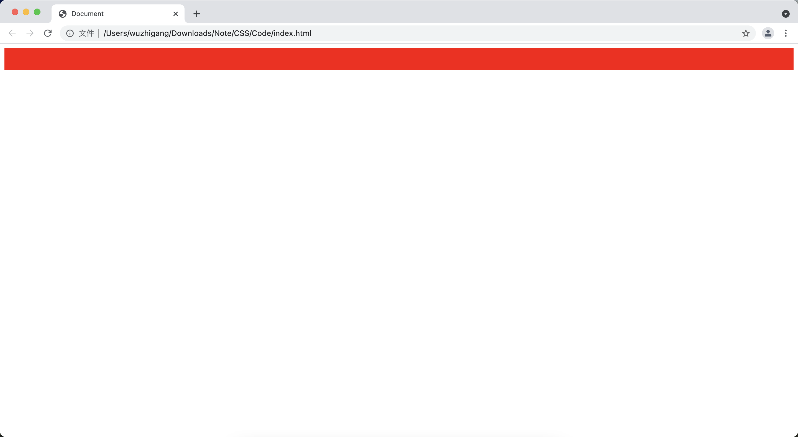
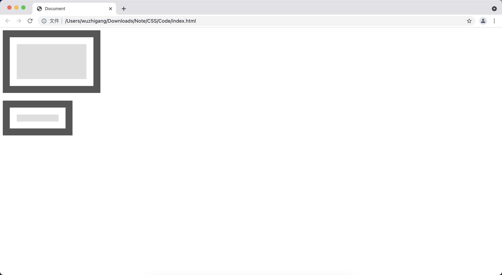
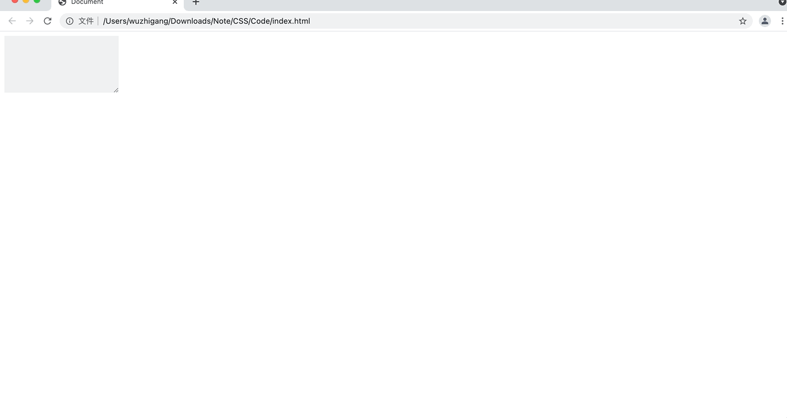
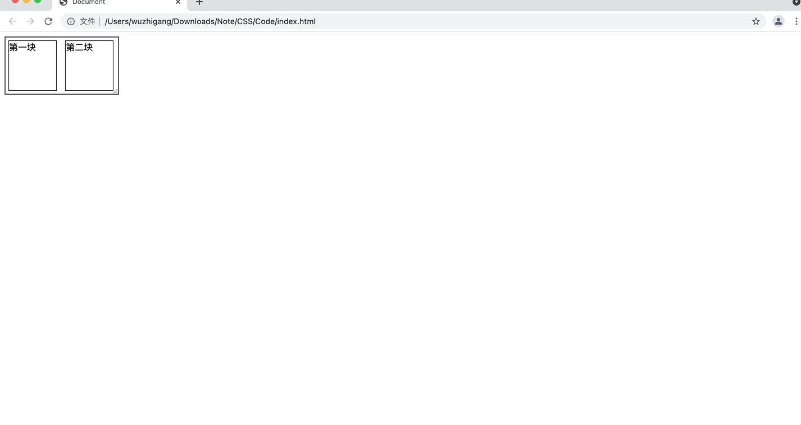

[toc]

# 大小相关属性
## width、height 属性

+ <font color=orange>**height：**</font> 用于设置目标对象的高度
+ <font color=orange>**width：**</font> 用于设置目标对象的宽度

```html
<!DOCTYPE html>
<html lang="en">
<head>
    <meta charset="UTF-8">
    <title>Document</title>
    <style>
        div {
            height: 300px;
            height: 40px;
            background-color: red;
        }
    </style>
</head>
<body>
    <div></div>
</body>
</html>
```



&emsp;&emsp;CSS还提供过了如下属性：

+ <font color=orange>****max-height：****</font> 用于设置目标对象的最大高度
+ <font color=orange>****min-height：****</font> 用于设置目标对象的最小高度
+ <font color=orange>****max-width：****</font> 用于设置目标对象的最大宽度
+ <font color=orange>****min-width：****</font> 用于设置目标对象的最小宽度

> <font color=red>**提示：**</font>
> + min-height 、min-width 会被撑开
> + max-height、max-width 当没有达到宽高时候会自适应
> + %单位是以父容器的大小进行换算

## CSS3 新增的box-sizing 属性

&emsp;&emsp;width、height 属性只是指定该元素的内容区的宽度、高度，对该元素的<font color=orange> **内填充区、边框区、外边距区所占的空间不产生任何效果** </font>。

&emsp;&emsp;CSS3 新增了<font color=orange> **box-sizing** </font>属性来设置 width、height 控制哪些区域的宽度、高度，这样就可以让开发者控制起来更加方便（比如：开发者需要控制的并不是该元素内容的宽度、高度，而是该元素整体），该元素支持如下几个属性值：

属性值 | 说明
-|-
content-box | 设置 width、height 控制元素的内容区宽度和高度
border-box | 设置 width、height 控制元素的内容区加内填充区再加边框区的宽度和高度
inherit | 指定从父元素继承 box-sizing 属性的值

```html
<!DOCTYPE html>
<html lang="en">
<head>
    <meta charset="UTF-8">
    <title>Document</title>
</head>
<body>
    <div style="width: 200px;height: 100px;background-color:#ddd;
    background-clip: content-box;
    border:20px solid #555;
    padding: 20px;
    box-sizing:content-box;"></div><br>
    <div style="width: 200px;height: 100px;background-color:#ddd;
    background-clip: content-box;
    border:20px solid #555;
    padding: 20px;
    box-sizing:border-box;"></div>
</body>
</html>
```



## CSS3 新增的resize属性

&emsp;&emsp;CSS3 还新增一个<font color=orange> **resize** </font>属性，该属性用于指定是否允许用户通过拖动来改变元素的大小，支持下面的几个值：

属性值 | 说明
-|-
none | 设置不允许用户通过拖动来改变元素的大小
both | 设置不允许用户通过拖动来改变元素的高度和宽度
horizontal | 设置不允许用户通过拖动来改变元素的宽度
vertical | 设置不允许用户通过拖动来改变元素的高度
inherit | 继承自父元素的resize属性值，这是默认值

```html
<!DOCTYPE html>
<html lang="en">
<head>
    <meta charset="UTF-8">
    <title>Document</title>
</head>
<body>
    <div style="width: 200px;height: 100px;background-color:#eee;
    resize: both;
    overflow: auto;"></div>
</body>
</html>
```



> <font color=red>**注意：**</font>resize 属性对于所有设置了 overflow 的HTML元素有效。

## CSS3 新增的calc函数

&emsp;&emsp;CSS3 新增了一个<font color=orange> **calc 函数** </font>，该函数用于动态计算HTML元素的宽度和高度，使用calc函数可以非常方便地实现自适应布局。由于calc函数的功能就是计算得到一个长度值，因此在CSS样式中可用calc函数为元素的border、margin等需要长度值的属性设置动态值：

```html
<!DOCTYPE html>
<html lang="en">
<head>
    <meta charset="UTF-8">
    <title>Document</title>
    <style>
        body > div {
            width: 200px;
            height: 100px;
            overflow: auto;
            resize: both;
            border: 2px solid #555;
        }
        div > div {
            border: 1px solid black;
            display: inline-block;
            margin: 5px;
            box-sizing: border-box;
            width: calc(50% - 14px);
            height: calc(100% - 10px);
        }
    </style>
</head>
<body>
    <div>
        <div>第一块</div>
        <div>第二块</div>
    </div>
</body>
</html>
```

