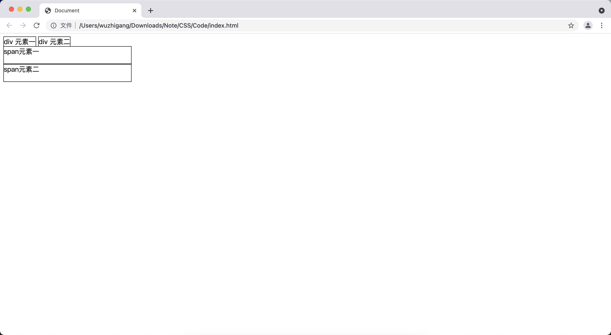

[toc]

# 基本概念

&emsp;&emsp;CSS的一个重要概念是盒模型，对于一个 HTML 元素而言，它会占据页面的一个矩形区域，这块区域就是该元素占据的<font color=orange> **"盒子"（形状像一个盒子）** </font>。HTML元素占据的矩形区域由<font color=orange> **内容区（content）、内填充区（padding）、边框区（border）和外边距（margin）** </font>组成：


&emsp;&emsp;HTML 元素的盒模型中有两个部分是可见的：<font color=orange> **元素内容和元素的边框** </font>；也有两个部分是不可见的：<font color=orange>内容填充区和外边距区</font>，这两个不可见的区域依然会占据空间。

> <font color=red>**注意：**</font>
> + 背景颜色会填充到margin以内的区域
> + 文字会在content区域
> + padding不能为负数，margin可以为负数

# display 属性
## 两种最基本的盒子模型

&emsp;&emsp;CSS 提供的最基本的盒模型元素可以分为两种：

+ <font color=orange>**block类型：**</font> 这种盒模型的元素默认占据一行，允许通过CSS设置宽度、高度，例如：div、p元素 不写宽的时候，跟父元素宽度相同，所占区域是一个矩形
+ <font color=orange>**inline类型：**</font> 这种盒模型的元素不会占据一行（默认允许在一行放置多个元素），即使通过CSS设置宽度、高度、margin、padding也不会起作用，不写宽度的时候，宽度由内容决定。所占的区域不一定是矩形。内联标签之间会有空隙（是因为换行引起，可以通过写一行或者父容器的文字大小设为0来解决）。例如：span、a元素

```html
<!DOCTYPE html>
<html lang="en">
<head>
    <meta charset="UTF-8">
    <meta http-equiv="X-UA-Compatible" content="IE=edge">
    <meta name="viewport" content="width=device-width, initial-scale=1.0">
    <title>Document</title>
    <style>
        div,span {
            width: 300px;
            height: 40px;
            border: 1px solid black;
        }
    </style>
</head>
<body>
    <div>div 元素一</div>
    <div>div 元素二</div>
    <span>span元素一</span>
    <span>span元素二</span>
</body>
</html>
```


&emsp;&emsp;CSS为 <font color=orange>**display 属性**</font> 提供了 <font color=orange>**block、inline**</font> 两个属性值，用于改变 HTML 元素默认的盒模型：

```html
<!DOCTYPE html>
<html lang="en">
<head>
    <meta charset="UTF-8">
    <meta http-equiv="X-UA-Compatible" content="IE=edge">
    <meta name="viewport" content="width=device-width, initial-scale=1.0">
    <title>Document</title>
    <style>
        div,span {
            width: 300px;
            height: 40px;
            border: 1px solid black;
        }
        body > div {
            display: inline;
        }
        body > span {
            display: block;
        }
    </style>
</head>
<body>
    <div>div 元素一</div>
    <div>div 元素二</div>
    <span>span元素一</span>
    <span>span元素二</span>
</body>
</html>
```



## none值和visibility属性

&emsp;&emsp;display 属性可指定为<font color=orange> **none 值**</font>，用于设置目标对象隐藏，一旦对象隐藏，<font color=orange> **其占用的页面空间也会释放**</font>。与此类似的还有 <font color=orange> **visibility** </font>属性（<font color=orange> **visible和hidden** </font>），该属性也可用于设置目标是否显示，与display属性不同，当通过visibility隐藏某个HTML元素后，<font color=orange> **该元素占用的页面空间依然会被保留** </font>：

```html
<!DOCTYPE html>
<html lang="en">
<head>
    <meta charset="UTF-8">
    <meta http-equiv="X-UA-Compatible" content="IE=edge">
    <meta name="viewport" content="width=device-width, initial-scale=1.0">
    <title>Document</title>
    <style>
        div {
            width: 300px;
            height: 40px;
            background-color: #ddd;
            border: 2px solid black;
        }
    </style>
</head>
<body>
    <div id="test1"></div>
    <button onclick="document.getElementById('test1').style.display = 'none'">隐藏
    </button>
    <button onclick="document.getElementById('test1').style.display = ''">显示
    </button>
    <div id="test2"></div>
    <button onclick="document.getElementById('test2').style.visibility = 'hidden'">隐藏
    </button>
    <button onclick="document.getElementById('test2').style.visibility = 'visible'">显示
    </button>
</body>
</html>
```


## inline-block 类型的盒模型

&emsp;&emsp;通过 display 属性可以设置为<font color=orange> **inline-block** </font>值，这种盒模型是 inline 类型和 block 类型的综合体（<font color=orange> **既不会占据一行，又支持 width、height 指定宽度及高度** </font>）：

```html
<!DOCTYPE html>
<html lang="en">
<head>
    <meta charset="UTF-8">
    <meta http-equiv="X-UA-Compatible" content="IE=edge">
    <meta name="viewport" content="width=device-width, initial-scale=1.0">
    <title>Document</title>
    <style>
        div#container {
            width: 960px;
        }
        div > div {
            border: 1px solid #aaf;
            display: inline-block;
            box-sizing: border-box;
            vertical-align: top;
            padding: 5px;
        }
    </style>
</head>
<body>
    <div id="container">
        <div style="width: 220px;">
            内容
        </div>
        <div style="width: 490px;">
            内容
        </div>
        <div style="width: 220px;">
            内容
        </div>
    </div>
</body>
</html>
```


> <font color=red>**注意：**</font> 默认情况下，多个 inline-block 类型的盒模型的元素将会采用底端对齐的方式，也就是它们的底部会位于同一条水平线上。这可能不是多栏布局期望的结果，为了让多个元素的顶端对齐，可以增加<font color=orange> **vertical-align:top;** </font>即可。

## inline-table 类型的盒模型

&emsp;&emsp;在默认情况下，table元素属于block类型的盒模型，也就是说该元素默认占据一行。CSS为元素提供了一个<font color=orange> **inline-table** </font>类型的盒模型，这个盒模型允许表格通过 width、height 设置宽度和高度，而且允许它的左边、右边出现其它内容：

```html
<!DOCTYPE html>
<html lang="en">
<head>
    <meta charset="UTF-8">
    <meta http-equiv="X-UA-Compatible" content="IE=edge">
    <meta name="viewport" content="width=device-width, initial-scale=1.0">
    <title>Document</title>
    <style>
        td {
            border: 1px solid black;
        }
        table {
            width: 360px;
            border-collapse: collapse;
            display: inline-table;
            vertical-align: top;
        }
    </style>
</head>
<body>
    前面内容
    <table>
        <tr><td>aaaaaaaaaaa</td><td>bbbbbbbbbbbbbbb</td></tr>
        <tr><td>aaaaaaaaaaa</td><td>bbbbbbbbbbbbbbb</td></tr>
    </table>
    后面内容
</body>
</html>
```


## 使用 table 类型的盒模型实现表格

&emsp;&emsp;diplay还提供了如下属性值：

属性值 | 说明
-|-
table | 将目标HTML元素显示为表格
table-caption | 将目标HTML元素显示为表格标题
table-cell | 将目标HTML元素显示为单元格
table-column | 将目标HTML元素显示为表格列
table-column-group | 将目标HTML元素显示为表格列组
table-header-group | 将目标HTML元素显示为表格头部分
table-footer-group | 将目标HTML元素显示为表格页脚部分
table-row | 将目标HTML元素显示为表格行
table-row-group | 将目标HTML元素显示为表格行组

```html
<!DOCTYPE html>
<html lang="en">
<head>
    <meta charset="UTF-8">
    <meta http-equiv="X-UA-Compatible" content="IE=edge">
    <meta name="viewport" content="width=device-width, initial-scale=1.0">
    <title>Document</title>
    <style>
        div > div {
            display: table-row;
            padding: 10px;
        }
        div > div > div {
            display: table-cell;
            border: 1px solid black;
        }
    </style>
</head>
<body>
   <div style="display: table;width: 400px;">
    <div style="display: table-caption;">标题</div>
    <div>
        <div>aaaa</div>
        <div>aaaa</div>
    </div>
    <div>
        <div>aaaa</div>
        <div>aaaa</div>
    </div>
   </div>
</body>
</html>
```


## list-item 类型的盒模型

&emsp;&emsp;list-item模型可以将目标元素转换为类似于ul的列表元素，也可以同时在元素前面添加列表标志：

```html
<!DOCTYPE html>
<html lang="en">
<head>
    <meta charset="UTF-8">
    <meta http-equiv="X-UA-Compatible" content="IE=edge">
    <meta name="viewport" content="width=device-width, initial-scale=1.0">
    <title>Document</title>
    <style>
        body > div {
            display: list-item;
            list-style-type: disc;
            margin-left: 20px;
        }
        div > div {
            display: list-item;
            list-style-type: square;
            margin-left: 40px;
        }
    </style>
</head>
<body>
    <div id="div1">
        小说
        <div>三国演义</div>
        <div>水浒传</div>
    </div>
    <div id="div2">
        技术书
        <div>Java从入门到精通</div>
        <div>C#从入门到精通</div>
    </div>
</body>
</html>
```


## run-in类型的盒模型

&emsp;&emsp;run-in类型的盒模型的行为取决于它周围的元素：

+ 如果 run-in 类型的元素包含一个block类型的元素，那么该run-in类型的元素自动变成block类型
+ 如果 run-in类型的元素的相邻兄弟元素是block类型的元素，那么run-in类型的元素将会变成inline行为，且被自动插入作为其兄弟元素的第一个元素
+ 其他情况下，run-in类型的元素被当成block类型

```html
<!DOCTYPE html>
<html lang="en">
<head>
    <meta charset="UTF-8">
    <meta http-equiv="X-UA-Compatible" content="IE=edge">
    <meta name="viewport" content="width=device-width, initial-scale=1.0">
    <title>Document</title>
    <style>
        p,span {
            padding: 6px;
        }
    </style>
</head>
<body>
    <span style="display: run-in;border: 1px solid black;">display: run-in</span>
    <p style="border: 2px solid red;">display:block</p>
    <span style="display: run-in;border: 1px solid black;">display:run-in</span>
    <p style="border: 2px solid red;display: inline;">display:inline</p>
</body>
</html>
```


> <font color=red>**注意：**</font> 除IE外，其它浏览器对 run-in 类型的盒模型支持不友好。

# 对盒添加阴影

&emsp;&emsp;<font color=orange>**box-shadow** </font>属性可以为所有盒模型的元素整体增加阴影，这是一个复合属性，语法格式如下：

```css
box-shadow: hoffset voffset blurLength spread color inset;
```

&emsp;&emsp;该属性包含如下几个值：

+ <font color=orange>**hOffset：**</font> 该属性值控制阴影在水平方向的偏移
+ <font color=orange>**vOffset：**</font> 该属性值控制阴影在垂直方向的偏移
+ <font color=orange>**blurLength：**</font> 该属性值控制阴影的模糊程度
+ <font color=orange>**spread：**</font> 该属性值控制阴影的缩放程度
+ <font color=orange>**color：**</font> 该属性值控制阴影的颜色
+ <font color=orange>**inset：**</font> 该属性值用于将外部阴影改为内部阴影

```html
<!DOCTYPE html>
<html lang="en">
<head>
    <meta charset="UTF-8">
    <meta http-equiv="X-UA-Compatible" content="IE=edge">
    <meta name="viewport" content="width=device-width, initial-scale=1.0">
    <title>Document</title>
    <style>
        div {
            width: 300px;
            height: 50px;
            border: 1px solid black;
            margin: 30px;
        }
    </style>
</head>
<body>
    <div style="box-shadow: -1px -8px 6px #444;"></div>
</body>
</html>
```


&emsp;&emsp;也可以为表格、单元格添加阴影：

```html
<!DOCTYPE html>
<html lang="en">
<head>
    <meta charset="UTF-8">
    <meta http-equiv="X-UA-Compatible" content="IE=edge">
    <meta name="viewport" content="width=device-width, initial-scale=1.0">
    <title>Document</title>
    <style>
        table {
            width: 500px;
            border-spacing: 10px;
            box-shadow: 10px 10px 6px #444;
        }
        td {
            box-shadow: 6px 6px 4px #444;
            padding: 5px;
        }
    </style>
</head>
<body>
    <table>
        <tr>
            <td>aaaaaaa</td>
            <td>aaaaaaa</td>
        </tr>
        <tr>
            <td>aaaaaaa</td>
            <td>aaaaaaa</td>
        </tr>
    </table>
</body>
</html>
```


# 关于盒模型的一些问题
## margin叠加问题

&emsp;&emsp;当给两个盒子同时添加上下边距的时候，就会出现叠加的问题，会取上下中比较大的值（这个问题只有上下有，左右是没有的）：

```html
<!DOCTYPE html>
<html lang="en">
<head>
    <meta charset="UTF-8">
    <meta http-equiv="X-UA-Compatible" content="IE=edge">
    <meta name="viewport" content="width=device-width, initial-scale=1.0">
    <title>Document</title>
    <style>
        #box1 {
            width: 200px;
            height: 200px;
            background-color: red;
            margin-bottom: 30px;
        }
        #box2 {
            width: 200px;   
            height: 200px;
            background-color: blue;
            margin-top: 20px;
        }
    </style>
</head>
<body>
    <div id="box1"></div>
    <div id="box2"></div>
</body>
</html>
```


&emsp;&emsp;两个div之间的距离并不是 20 + 30 像素，而是只有 30 像素。可以使用下面两个方法来解决问题：

1. BFC规范
2. 想办法只给一个元素添加间距

## margin 传递

&emsp;&emsp;marg传递的问题只会出现在嵌套的结构中，且只有margin-top会有传递的问题，其它三个方向是没有问题的：

```html
<!DOCTYPE html>
<html lang="en">
<head>
    <meta charset="UTF-8">
    <meta http-equiv="X-UA-Compatible" content="IE=edge">
    <meta name="viewport" content="width=device-width, initial-scale=1.0">
    <title>Document</title>
    <style>
        #box1 {
            width: 200px;
            height: 200px;
            background-color: red;
        }
        #box2 {
            width: 100px;   
            height: 100px;
            background-color: blue;
            margin-top: 100px;
        }
    </style>
</head>
<body>
    <div id="box1">
        <div id="box2"></div>
    </div>
</body>
</html>
```


&emsp;&emsp;可以发现本来设置给 box2 的 margin-top 传递给 box1 了，解决该问题有一下几个方法：

1. BFC规范
2. 给父容器添加边框

```html
<!DOCTYPE html>
<html lang="en">
<head>
    <meta charset="UTF-8">
    <meta http-equiv="X-UA-Compatible" content="IE=edge">
    <meta name="viewport" content="width=device-width, initial-scale=1.0">
    <title>Document</title>
    <style>
        #box1 {
            width: 200px;
            height: 200px;
            background-color: red;
            border : 1px solid red;
        }
        #box2 {
            width: 100px;   
            height: 100px;
            background-color: blue;
            margin-top: 100px;
        }
    </style>
</head>
<body>
    <div id="box1">
        <div id="box2"></div>
    </div>
</body>
</html>
```


3. margin 换成 padding

```html
<!DOCTYPE html>
<html lang="en">
<head>
    <meta charset="UTF-8">
    <meta http-equiv="X-UA-Compatible" content="IE=edge">
    <meta name="viewport" content="width=device-width, initial-scale=1.0">
    <title>Document</title>
    <style>
        #box1 {
            width: 200px;
            height: 100px;
            background-color: red;
            padding-top: 100px;
        }
        #box2 {
            width: 100px;   
            height: 100px;
            background-color: blue;   
        }
    </style>
</head>
<body>
    <div id="box1">
        <div id="box2"></div>
    </div>
</body>
</html>
```


# 盒模型扩展
## margin 自适应居中

```html
<!DOCTYPE html>
<html lang="en">
<head>
    <meta charset="UTF-8">
    <meta http-equiv="X-UA-Compatible" content="IE=edge">
    <meta name="viewport" content="width=device-width, initial-scale=1.0">
    <title>Document</title>
    <style>
        #box1 {
            width: 400px;
            height: 100px;
            background-color: red;
            margin: auto auto;
        }
    </style>
</head>
<body>
    <div id="box1">
    </div>
</body>
</html>
```


> <font color=red>**注意：**</font>左右自适应是可以的，上下自适应是不可以的。

## 不设置 content（width、height）的现象

```html
<!DOCTYPE html>
<html lang="en">
<head>
    <meta charset="UTF-8">
    <meta http-equiv="X-UA-Compatible" content="IE=edge">
    <meta name="viewport" content="width=device-width, initial-scale=1.0">
    <title>Document</title>
    <style>
        #box1 {
           width: 300px;
           height: 300px;
           background-color: red;
        }
        #box2 {
            width: 100%;
            height: 100px;
            background-color: blue;
            color: white;
            padding-left: 30px;
            border-left: 10px solid black;
        }
    </style>
</head>
<body>
    <div id="box1">
        <div id="box2">这是一些内容</div>
    </div>
</body>
</html>
```


&emsp;&emsp;上面 box2 的宽度设置了 100%，但是后面设置了 border 和 padding 以后就会出现超出的问题，此时只要去掉宽度的设置就可以自动换算宽度：

```html
<!DOCTYPE html>
<html lang="en">
<head>
    <meta charset="UTF-8">
    <meta http-equiv="X-UA-Compatible" content="IE=edge">
    <meta name="viewport" content="width=device-width, initial-scale=1.0">
    <title>Document</title>
    <style>
        #box1 {
           width: 300px;
           height: 300px;
           background-color: red;
        }
        #box2 {
            height: 100px;
            background-color: blue;
            color: white;
            padding-left: 30px;
            border-left: 10px solid black;
        }
    </style>
</head>
<body>
    <div id="box1">
        <div id="box2">这是一些内容</div>
    </div>
</body>
</html>
```

