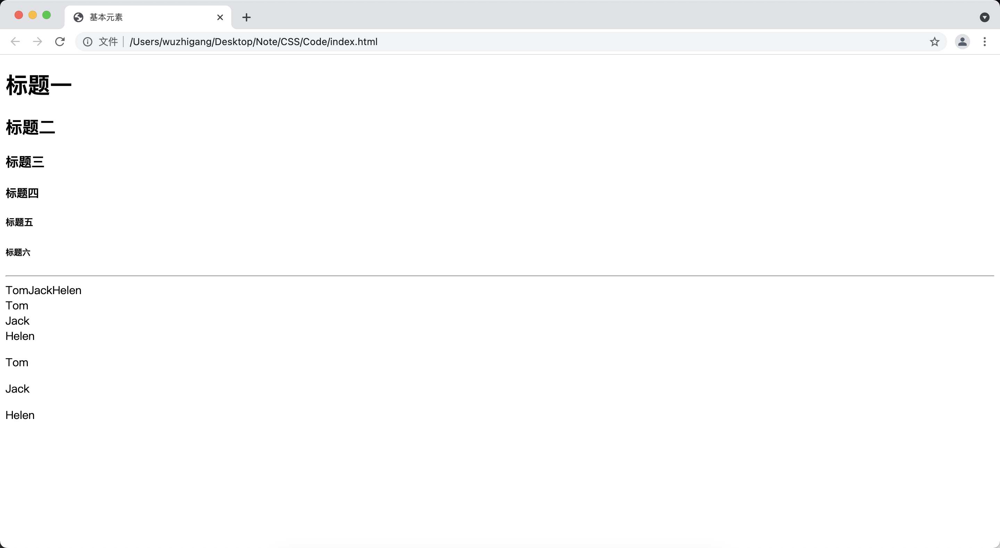

[toc]

# 基本元素

&emsp;&emsp;HTML5保留的基本元素有以下几个：

+ <font color=orange> **&lt;!-- --&gt;：** </font> 定义HTML注释。
+ <font color=orange> **&lt;html&gt;：** </font>HTML5的根元素
+ <font color=orange> **&lt;head&gt;：** </font> HTML5文档的页面头部分
+ <font color=orange> **&lt;title&gt;：** </font> HTML5文档的页面标题
+ <font color=orange> **&lt;body&gt;：** </font> 定义HTML5文档的页面主体部分
+ <font color=orange> **&lt;h1&gt; ~ &lt;h6&gt;：** </font> 定义标题一到标题六
+ <font color=orange> **&lt;p&gt;：** </font> 定义段落
+ <font color=orange> **&lt;br&gt;：** </font> 插入一个换行
+ <font color=orange> **&lt;hr&gt;：** </font> 定义水平线，HTML5中还代表了主题结束的语义
+ <font color=orange> **&lt;div&gt;：** </font> 定义文档中的节
+ <font color=orange> **&lt;span&gt;：** </font> 与div基本相似，区别是span只是表示一段一般性文本，该元素包含的文本内容默认不会换行

```html
<!DOCTYPE html>
<html>
<head>
    <meta charset="UTF-8">
    <title>基本元素</title>
</head>
<body>
    <!-- 标题一到标题六 -->
    <h1>标题一</h1>
    <h2>标题二</h2>
    <h3>标题三</h3>
    <h4>标题四</h4>
    <h5>标题五</h5>
    <h6>标题六</h6>
    <!-- 输出一条水平线 -->
    <hr />
    <!-- 使用span定义文本 -->
    <span>Tom</span><span>Jack</span><span>Helen</span>
    <!-- 使用div定义文本 -->
    <div>Tom</div><div>Jack</div><div>Helen</div>
    <!-- 使用p来定义文本 -->
    <p>Tom</p><p>Jack</p><p>Helen</p>
</body>
</html>
```



> <font color=red>**div、span 和 p 的对比**</font>
> + 都可以作为其它内容的容器，容纳文本和其它内容
> + 默认情况下，span 不会导致换行、div 会导致换行、p 会产生一个段落，段落与段落之间默认有更大的间距
> + p 和 span 元素只能包含文本、图像、超链接、文本格式化元素和表单控件元素等内容，p 可以包含 span，span 不能包含 p
> + div 元素除了可以包含上面这些内容（包括 p 和 span ），还可以包含 h1 ~ h6、form、table、列表元素和 div 元素，div 可以包含更多的内容

# 文本格式化相关元素

&emsp;&emsp;下面这些元素让文本内容在浏览器中呈现出特定的效果：

+ <font color=orange>**&lt;b&gt;：**</font> 定义粗体文本
+ <font color=orange>**&lt;i&gt;：**</font> 定义斜体文本
+ <font color=orange>**&lt;em&gt;：**</font> 定义强调文本，实际效果与斜体文本差不多
+ <font color=orange>**&lt;strong&gt;：**</font> 定义粗体文本，与b元素的作用和用法基本相同。HTMl5为其增加了语义，代表重要的文本
+ <font color=orange>**&lt;small&gt;：**</font> 定义小号字体文本，HTML5定义small元素专门用于标识所谓的 "小字印刷体"，通常用来标注免责声明、注意事项、法律规定和版权相关的声明性文字
+ <font color=orange>**&lt;sup&gt;：**</font> 定义上标文本
+ <font color=orange>**&lt;sub&gt;：**</font> 定义下标文本
+ <font color=orange>**&lt;bdo&gt;：**</font> 定义文本显示方向，该元素可以指定 <font color=green>*__dir__*</font> 属性，该属性值只能是 <font color=green>*__ltr__*</font> 和<font color=green> *__rtl__*</font> ，用于指定文本的排列方向