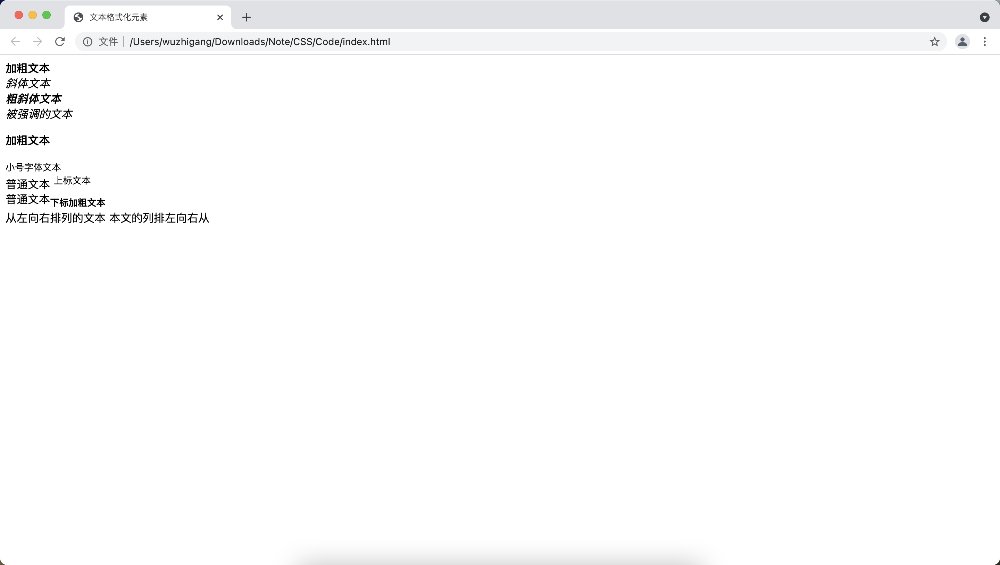
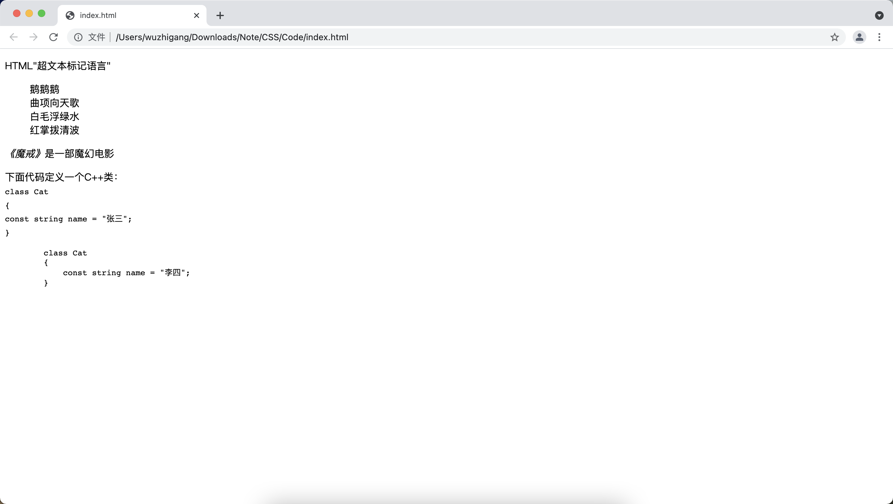
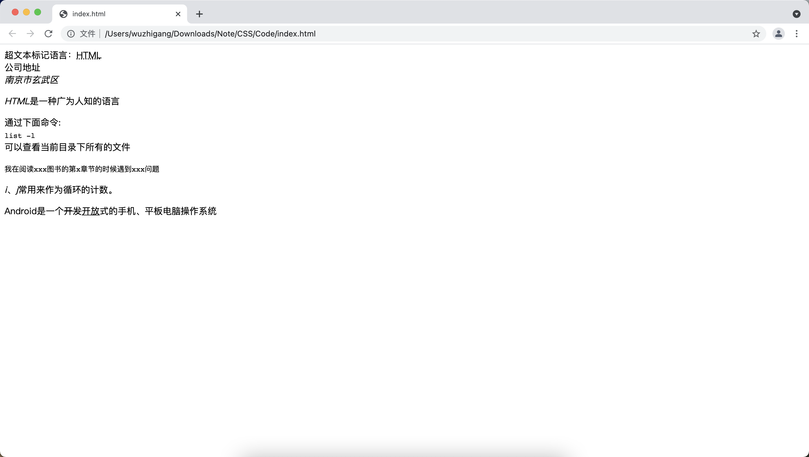

[toc]

# 基本元素

&emsp;&emsp;HTML5保留的基本元素有以下几个：

+ <font color=orange> **&lt;!-- --&gt;：** </font> 定义HTML注释。
+ <font color=orange> **&lt;html&gt;：** </font>HTML5的根元素
+ <font color=orange> **&lt;head&gt;：** </font> HTML5文档的页面头部分
+ <font color=orange> **&lt;title&gt;：** </font> HTML5文档的页面标题
+ <font color=orange> **&lt;body&gt;：** </font> 定义HTML5文档的页面主体部分
+ <font color=orange> **&lt;h1&gt; ~ &lt;h6&gt;：** </font> 定义标题一到标题六
+ <font color=orange> **&lt;p&gt;：** </font> 定义段落
+ <font color=orange> **&lt;br&gt;：** </font> 插入一个换行
+ <font color=orange> **&lt;hr&gt;：** </font> 定义水平线，HTML5中还代表了主题结束的语义
+ <font color=orange> **&lt;div&gt;：** </font> 定义文档中的节
+ <font color=orange> **&lt;span&gt;：** </font> 与div基本相似，区别是span只是表示一段一般性文本，该元素包含的文本内容默认不会换行

```html
<!DOCTYPE html>
<html>
<head>
    <meta charset="UTF-8">
    <title>基本元素</title>
</head>
<body>
    <!-- 标题一到标题六 -->
    <h1>标题一</h1>
    <h2>标题二</h2>
    <h3>标题三</h3>
    <h4>标题四</h4>
    <h5>标题五</h5>
    <h6>标题六</h6>
    <!-- 输出一条水平线 -->
    <hr />
    <!-- 使用span定义文本 -->
    <span>Tom</span><span>Jack</span><span>Helen</span>
    <!-- 使用div定义文本 -->
    <div>Tom</div><div>Jack</div><div>Helen</div>
    <!-- 使用p来定义文本 -->
    <p>Tom</p><p>Jack</p><p>Helen</p>
</body>
</html>
```


> <font color=red>**div、span 和 p 的对比**</font>
> + 都可以作为其它内容的容器，容纳文本和其它内容
> + 默认情况下，span 不会导致换行、div 会导致换行、p 会产生一个段落，段落与段落之间默认有更大的间距
> + p 和 span 元素只能包含文本、图像、超链接、文本格式化元素和表单控件元素等内容，p 可以包含 span，span 不能包含 p
> + div 元素除了可以包含上面这些内容（包括 p 和 span ），还可以包含 h1 ~ h6、form、table、列表元素和 div 元素，div 可以包含更多的内容

# 文本格式化相关元素

&emsp;&emsp;下面这些元素让文本内容在浏览器中呈现出特定的效果：

+ <font color=orange>**&lt;b&gt;：**</font> 定义粗体文本
+ <font color=orange>**&lt;i&gt;：**</font> 定义斜体文本
+ <font color=orange>**&lt;em&gt;：**</font> 定义强调文本，实际效果与斜体文本差不多
+ <font color=orange>**&lt;strong&gt;：**</font> 定义粗体文本，与b元素的作用和用法基本相同。HTMl5为其增加了语义，代表重要的文本
+ <font color=orange>**&lt;small&gt;：**</font> 定义小号字体文本，HTML5定义small元素专门用于标识所谓的 "小字印刷体"，通常用来标注免责声明、注意事项、法律规定和版权相关的声明性文字
+ <font color=orange>**&lt;sup&gt;：**</font> 定义上标文本
+ <font color=orange>**&lt;sub&gt;：**</font> 定义下标文本
+ <font color=orange>**&lt;bdo&gt;：**</font> 定义文本显示方向，该元素可以指定 <font color=green>*__dir__*</font> 属性，该属性值只能是 <font color=green>*__ltr__*</font> 和<font color=green> *__rtl__*</font> ，用于指定文本的排列方向

&emsp;&emsp;上面这些文本格式化元素能包含文本、图像、超链接、文本格式化元素和表单控件元素等，除此之外还可以和span元素相互包含：

```html
<!DOCTYPE html>
<html>
<head>
    <meta charset="UTF-8">
    <title>文本格式化元素</title>
</head>
<body>
    <span><b>加粗文本</b></span> <br/>
    <span><i>斜体文本</i></span> <br/>
    <span><b><i>粗斜体文本</i></b></span> <br/>
    <span><em>被强调的文本</em></span> <br/>
    <p><strong>加粗文本</strong></p>
    <small><span>小号字体文本</span></small> <br/>
    <div>普通文本 <sup>上标文本</sup></div>
    <span>普通文本<strong><sub>下标加粗文本</sub></strong></span> <br/>
    <!-- 指定文本从左向右排列 -->
    <bdo dir="ltr">从左向右排列的文本</bdo>
    <!-- 指定文本从右向左排列 -->
    <bdo dir="rtl">从右向左排列的文本</bdo>
</body>
</html>
```



> <font color=red>**注意：**</font> 文本格式化标签只能进行一些基本的格式化，如果希望让HTML页面内的文本更美观，应该使用CSS样式。

# 语义相关元素

&emsp;&emsp;HTML5 保留了如下语义相关元素：

+ <font color=orange>**&lt;abbr&gt;：**</font> 用于表示一个缩写，使用该元素时通常建议指定 <font color=green>*__title__*</font> 属性，该属性用于指定该缩写所代表的全称
+ <font color=orange>**&lt;address&gt;：**</font> 用于表示一个地址，浏览器通常用斜体显示该标签所包含的文本
+ <font color=orange>**&lt;blockquote&gt;：**</font> 用于定义一段长的引用文本。浏览器通常会使用缩进的方式显示这段被引用的文本。使用该标签时候可以指定 <font color=green>*__cite__*</font> 属性，该属性用于指定该引用文本所引用的网址URL或出处
+ <font color=orange>**&lt;q&gt;：**</font> 用于定义一段短的引用文本，浏览器会为这段被引用的文本添加引号

> <font color=red>**blockquote 和 q 元素的比较：**</font><br/>
> &emsp;&emsp;blockquote 和 q 元素的作用基本相似，区别是 blockquote 用于引用一段带换行的、大段文本；q 元素用于引用一段不带换行的、较短的文本。

+ <font color=orange>**&lt;cite&gt;：**</font> 用于表示作品（一本书、一部电影、一首歌曲）的标题，浏览器常常用斜体显示该标签包含的文本
+ <font color=orange>**&lt;code&gt;：**</font> 用于表示一段计算机代码
+ <font color=orange>**&lt;dfn&gt;：**</font> 用于定义一个专业术语，浏览器通常会用粗体或斜体显示该标签所包含的文本
+ <font color=orange>**&lt;del&gt;：**</font> 定义文档中被删除的文本，浏览器通常会以中画线形式显示该标签所包含的文本
+ <font color=orange>**&lt;ins&gt;：**</font> 定义文档中插入的文本，浏览器通常会以下画线形式显示该标签所包含的文本

> <font color=red>**使用 del 和 ins 标签的时候可以指定如下两个属性:**</font>
> + <font color=orange>**cite**</font>：该属性为一个URL，该URL对应的文本解释了文本被删除或插入的原因
> + <font color=orange>**datetime**</font>：定义文本被删除或插入的日期、时间

+ <font color=orange>**&lt;pre&gt;：**</font> 用于表示该元素所包含的文本已经进行了预格式化，也就是说 pre 元素所包含文本中的空格、回车、tab和其它字符都会被保留下来，但浏览器会处理 pre 元素内大部分的HTML元素
+ <font color=orange>**&lt;samp&gt;：**</font> 用于定义示范文本内容
+ <font color=orange>**&lt;kbd&gt;：**</font> 用于定义键盘文本，通常在计算机使用文档、使用说明中会经常使用该元素
+ <font color=orange>**&lt;var&gt;：**</font> 用于表示一个变量，浏览器通常用斜体显示 var 标签中的文本

```html
<!DOCTYPE html>
<html>
<head>
    <meta charset="UTF-8">
    <title></title>
</head>
<body>
    <!-- 使用q表示一段短的引用文本 -->
    <p>HTML<q>超文本标记语言</q></p>
    <div>
        <!-- 使用blockquote表示一段长的引用文本 -->
        <blockquote cite="咏鹅">
            鹅鹅鹅 <br/>
            曲项向天歌 <br/>
            白毛浮绿水 <br/>
            红掌拨清波
        </blockquote>
    </div>
    <p><cite>《魔戒》</cite>是一部魔幻电影</p>
    <p>
        下面代码定义一个C++类：<br/>
        <code>
            class Cat <br/>
            {<br/>
                const string name = "张三"; <br/>
            } <br/>
        </code>
    </p>
    <!-- pre元素包含的内容是预格式化的 -->
    <pre>
        class Cat
        {
            const string name = "李四";
        }
    </pre>
</body>
</html>
```



```html
<!DOCTYPE html>
<html>
<head>
    <meta charset="UTF-8">
    <title></title>
</head>
<body>
    <!-- 使用abbr定义缩写 -->
    超文本标记语言：<abbr title="超文本标记语言">HTML</abbr><br/>
    <!-- 使用address定义地址 -->
    公司地址<address>南京市玄武区</address>
    <!-- 使用dfn定义术语 -->
    <p>
        <dfn>HTML</dfn>是一种广为人知的语言
    </p>
    <p>
        通过下面命令: <br/>
        <kbd>list -l</kbd><br/>
        可以查看当前目录下所有的文件
    </p>
    <p>
        <!-- samp定义范例 -->
        <samp>
            我在阅读xxx图书的第x章节的时候遇到xxx问题
        </samp>
    </p>
    <p>
        <!-- 使用var定义变量 -->
        <var>i</var>、<var>j</var>常用来作为循环的计数。
    </p>
    <p>
        <!-- 使用del和ins表示修订 -->
        Android是一个<del>开发</del><ins>开放</ins>式的手机、平板电脑操作系统
    </p>
</body>
</html>
```



# 特殊字符标签

&emsp;&emsp;编写一些文本时，经常会遇到输入法无法输入的字符，如：

+ ®（注册商标）、©（版权符）等
+ 往一段文字中加入多个空格时，页面并不会解析出多个空格
+ 解决冲突，左右尖括号

&emsp;&emsp;这些无法输入和空格字符都是特殊字符，在HTML中，为这些特殊字符准备了专门的代码：

特殊字符 | 描述 | 字符的代码
-|-|-
&nbsp;|空格符|\&nbsp;
&lt;|小于号|\&lt;
&gt;|大于号|\&gt;
&amp;|和好|\&amp;
&yen;|人民币|\&yen;
&copy;|版权|\&copy;
&reg;|注册商标|\&reg;
&deg;|摄氏度|\&deg;
&plusmn;|正负号|\&plusmn;
&times;|乘号|\&times;
&divide;|除号|\&divide;
&sup2;|平方2|\&sup2;
&sup3;|立方3|\&sup3;