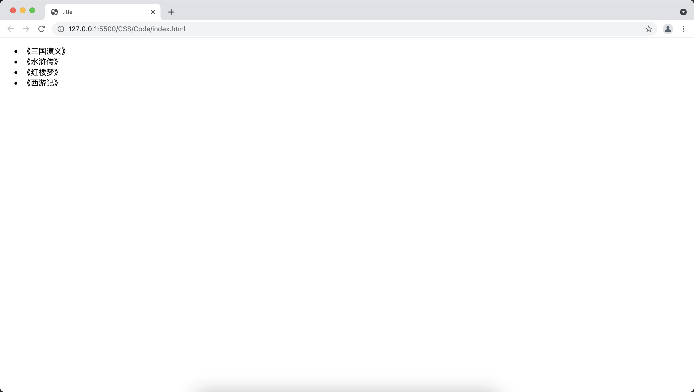
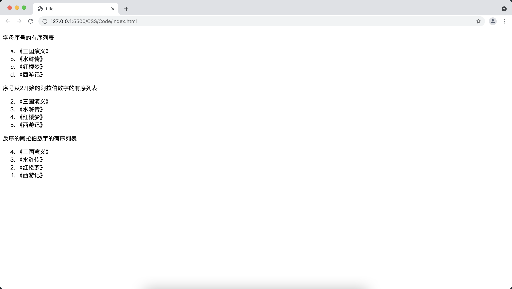
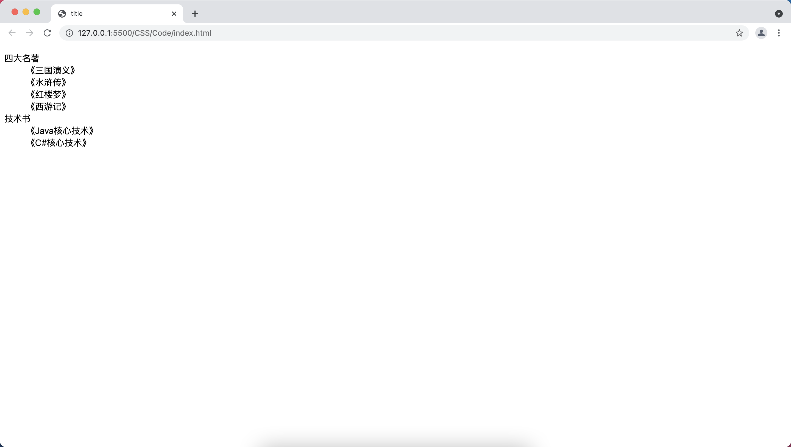
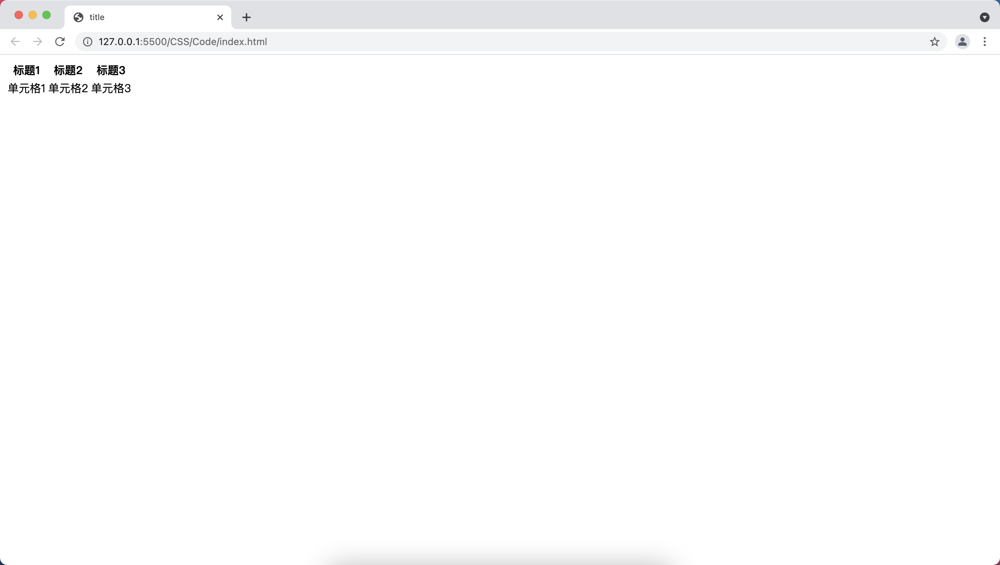
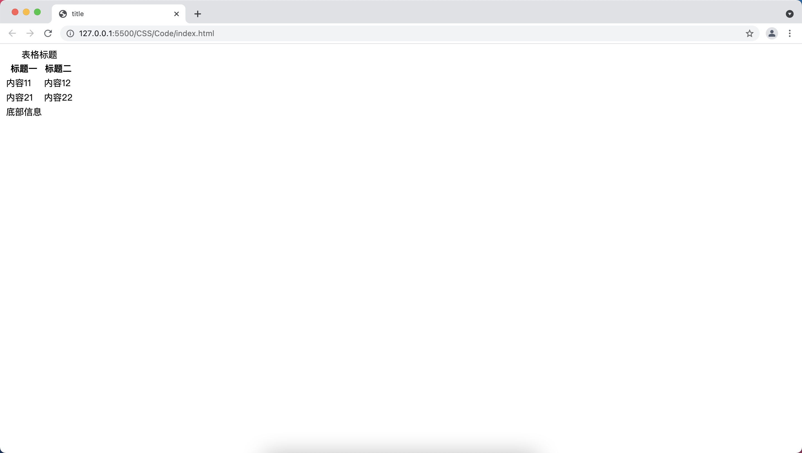
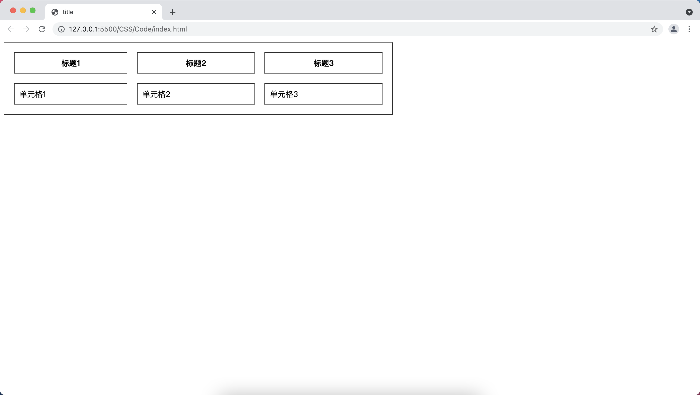
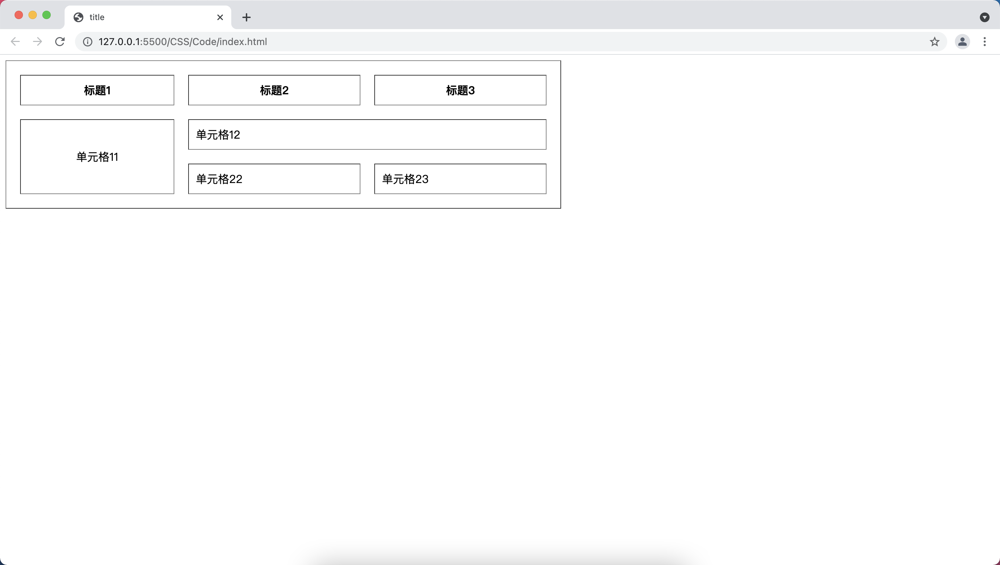
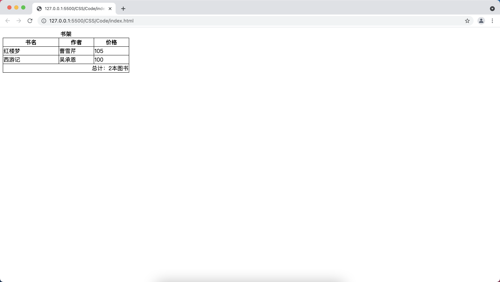

[toc]

# 列表相关元素
## 无序号列表

+ <font color=orange>**ul：**</font> 定义无序列表，该元素只能包含 li 子元素
+ <font color=orange>**li：**</font> 定义列表项，该元素可以和div包含完全类似的内容

```html
<!DOCTYPE html>
<html>
<head>
    <meta charset="UTF-8">
    <title>title</title>
</head>
<body>
    <ul>
        <li>《三国演义》</li>
        <li>《水浒传》</li>
        <li>《红楼梦》</li>
        <li>《西游记》</li>
    </ul>
</body>
</html>
```



## 有序列表

+ <font color=orange>**ol：**</font> 定义有序列表，只能包含 li 子元素。该元素可以指定下面三个属性：
  + <font color=orange>**start：**</font> 指定列表的起始数字，默认是第一个
  + <font color=orange>**type：**</font> 指定使用哪种类型的编号，如：1代表数字、A或a代表大小写字母、I或者i代表使用大写或者小写的罗马数字。（该属性不推荐使用，推荐使用CSS）
  + <font color=orange>**reversed：**</font> 该属性指定是否将排序反转
+ <font color=orange>**li：**</font> 定义列表项，该元素可以和div包含完全类似的内容

```html
<!DOCTYPE html>
<html>
<head>
    <meta charset="UTF-8">
    <title>title</title>
</head>
<body>
    <p>字母序号的有序列表</p>
    <ol type="a">
        <li>《三国演义》</li>
        <li>《水浒传》</li>
        <li>《红楼梦》</li>
        <li>《西游记》</li>
    </ol>
    <p>序号从2开始的阿拉伯数字的有序列表</p>
    <ol type="1" start="2">
        <li>《三国演义》</li>
        <li>《水浒传》</li>
        <li>《红楼梦》</li>
        <li>《西游记》</li>
    </ol>
    <p>反序的阿拉伯数字的有序列表</p>
    <ol type="1" reversed>
        <li>《三国演义》</li>
        <li>《水浒传》</li>
        <li>《红楼梦》</li>
        <li>《西游记》</li>
    </ol>
</body>
</html>
```



## 定义列表

+ <font color=orange>**dl：**</font> 用于定义术语列表，该元素只能包含 dt 和 dd 两种子元素
+ <font color=orange>**dt：**</font> 定义标题列表项，该元素只能包含文本、图像、超链接、文本格式化元素和表单控件元素等
+ <font color=orange>**dd：**</font> 定义普通列表项，该元素可以和 div 完全类似的内容

```html
<!DOCTYPE html>
<html>
<head>
    <meta charset="UTF-8">
    <title>title</title>
</head>
<body>
    <dl>
        <dt>四大名著</dt>
        <dd>《三国演义》</dd>
        <dd>《水浒传》</dd>
        <dd>《红楼梦》</dd>
        <dd>《西游记》</dd>
        <dt>技术书</dt>
        <dd>《Java核心技术》</dd>
        <dd>《C#核心技术》</dd>
    </dl>
</body>
</html>
```



# 表格相关的元素
## 表格的基本结构

&emsp;&emsp;最基本的表格结构如下：

```html
<!DOCTYPE html>
<html>
<head>
    <meta charset="UTF-8">
    <title>title</title>
</head>
<body>
    <table>
        <tr>
            <th>标题1</th>
            <th>标题2</th>
            <th>标题3</th>
        </tr>
        <tr>
            <td>单元格1</td>
            <td>单元格2</td>
            <td>单元格3</td>
        </tr>
    </table>
</body>
</html>
```



+ <font color=orange>**table：**</font> 用于定义表格
+ <font color=orange>**tr：**</font> 定义表格行，该元素只能包含 td 或者 th 两种元素
+ <font color=orange>**td：**</font> 定义单元格，该元素和 div 元素一样，可以包含各种类型的子元素，包括再次插入一个表格
+ <font color=orange>**th：**</font> 定义表格的表头单元格，和 td 元素的用法几乎完全一样

&emsp;&emsp;还可以通过下面的方法使得表格的结构更加完整：

```html
<!DOCTYPE html>
<html>
<head>
    <meta charset="UTF-8">
    <title>title</title>
</head>
<body>
    <table>
        <caption>表格标题</caption>
        <thead>
            <tr>
                <th>标题一</th>
                <th>标题二</th>
            </tr>
        </thead>
        <tbody>
            <tr>
                <td>内容11</td>
                <td>内容12</td>
            </tr>
            <tr>
                <td>内容21</td>
                <td>内容22</td>
            </tr>
        </tbody>
        <tfoot>
            <tr>
                <td>底部信息</td>
            </tr>
        </tfoot>
    </table>
</body>
</html>
```



+ <font color=orange>**caption：**</font> 用于定义表格标题，只能包含文本、图片、超链接、文本格式化元素和表单控件元素等
+ <font color=orange>**tbody：**</font> 定义表格的主体，该元素只能包含 tr 子元素
+ <font color=orange>**thead：**</font> 定义表格头
+ <font color=orange>**tfoot：**</font> 定义表格脚

> <font color=red>**提示：**</font> table 元素只能包含 0 个或 1 个 caption 子元素（定义表格标题）、0 个或 1 个 thead 子元素（定义表格头）、0 个或 1 个 tfoot 子元素（定义表格脚）、多个 tr 子元素（定义表格行）、多个 tbody 子元素（定义表格体）。

## 表格属性

&emsp;&emsp;table元素的常用属性如下：

+ <font color=orange>**cellpadding：**</font> 指定单元格内容和单元格边框之间的间距，既可以是百分比也可以是像素值
+ <font color=orange>**cellspacing：**</font> 指定单元格之间的间距，可以是像素值或百分比
+ <font color=orange>**width：**</font> 指定表格的宽度，可以是像素值或百分比
+ <font color=orange>**border：**</font> 指定表格的边框宽度

```html
<!DOCTYPE html>
<html>
<head>
    <meta charset="UTF-8">
    <title>title</title>
</head>
<body>
    <table width="800px" border="1" cellpadding="10" cellspacing="20">
        <tr>
            <th>标题1</th>
            <th>标题2</th>
            <th>标题3</th>
        </tr>
        <tr>
            <td>单元格1</td>
            <td>单元格2</td>
            <td>单元格3</td>
        </tr>
    </table>
</body>
</html>
```



&emsp;&emsp;td元素的常用属性如下：

+ <font color=orange>**colspan：**</font> 指定该单元格跨多少列
+ <font color=orange>**rowspan：**</font> 指定此单元格横跨多少行
+ <font color=orange>**height：**</font> 指定单元格的高度，可以是像素值或百分比
+ <font color=orange>**width：**</font> 指定单元格的宽度，可以是像素值或百分比
+ <font color=orange>**align：** </font>文本左右对齐方式（<font color=green> *__left、center、right__* </font>）
+ <font color=orange>**valign：** </font>文本上下对齐方式 （<font color=green> *__top、middle、bottom__* </font> ）

```html
<!DOCTYPE html>
<html>
<head>
    <meta charset="UTF-8">
    <title>title</title>
</head>
<body>
    <table width="800px" border="1" cellpadding="10" cellspacing="20">
        <tr>
            <th>标题1</th>
            <th>标题2</th>
            <th>标题3</th>
        </tr>
        <tr>
            <td rowspan="2" height="50" align="center" valign="middle" width="200">单元格11</td>
            <td colspan="2">单元格12</td>
        </tr>
        <tr>
            <td>单元格22</td>
            <td>单元格23</td>
        </tr>
    </table>
</body>
</html>
```



## col 和 colgroup

&emsp;&emsp;如果需要为某列整体指定属性，HTML5 保留如下两个元素：

+ <font color=orange>**col：**</font> 该元素用于为表格中的一个或多个列指定属性值，该元素只能出现在 table 元素或 colgroup 元素内。col 元素是个空元素，本身并不产生表格列，只是为表格中指定列整体指定属性值，因此一旦在 table 中使用 col 为表格列指定属性，col 定义的表格列数就应该和表格内实际包含的列数相等
+ <font color=orange>**colgroup：**</font> 该元素用于为表格中的一个或多个列指定属性值，通常定义在 table 内，该元素的作用只是用于组织多个 col 元素

```html
<!DOCTYPE html>
<html>
<head>
    <meta charset="UTF-8">
    <title></title>
</head>
<body>
    <table style="background-color: black;border-collapse: separate;border-spacing: 1px;">
        <caption><b>书架</b></caption>
        <colgroup style="background-color: white;">
            <col style="width: 160px;">
            <col span="2" style="width: 100px;">
        </colgroup>
        <thead>
            <tr>
                <th>书名</th>
                <th>作者</th>
                <th>价格</th>
            </tr>
        </thead>
        <tfoot>
            <td colspan="3" style="text-align: right;">总计：2本图书</td>
        </tfoot>
        <tbody>
            <tr>
                <td>红楼梦</td>
                <td>曹雪芹</td>
                <td>105</td>
            </tr>
            <tr>
                <td>西游记</td>
                <td>吴承恩</td>
                <td>100</td>
            </tr>
        </tbody>
    </table>
</body>
</html>
```

