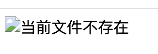
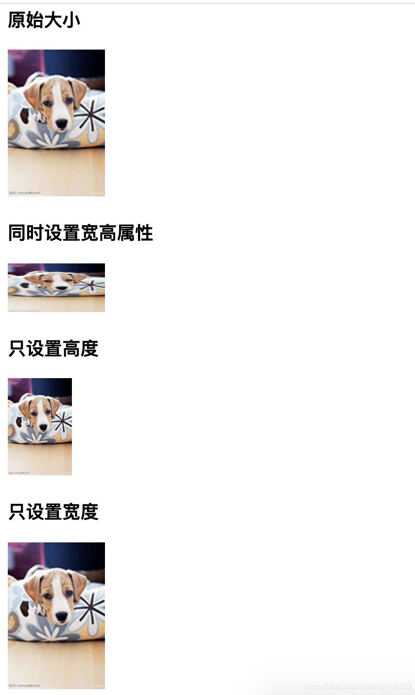
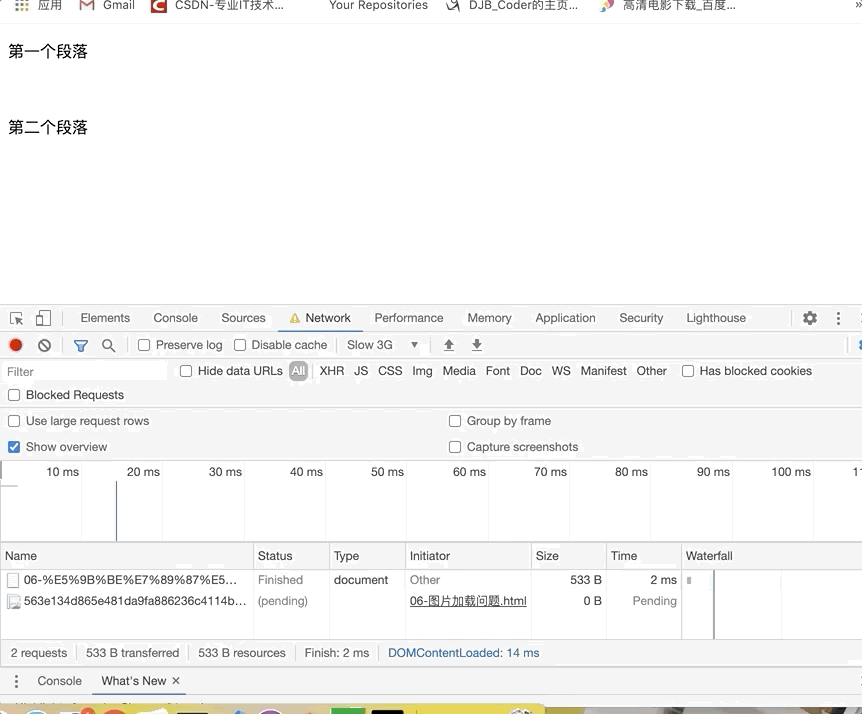
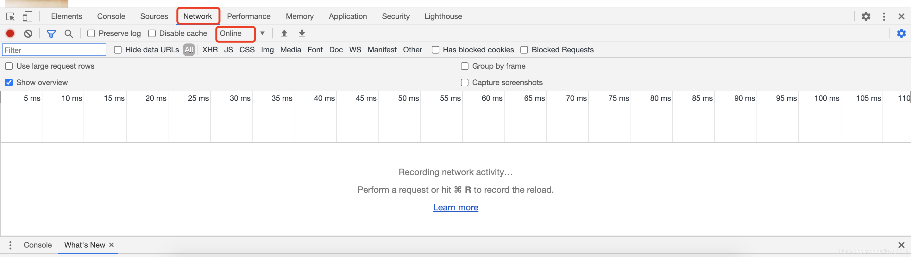
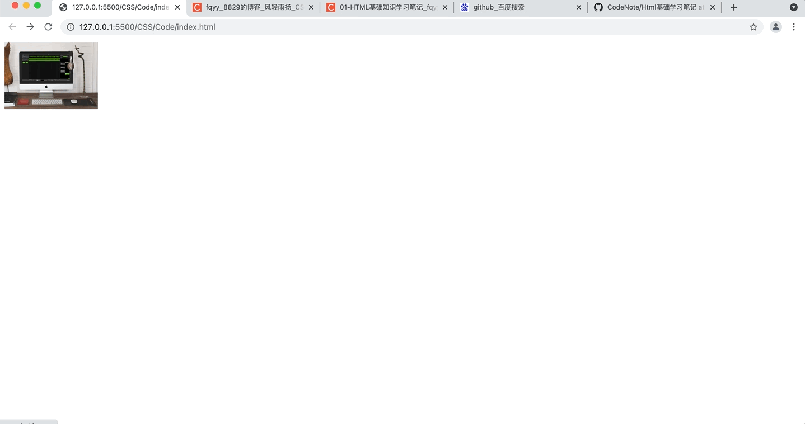
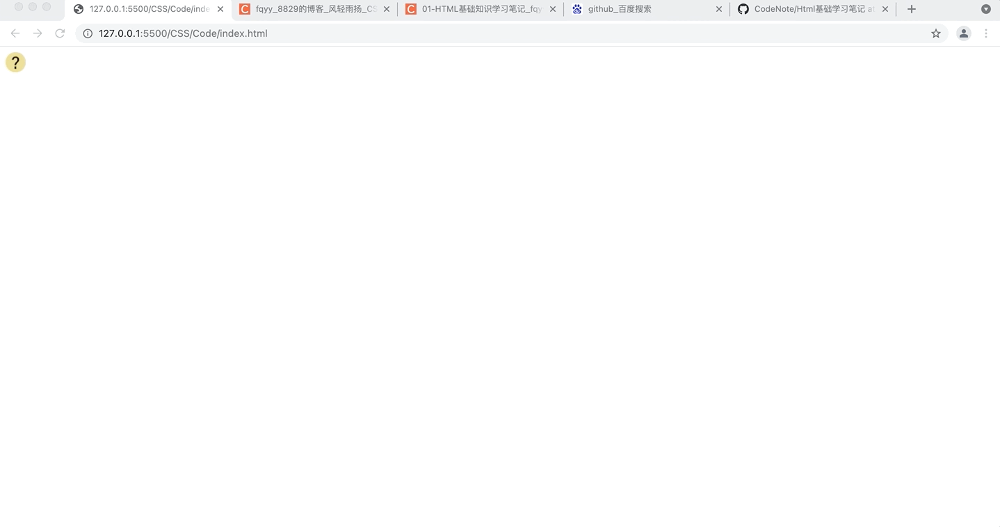

[toc]

# 使用img元素添加图片

&emsp;&emsp;要想在网页中显示图像就需要使用图像标签<font color=orange> **&lt;img /&gt;** </font>以及相关的标签属性，其基本语法如下：

```html

```

&emsp;&emsp;关于 img 标签的属性说明如下：

属性| 属性值| 描述
-|-|-
src | URL | 图像的路径
alt  | 文本 | 图像不能显示时候的替换文本
title  | 文本 | 鼠标悬停的时候的内容
width  | 像素 | 图像的宽度
height  | 像素 | 图像的高度
border | 数字 | 图像边框的宽度

<font color=skyblue size=3>**1. src 属性**</font>

&emsp;&emsp;<font color=orange>*__src__*</font> 属性用来指定引入的图片的地址<font color=orange>（ **src属性是必须的属性** ）</font>，这个地址可以是一个相对地址，也可以是一个绝对地址：

```html
<!DOCTYPE html>
<html lang="en">
<head>
    <meta charset="UTF-8">
    <meta name="viewport" content="width=device-width, initial-scale=1.0">
    <title>图片的src属性</title>
</head>
<body>
    <!-- 通过相对路径引入图片地址 -->
    

    <!-- 通过绝对路径引入图片地址 -->
    

    <!-- 网络路径引入图片 -->
    
</body>
</html>
```


> <font color=red>**关于绝对路径和相对路径：**</font>
> + <font color=orange>*__相对路径：__*</font> 相对于某个文件的路径，如：<font color=green>*__./imgae/1.png__*</font>
>   + <font color=orange>**"."**</font> 表示当前路径
>   + <font color=orange>**"\.\."**</font> 表示上一层路径
> + <font color=orange>*__绝对路径：__*</font> 指的是当前目录绝对位置，直接到达目标位置，通常是从盘符开始的路径（<font color=orange>网络中的图片也是绝对路径</font>）。

<font color=skyblue size=3>**2. alt 属性**</font>

&emsp;&emsp;<font color=orange>**alt**</font> 属性用作在图片出现问题的时候（如加载的图片文件不存在）显示一段友好的提示信息：

```html
<!DOCTYPE html>
<html lang="en">
<head>
    <meta charset="UTF-8">
    <meta name="viewport" content="width=device-width, initial-scale=1.0">
    <title>图片的alt属性</title>
</head>
<body>
    
</body>
</html>
```



<font color=skyblue size=3>**2. title 属性**</font>

&emsp;&emsp;<font color=orange>**title**</font> 属性用作鼠标放在图片上的时候显示的一段提示信息：

```html
<!DOCTYPE html>
<html lang="en">
<head>
    <meta charset="UTF-8">
    <meta name="viewport" content="width=device-width, initial-scale=1.0">
    <title>图片的title属性</title>
</head>
<body>
    
</body>
</html>
```


<font color=skyblue size=3>**3. width 和 height 属性**</font>

&emsp;&emsp;图片的 <font color=orange>**width、height**</font> 属性用来设置图片的宽和高。同时设置这两个的属性的时候可能会出现图片的变形（<font color=red>**如果只设置了其中的一个，另外一个属性会根据图片的原始比例进行等比例缩放**</font>）：

```html
<!DOCTYPE html>
<html lang="en">
<head>
    <meta charset="UTF-8">
    <meta name="viewport" content="width=device-width, initial-scale=1.0">
    <title>图片的宽高属性</title>
</head>
<body>
    <!-- 原始大小 -->
    <h3>原始大小</h3>
    

    <!-- 同时修改宽度和高度 -->
    <h3>同时设置宽高属性</h3>
    

    <!-- 只设置高度 -->
    <h3>只设置高度</h3>
    

    <!-- 只设置宽度 -->
    <h3>只设置宽度</h3>
    
</body>
</html>
```



&emsp;&emsp;建议设置图片的宽高属性，不然在网络慢的时候会出现问题。比如下面的案例中没有指定 height 属性：

```html
<!DOCTYPE html>
<html lang="en">
<head>
    <meta charset="UTF-8">
    <meta name="viewport" content="width=device-width, initial-scale=1.0">
    <meta http-equiv="X-UA-Compatible" content="ie=edge">
    <title>图片加载问题</title>
</head>
<body>
    <p>第一个段落</p>
    
    <p>第二个段落</p>
</body>
</html>
```



&emsp;&emsp;你会发现在加载图片的时候两个段落之间并没有预留图片的高度，如果给图片指定了 height 属性就不会出现这个问题。

&emsp;&emsp;通过chrome浏览器可以模仿当前的网络环境，设置步骤如下：<font color=orange>打开chrome浏览器 -> 右键选择 *__检查__* 功能 -> 选择 *__network__* 标签 -> 通过 *__online__* 菜单</font> 选择网络环境：



# map 和 area 

+ <font color=orange>**map：**</font> 用于定义图片映射，该元素可以包含一个或多个 area 子元素，每个 area 元素定义一个区域，不同区域可连接到不同的 URL
+ <font color=orange>**area：**</font> 用于定义图片映射的内部区域，该元素只能是一个空元素
  + <font color=orange>**shape：**</font> 指定该内部区域是哪种区域：<font color=green> **rect（矩形）、 circle（圆形）、ploy（多边形）** </font>
  + <font color=orange>**coords：**</font> 指定多个坐标值，用于确定区域位置
  + <font color=orange>**href：**</font> 用于确定该区域所链接的资源
  + <font color=orange>**alt：**</font> 该属性指定一段文本，该文本将作为该图片的提示信息
  + <font color=orange>**target：**</font> 使用框架集中的哪种框架来装载另一个资源（<font color=green> **_slef、_blank、_top、_parent** </font>）

```html
<!DOCTYPE html>
<html>
<head>
    <meta charset="UTF-8">
    <title></title>
</head>
<body>
    <!-- 创建分区链接图片 -->
    <br/>
    <!-- 定义图片映射 -->
    <map name="test" id="test">
        <!-- 为图片映射定义2个区域 -->
        <area shape="circle" coords="57,55,25" href="http://www.baidu.com" alt="百度">
        <area shape="poly" coords="188,28,50,200,47,224,72,246,51" href="http://www.qq.com" alt="qq">
    </map>
</body>
</html>
```



&emsp;&emsp;还可以提交图片的点击坐标，如果为img元素指定<font color=orange> **ismap** </font>属性（该属性是一个boolean），当用户点击该图片导航到链接目标时，还会将用户点击图片的坐标也提交给服务器：

```html
<!DOCTYPE html>
<html>
<head>
    <meta charset="UTF-8">
    <title></title>
</head>
<body>
    <a href="test.html"></a>
</body>
</html>
```

